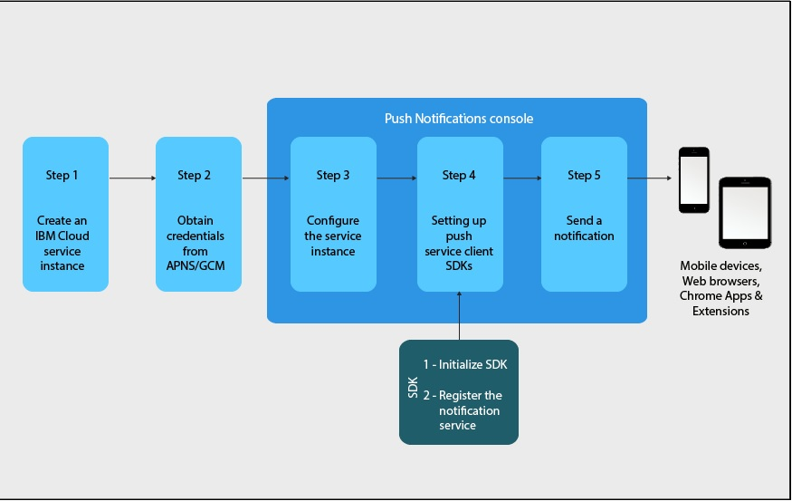

---

copyright:
years: 2015, 2017

---

{:new_window: target="_blank"}
{:shortdesc: .shortdesc}
{:screen:.screen}
{:codeblock:.codeblock}
{:pre: .pre}
{:tip: .tip}

# Getting started tutorial
{: #gettingstartedtemplate}
Last updated: 12 June 2017
{: .last-updated}

{:shortdesc}

{{site.data.keyword.mobilepushshort}} is available as a Bluemix Catalog service in the Mobile category and enables you to send and manage mobile and web push notifications. A push notification is an alert indicating a change or update on a mobile device or browser.

Push Notifications are an universally accepted communication channel across enterprises or for a wide spectrum of audience. You can deliver these notifications as an onscreen banner alert or to a device's locked screen, thus providing information updates that are quickly and easily accessible.  

The basic steps that will get you started:

1. [Obtain your notification provider credentials](/docs/services/mobilepush/push_step_1.html).
1. [Configure a service instance](/docs/services/mobilepush/push_step_2.html)
1. [Setup service client SDK's](/docs/services/mobilepush/push_step_3.html)
1. [Sending a notification](/docs/services/mobilepush/push_step_4.html)

The following image gives you an overview of the Push Notifications service life cycle.

  

