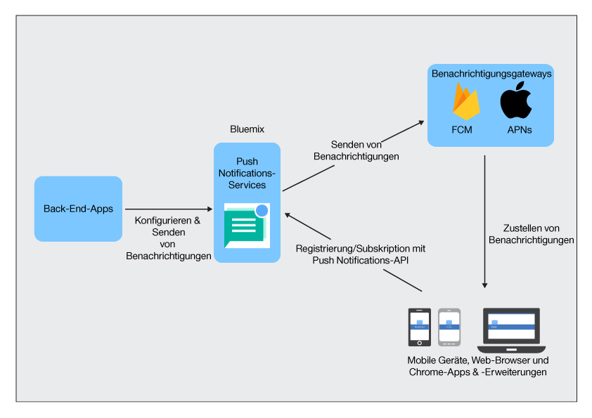

----

copyright:
 years: 2015, 2017

---

{:new_window: target="_blank"}
{:shortdesc: .shortdesc}
{:screen:.screen}
{:codeblock:.codeblock}
{:pre: .pre}
{:tip: .tip}

# Informationen zu Push Notifications 
{: #overview-push}
Letzte Aktualisierung: 28. September 2017
{: .last-updated}

Mit dem IBM Service {{site.data.keyword.mobilepushshort}} können Sie Benachrichtigungen an mobile Geräte und Browser senden. Benachrichtigungen können zielgruppenspezifisch an alle Anwendungsbenutzer und an bestimmte Benutzergruppen und Geräte mithilfe von Tags gesendet werden. Für jede an den Service übermittelte Nachricht wird an die jeweilige Zielgruppe eine Benachrichtigung gesendet.

Der {{site.data.keyword.mobilepushshort}}-Service ist als Teil von MobileFirst Services Starter Boilerplate oder in [Dedizierte Services](/docs/dedicated/index.html) von Bluemix verfügbar.  Sie können auch ein SDK (Software-Development-Kit) und [REST-APIs ](https://mobile.{DomainName}/imfpush/){: new_window} verwenden, um Ihre Clientanwendungen weiter zu entwickeln.

Der {{site.data.keyword.mobilepushshort}}-Service ist auch [OpenWhisk](/docs/openwhisk/index.html)-fähig. OpenWhisk ist ein verteilter, ereignisgesteuerter Verarbeitungsservice, der auch als serverunabhängige Verarbeitung bezeichnet wird. Entwickler können sich mit diesem Service auf das Schreiben von Anwendungslogik konzentrieren und Aktionen erstellen, die bei Bedarf ausgeführt werden.

## Serviceprozesse
{: #overview_push_process}

Mobile Clients, Web-Browser-Clients und Google Chrome-Apps & Erweiterungen können den {{site.data.keyword.mobilepushshort}}-Service subskribieren und sich bei ihm registrieren. Beim Start registrieren sich die Clientanwendungen beim {{site.data.keyword.mobilepushshort}}-Service und subskribieren ihn. Die Benachrichtigungen werden dem Server von Apple Push Notification Service (APNs) oder von Firebase Cloud Messaging (FCM) zugeteilt und anschließend an registrierte Geräte, Browser-Clients oder Chrome-Apps & Erweiterungen gesendet.

### Mobile Anwendungen, Browseranwendungen und Chrome-Apps & Erweiterungen
{: #mobile-applications}

Beim Start registrieren sich Clientanwendungen beim {{site.data.keyword.mobilepushshort}}-Service und subskribieren ihn, um Benachrichtigungen empfangen zu können.

### Back-End-Anwendungen
{: #backend-applications}

Back-End-Anwendungen können sich vor Ort oder in einer öffentlichen Cloud befinden. Back-End-Anwendungen verwenden den {{site.data.keyword.mobilepushshort}}-Service zum Senden kontextabhängiger Benachrichtigungen an Benutzer von mobilen Geräten, Browseranwendungen und Chrome-Apps & Erweiterungen. Die Back-End-Anwendungen sind für die Verwaltung und Wartung von mobilen Geräten, Browseragenten und von Benutzerinformationen zum Senden von Push-Benachrichtigungen nicht erforderlich. Stattdessen können Back-End-Anwendungen den {{site.data.keyword.mobilepushshort}}-Service verwenden, der Sie verwaltet und wartet.

### Eigner der Back-End-App
{: #app-backend-owner}

Der Eigner der Back-End-App erstellt die mobile Back-End-Anwendung, die eine Instanz des {{site.data.keyword.mobilepushshort}}-Service bündelt. Der Eigner der Back-End-App konfiguriert außerdem den {{site.data.keyword.mobilepushshort}}-Service und richtet ihn so ein, dass er sich für die Back-End-Anwendungen eignet, die den Service verwenden, sowie für mobile Anwendungen und Browseranwendungen, die als Ziel für Push-Benachrichtigungen fungieren.

### Push Notifications-Service
{: #push-notification-service}

Der {{site.data.keyword.mobilepushshort}}-Service ist für die Verwaltung aller Informationen im Zusammenhang mit mobilen Geräten und Web-Browser-Clients zuständig, die für Benachrichtigungen registriert sind. Der Service sorgt dafür, dass Ihre Anwendungen transparent gegenüber den Technologiedetails beim Senden von Benachrichtigungen an heterogene mobile Plattformen und Browserplattformen bleiben, und verarbeitet dies alles innerhalb seiner Tätigkeit.

### Gateways
{: #gateways}

Plattformspezifische Cloud-Services für Push-Benachrichtigungen wie FCM/GCM oder Apple Push Notification Service (APNs), die vom IBM {{site.data.keyword.mobilepushshort}}-Service verwendet werden, um Benachrichtigungen an mobile und Browseranwendungen zu verteilen.

## Nachrichtengröße
{: #push-message-size}

Die Größe der {{site.data.keyword.mobilepushshort}}-Nachrichtennutzdaten hängt von den Einschränkungen ab, die durch die Gateways (FCM/GCM, APNs) und Clientplattformen festgelegt sind. 

- iOS und Safari: Ab iOS 8 beträgt die zulässige maximale Größe 4 Kilobyte. APNs sendet keine Benachrichtigungen, die dieses Limit überschreiten.
- Android, Firefox-Browser, Chrome-Browser und Chrome-Apps & Erweiterungen: Es gibt eine Einschränkung von 4 Kilobyte als maximal zulässige Nachrichtennutzdatengröße.

## Beispiele
{: #push-blog}

Beispielanwendungen sind für [Android](https://github.com/ibm-bluemix-mobile-services/bms-samples-android-hellopush/), [Cordova](https://github.com/ibm-bluemix-mobile-services/bms-samples-cordova-hellopush) und [iOS](https://github.com/ibm-bluemix-mobile-services/bms-samples-swift-hellopush) verfügbar.
Weitere Informationen finden Sie auch auf der Seite [Blogs](http://push-notification-service.mybluemix.net/) für den Push Notifications-Service.  

## Beispielszenario 
{: #push-scenario}

Der {{site.data.keyword.mobilepushshort}}-Service wird anhand des Beispielszenarios der ACME-Bank erläutert. Die ACME-Bank ist gerade dabei, ihre traditionelle IT-Infrastruktur auf IBM Bluemix-Services zu verlagern und erstellt momentan eine mobile Back-End-Lösung für kunden- und mitarbeiterseitige Apps. Der {{site.data.keyword.mobilepushshort}}-Service wird verwendet, um Benachrichtigungen zu Bankgeschäften und anderen wichtigen Ereignisse und Terminen an die Kunden zu senden.

