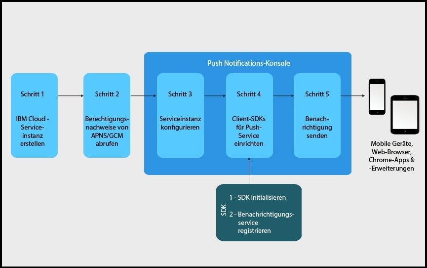

---

copyright:
 years: 2015, 2017

---

{:new_window: target="_blank"}
{:shortdesc: .shortdesc}
{:screen:.screen}
{:codeblock:.codeblock}
{:pre: .pre}
{:tip: .tip}

# Lernprogramm zur Einführung
{: #gettingstartedtemplate}
Letzte Aktualisierung: 08. September 2017
{: .last-updated}

{:shortdesc}

{{site.data.keyword.mobilepushshort}} ist als IBM Cloud Catalog-Service in der Kategorie 'Mobile' verfügbar und ermöglicht das Senden und Verwalten von Push-Benachrichtigungen im Web und für mobile Endgeräte. Eine Push-Benachrichtigung ist ein Alert, der auf eine Änderung oder Aktualisierung auf einem mobilen Gerät oder einem Browser hinweist.

Push-Benachrichtigungen sind ein allgemein akzeptierter Kommunikationskanal für Unternehmen oder große Zielgruppen. Sie können als Banneralerts auf einem Bildschirm angezeigt oder an den Sperrbildschirm eines Geräts gesendet werden und stellen somit schnelle und leicht zugängliche Informationsupdates bereit.  

Zunächst müssen die folgenden grundlegenden Schritte ausgeführt werden:

1. [IBM Cloud-Serviceinstanz erstellen](/docs/services/mobilepush/push_step_prereq.html)
1. [Berechtigungsnachweise des Benachrichtigungsproviders abrufen](/docs/services/mobilepush/push_step_1.html)
1. [Serviceinstanz konfigurieren](/docs/services/mobilepush/push_step_2.html)
1. [Client-SDKs für Push-Srvice einrichten](/docs/services/mobilepush/push_step_3.html)
1. [Benachrichtigung senden](/docs/services/mobilepush/push_step_4.html)

Die folgende Abbildung gibt einen Überblick über den Lebenszyklus des Push Notifications-Service.

  

