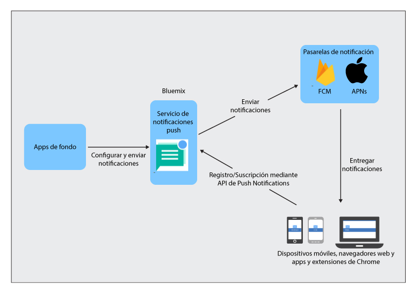

----

copyright:
 years: 2015, 2017

---

{:new_window: target="_blank"}
{:shortdesc: .shortdesc}
{:screen:.screen}
{:codeblock:.codeblock}
{:pre: .pre}
{:tip: .tip}

# Sobre las notificaciones push 
{: #overview-push}
Última actualización: 28 de septiembre de 2017
{: .last-updated}

IBM {{site.data.keyword.mobilepushshort}} es un servicio que puede utilizar para enviar notificaciones a dispositivos móviles y navegadores. Las notificaciones se pueden destinar a todos los usuarios de la aplicación o a un conjunto específico de usuarios y dispositivos mediante etiquetas. Para cada mensaje que se envía al servicio, los usuarios de destino reciben una notificación.

Puede utilizar el servicio {{site.data.keyword.mobilepushshort}} como parte del contenedor modelo de iniciador de servicios MobileFirst o bien como [servicios dedicados](/docs/dedicated/index.html) de IBM Cloud.  También puede utilizar un SDK (kit de desarrollo de software) y [API REST ](https://imfpush.{DomainName}/imfpush/){: new_window} para desarrollar más las aplicaciones de cliente.

El servicio {{site.data.keyword.mobilepushshort}} también se habilita para [OpenWhisk](/docs/openwhisk/index.html). OpenWhisk es un servicio de cálculo distribuido y controlado por sucesos que también se conoce como computación sin servidor. Gracias a esto, los desarrolladores pueden centrarse en escribir la lógica de aplicación y crear acciones ejecutadas bajo demanda.

## Procesos del servicio
{: #overview_push_process}

Los clientes de navegadores web y móviles y las apps y extensiones de Google Chrome pueden suscribirse y registrarse para el servicio de {{site.data.keyword.mobilepushshort}}. Al arrancar, las aplicaciones móviles y de navegador se registrarán y se suscribirán al servicio {{site.data.keyword.mobilepushshort}}. Las notificaciones se asignan al servicio de APNs (Apple Push Notification Service) o al servidor FCM (Firebase Cloud Messaging) y se envían al dispositivo móvil registrado, a los clientes de navegador o a apps y extensiones de Chrome.

### Aplicaciones para móviles y navegadores, y apps y extensiones de Chrome
{: #mobile-applications}

Al arrancar, las aplicaciones cliente se registrarán y se suscribirán al servicio {{site.data.keyword.mobilepushshort}} para recibir notificaciones.

### Aplicaciones de fondo
{: #backend-applications}

Las aplicaciones de fondo pueden ser locales o pueden estar en una nube pública. Las aplicaciones de fondo utilizarán el servicio {{site.data.keyword.mobilepushshort}} para enviar notificaciones según el contexto a usuarios de aplicaciones móviles y de navegador, y de apps y extensiones de Chrome. No es necesario que las aplicaciones de fondo mantengan ni gestionen dispositivos móviles, agentes de navegador ni información de usuarios para enviar notificaciones push. En lugar de ello, pueden utilizar el servicio {{site.data.keyword.mobilepushshort}}, que los gestionará y mantendrá.

### Propietario de back-end de app
{: #app-backend-owner}

El propietario de back-end de app crea la aplicación móvil de fondo, que agrupa una instancia del servicio {{site.data.keyword.mobilepushshort}}. El propietario también configura el servicio {{site.data.keyword.mobilepushshort}} para adaptar las aplicaciones de fondo utilizando el servicio junto con las apps móviles y de navegador destinadas para {{site.data.keyword.mobilepushshort}}.

### Servicio de notificaciones push
{: #push-notification-service}

El servicio {{site.data.keyword.mobilepushshort}} gestiona toda la información relacionada con los dispositivos móviles y clientes de navegadores web registrados para las notificaciones. El servicio mantiene sus aplicaciones transparentes a los detalles tecnológicos del envío de notificaciones a plataformas móviles y navegadores web heterogéneas y lo maneja todo.

### Pasarelas
{: #gateways}

Los servicios de nube específicos de plataformas para las notificaciones push, como FCM o Apple Push Notification Service (APNs), que utilizan el servicio IBM {{site.data.keyword.mobilepushshort}} para asignar notificaciones a las aplicaciones móviles y de navegador.

## Tamaño de mensaje
{: #push-message-size}

El tamaño de carga útil de los mensajes de {{site.data.keyword.mobilepushshort}} depende de las restricciones diseñadas por las pasarelas (FCM, APNs) y las plataformas cliente. 

- Para iOS y Safari: Para iOS 8 y versiones posteriores, el tamaño máximo permitido es de 4 kilobytes. Los APNs no envían las notificaciones que superan este límite.
- Para Android, el navegador Firefox, el navegador Chrome y apps y extensiones de Chrome: existe una limitación de 4 kilobytes como tamaño máximo de carga útil del mensaje permitido.

## Ejemplos
{: #push-blog}

Hay aplicaciones de ejemplo disponibles para [Android](https://github.com/ibm-bluemix-mobile-services/bms-samples-android-hellopush/), [Cordova](https://github.com/ibm-bluemix-mobile-services/bms-samples-cordova-hellopush) e [iOS](https://github.com/ibm-bluemix-mobile-services/bms-samples-swift-hellopush).
También puede encontrar más información en la página del [Blog](http://push-notification-service.mybluemix.net/) del servicio de notificaciones push.  

## Caso de ejemplo 
{: #push-scenario}

El servicio {{site.data.keyword.mobilepushshort}} se explica en el caso de ejemplo de ACME Bank. ACME Bank está en fase de mover su infraestructura de TI heredada a servicios de IBM Cloud y actualmente se está creando un proceso de fondo móvil para sus apps para clientes y empleados. Utilizan el servicio {{site.data.keyword.mobilepushshort}} para enviar a sus clientes notificaciones de transacciones bancarias y otros sucesos importantes, así como recordatorios.

