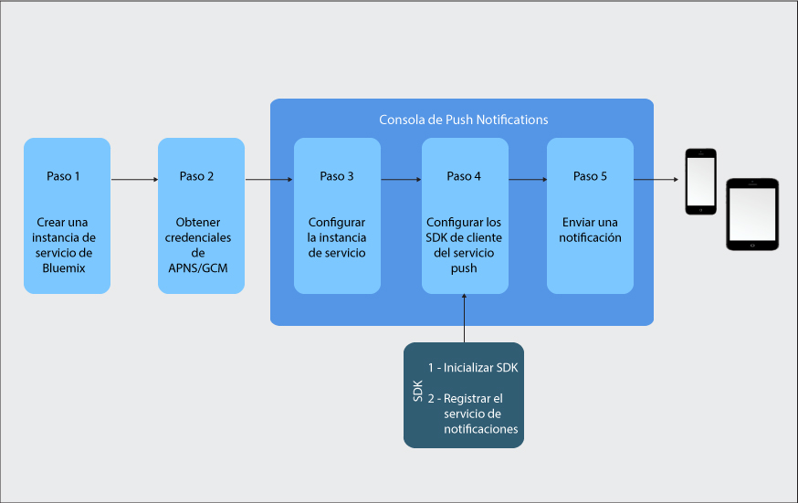

---

copyright:
years: 2015, 2017

---

{:new_window: target="_blank"}
{:shortdesc: .shortdesc}
{:screen:.screen}
{:codeblock:.codeblock}
{:pre: .pre}
{:tip: .tip}

# Guía de aprendizaje de iniciación
{: #gettingstartedtemplate}
Última actualización: 8 de septiembre de 2017
{: .last-updated}

{:shortdesc}

{{site.data.keyword.mobilepushshort}} está disponible como servicio de catálogo de IBM Cloud en la categoría Móvil y le permite enviar y gestionar notificaciones push móviles y de web. Una notificación push es una alerta que indica un cambo o una actualización en un dispositivo móvil o un navegador.

Las notificaciones push son un canal de comunicación entre empresas o para un amplio espectro de público aceptado universalmente. Puede entregar dichas notificaciones como alerta de banner en pantalla o en la pantalla de un dispositivo bloqueado para proporcionar información actualizada fácilmente accesible.  

Los pasos básicos para comenzar:

1. [Cree una instancia de servicio de IBM Cloud](/docs/services/mobilepush/push_step_prereq.html)
1. [Obtener las credenciales del proveedor de notificaciones](/docs/services/mobilepush/push_step_1.html)
1. [Configurar la instancia de servicio](/docs/services/mobilepush/push_step_2.html)
1. [Configurar el SDK del cliente de servicio de Push](/docs/services/mobilepush/push_step_3.html)
1. [Enviar una notificación](/docs/services/mobilepush/push_step_4.html)

La siguiente imagen le ofrece una visión general del ciclo de vida del servicio de notificaciones push.

  

