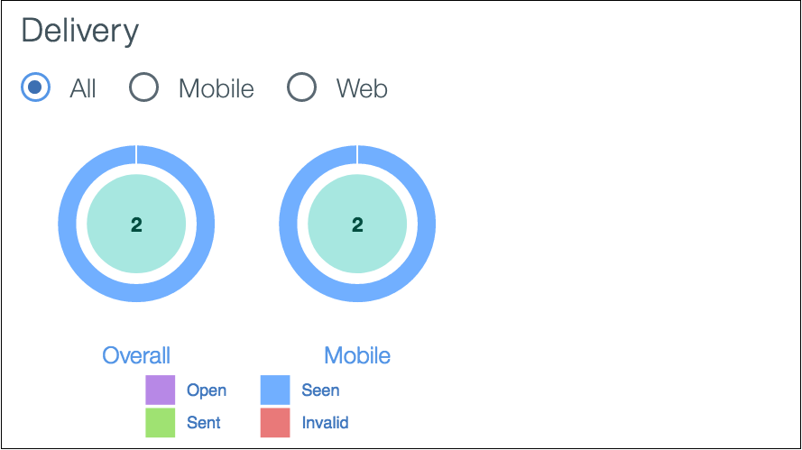

---

copyright:
 years: 2015, 2017

---

{:new_window: target="_blank"}
{:shortdesc: .shortdesc}
{:screen:.screen}
{:codeblock:.codeblock}

# Estado de entrega de la notificación por mensaje
{: #tag_based_notifications}
Última actualización: 21 de agosto de 2017
{: .last-updated}

Con el servicio de {{site.data.keyword.mobilepushshort}}, puede visualizar el estado de todas las notificaciones que se han enviado al servicio. 

Se ha enviado un mensaje que puede tener el siguiente estado:

- **Aceptado**: El mensaje ha sido aceptado para que sea entregado por el servicio de Notificaciones push.
- **Proceso**: El mensaje ha sido procesado y se asignará a la pasarela del proveedor de notificaciones. Cualquier notificación que sea procesada puede devolver un fallo con el estado **El proceso ha fallado**.
- **Asignando**: El proveedor de notificaciones ha recibido la notificación, APNs, FCM o Web, y está a punto de ser asignada. Cualquier notificación que se encuentre en el proceso de ser asignada también puede devolver un error con el estado **La asignación ha fallado**.
- **Asignado**: La notificación ha sido asignada por el proveedor de notificaciones.
- **Desconocido**: No se puede determinar el estado de la notificación.

El separador Mensajes del servicio {{site.data.keyword.mobilepushshort}} muestra el estado de la notificación.

1. La opción **Ver** muestra el estado de entrega de las notificaciones asignadas. Puede ver la información basada en los siguientes aspectos:

 - Categoría: Todo, Móvil, Web<!---and HTTP--->.
 - Estado del mensaje: Enviado, Visto, Abierto y No válido. 

2. Pulse en **Opciones** para ver el **Estado de entrega del mensaje detallado**.  Se puede realizar el seguimiento de estado de entrega detallado seleccionando el `ID de dispositivo` o el `ID de usuario` desde el menú desplegable. Se podrá obtener el estado detallado de un usuario o dispositivo específico.

En un momento dado, el servicio solo muestra el estado de los 10 últimos mensajes que se encuentran disponibles dentro de un periodo de 90 días.

**Nota**: Solo se habilita la característica para los usuarios que han elegido el plan de precios avanzado `Advanced Pricing Plan`. Seleccione **Plan** en la consola de servicio de {{site.data.keyword.mobilepushshort}} para [actualizar](https://console-tok02-red.cdn.s-bluemix.net/docs/account/change-plan.html#changing)
