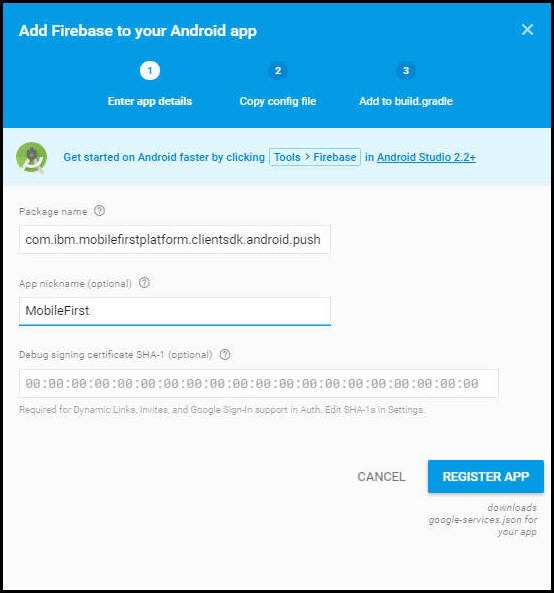

---

copyright:
 years: 2015, 2017

---

{:new_window: target="_blank"}
{:shortdesc: .shortdesc}
{:screen:.screen}
{:codeblock:.codeblock}

# Paso 2: Obtenga las credenciales del proveedor de notificaciones
{: #push_step_1}
Última actualización: 27 de junio de 2017
{: .last-updated}

Para configurar el servicio {{site.data.keyword.mobilepushshort}}, debe obtener las credenciales necesarias del proveedor de notificaciones push. 

## Para Android
{: #push_step_1_android}

Firebase Cloud Messaging (FCM) es la pasarela utilizada para entregar notificaciones push a dispositivos Android y a los navegadores Google Chrome y a apps y extensiones de Chrome. Para configurar el servicio {{site.data.keyword.mobilepushshort}} en la consola, debe obtener credenciales de FCM (ID de remitente y clave API). 

La clave de la API se almacena de forma segura y la utiliza el servicio {{site.data.keyword.mobilepushshort}} para conectarse al servidor de FCM y el ID de remitente (número de proyecto) lo utilizará el SDK de Android y el SDK de JS para Google Chrome y Mozilla Firefox en el lado de cliente. 

Para configurar FCM y obtener sus credenciales, lleve a cabo los pasos siguientes:

1. Visite la [Consola de Firebase ](https://console.firebase.google.com/?pli=1){: new_window}. Se requiere una cuenta de Google. 
2. Seleccione **Añadir proyecto**. 
3. En la ventana Crear un proyecto, proporcione un nombre de proyecto, elija un país/región y pulse **Crear proyecto**.
3. En el panel de navegación, seleccione **Valores** > **Valores del proyecto**.
4. Seleccione el separador Cloud Messaging para obtener las credenciales del proyecto: una Clave de API de servidor y un ID de remitente. Tenga en cuenta que la Clave de servidor especificada en FCM es la misma que la Clave de API de servidor.
   
	

También necesitaría generar el archivo `google-services.json`. Complete los pasos siguientes:

1. En la consola de Firebase, pulse el icono **Configuración del proyecto**.
    
	

3. Seleccione **AÑADIR APP** o el icono **Añadir Firebase a la app de Android** en el separador General del panel Sus apps.
    
4. En la ventana Añadir Firebase a la app Android, añada en primer lugar **com.ibm.mobilefirstplatform.clientsdk.android.push** como Nombre de paquete. El campo Apodo de app es opcional. Pulse **REGISTRAR APP**. 
    
	

5. Ahora, incluya el nombre de paquete de la aplicación, especificando el nombre de paquete en la ventana Añadir Firebase a la app Android. El campo Apodo de app es opcional. Pulse **REGISTRAR APP**.  A continuación se muestra un ejemplo -

	

6. Se generará el archivo `google-services.json`. 

Una vez que haya obtenido las credenciales de FCM y que haya generado el archivo `google-services.json`, el siguiente paso es [Crear una instancia de servicio](push_step_2.html).

**Nota**: Google ha dejado en desuso GCM y ha integrado Cloud Messaging con Firebase. Tendrá que migrar sus apps cliente GCM de Android a FCM.

## Para iOS
{: #push_step_1_ios}

Para dispositivos y aplicaciones iOS, el servicio de notificaciones push de Apple (APNs) permite a los desarrolladores de aplicaciones enviar notificaciones remotas desde la instancia del servicio {{site.data.keyword.mobilepushshort}} de IBM Cloud (el proveedor) a dispositivos y aplicaciones de iOS. Los mensajes se envían a una aplicación de destino del dispositivo. 

Debe obtener y configurar las credenciales de APNs. Los certificados de APNs se gestionan de forma segura mediante el servicio {{site.data.keyword.mobilepushshort}} y se utilizan para conectarse al servidor APNs como proveedor.

### Registrar un ID de App
{: #push_step_1_ios_2}

El ID de app (el identificador de paquete) es un identificador exclusivo que identifica una aplicación específica. Cada aplicación requiere un ID de app. Los servicios como {{site.data.keyword.mobilepushshort}} se configuran en el ID de la app.

Asegúrese de tener una cuenta de [desarrolladores de Apple ](https://developer.apple.com/){: new_window}. Es un prerrequisito obligatorio.

2. Vaya al portal [desarrolladores de Apple ](https://developer.apple.com){: new_window}, pulse **Centro de miembros** y seleccione **Certificados, identificadores y perfiles**.
3. Vaya a **Identificadores** > **sección ID de apps**.
3. En la página **Registro de ID de app**, proporcione el nombre de la app en el campo Nombre de descripción de ID de app. Por ejemplo: notificaciones push de ACME Push.
4. Proporcione una cadena de caracteres para el prefijo de ID de app.  
4. Para el sufijo de ID de app, seleccione **ID de app explícito** y proporcione un valor de ID de paquete. Se recomienda que proporcione una cadena de estilo de dominio inverso. Por ejemplo: `com.ACME.push`.
5. Seleccione el recuadro de selección **Notificaciones push** y pulse **Continuar**.
6. Vaya a la configuración y pulse **Registrar** &gt; **Terminado**.

Se ha registrado el ID de la app. 

   
  

### Crear un certificado SSL de APNs de desarrollo y distribución
{: #push_step_1_ios_3}

Para poder obtener un certificado de APNs, debe generar en primer lugar una solicitud de firma de certificado (CSR) y enviarla a Apple, la entidad emisora de certificados (CA). La CSR contiene información que identifica a la empresa y a la clave pública y privada que utilice para firmar las notificaciones push de Apple. A continuación, genere el certificado SSL en el Portal de desarrollador de iOS. El certificado, junto con su clave pública y privada, se almacena en el Acceso de cadena de claves.

Puede utilizar APNs de dos maneras: 

* La modalidad de recinto de seguridad (sandbox) durante el desarrollo y pruebas.
* La modalidad de producción al distribuir aplicaciones mediante App Store (u otros mecanismos de distribución de empresa).

Debe obtener certificados independientes para los entornos de desarrollo y de distribución. Los certificados están asociados con un ID de App para la app que es el destinatario de las notificaciones remotas. Para la producción, puede crear un máximo de dos certificados. IBM Cloud utiliza los certificados para establecer una conexión SSL con APNs.

<!-- Create a development and distribution SSL certificate. -->

1. Vaya al sitio web [desarrolladores de Apple ](https://developer.apple.com){: new_window}, pulse **Centro de miembros** y seleccione **Certificados, identificadores y perfiles**.
2. En el área **Identificadores**, pulse **ID de app**.
3. En la lista de ID de app, seleccione el ID de app y, a continuación, seleccione **Editar**.
4. Seleccione el recuadro de selección **Notificaciones push**y, a continuación:
	-  En el panel Certificado SSL de desarrollo, pulse **Crear certificado**.
	-  En el panel Certificado SSL de producción, pulse **Crear certificado**.

	

5. Cuando se muestre la pantalla **Acerca de la creación de una solicitud de firma de certificado (CSR)**, inicie la aplicación **Acceso de cadena de claves** en el Mac para crear una Solicitud de firma de certificado (CSR). Pulse **Continuar**.
6. Para la opción Cargar archivo CSR, pulse **Seleccione archivo** y seleccione el archivo `CertificateSigningRequest.certSigningRequest`. 
7. Pulse **Continuar**.
8. En la descarga, panel Instalación y copia de seguridad, pulse **Descargar**. Se descarga el archivo `aps_development.cer`.
	
		
	
6. En el menú, seleccione **Acceso de cadena de claves > Asistente de certificado > Solicitud de un certificado a partir de una entidad emisora de certificados…** 
7. En **Información del certificado**, especifique la dirección de correo electrónico asociada con la cuenta de Desarrollador de apps y un nombre común. Otorgue un nombre significativo que le ayude a identificar si es un certificado para desarrollo (recinto de seguridad) o distribución (producción); por ejemplo, _sandbox-apns-certificate_ o _production-apns-certificate_.
8. Seleccione **Guardado en disco** para descargar el archivo `.certSigningRequest` en su escritorio y, a continuación, pulse **Continuar**.
9. En la opción de menú **Guardar como**, asigne `.certSigningRequest` al archivo y pulse **Guardar**.
10. Pulse **Hecho**. Ahora tiene un CSR.
11. Vuelva a la ventana **Acerca de la creación de una solicitud de firma de certificado (CSR)** y pulse **Continuar**. 
12. Desde la pantalla **Generar**, pulse **Elegir archivo...** y seleccione el archivo CSR que ha guardado en el escritorio. Luego, pulse **Generar**.

	
13. Cuando el certificado esté listo, pulse **Hecho**.
14. En la pantalla **Notificaciones Push**, pulse **Descargar** para descargar el certificado y, a continuación, pulse **Hecho**. 
	
	

15. En el Mac, vaya a **Acceso de cadena de claves > Mis certificados**, y ubique el certificado recién instalado. Efectúe una doble pulsación en el certificado para instalarlo en el Acceso de cadena de claves.
16. Seleccione el certificado y la clave privada y, a continuación, seleccione **Exportar** para convertir el certificado en el formato de intercambio de información personal (formato `.p12`).

	
17. En el campo **Guardar como**, escriba un nombre significativo para el certificado. Por ejemplo, `sandbox_apns.p12_certifcate` o `production_apns.p12`; luego pulse **Guardar**.
	
	
18. En el campo **Escriba una contraseña**, especifique una contraseña para proteger los elementos exportados y, a continuación, pulse **Aceptar**. Puede utilizar esta contraseña para configurar los valores de APNs en la consola del servicio de notificaciones Push.
	
	
19. **Key Access.app** le solicita que exporte su clave desde la pantalla **Cadena de claves**. Especifique la contraseña de administración para Mac para permitir al sistema exportar estos elementos y, a continuación, seleccione la opción **Permitir siempre**. Se generará un certificado `.p12` en el escritorio.

### Creación de un perfil de suministro de desarrollo
{: #create-push-credentials-dev-profile}

El perfil de suministro funciona con el ID de App para determinar qué dispositivos pueden instalar y ejecutar la app y a qué servicios puede acceder la app. Para cada ID de App, cree dos perfiles de suministro: uno para desarrollo y otro para distribución. Xcode utiliza el perfil de suministro de desarrollo para determinar qué desarrolladores están permitidos para crear la aplicación y qué dispositivos están permitidos para probarse en la aplicación.

Asegúrese de que ha registrado un ID de App, de que lo ha habilitado para el servicio de {{site.data.keyword.mobilepushshort}} y de que lo ha configurado para utilizar un certificado SSL de APNs de desarrollo y producción.

Cree un perfil de suministro de desarrollo, como se indica a continuación:

1. Vaya al portal [desarrolladores de Apple ](https://developer.apple.com){: new_window}, pulse **Centro de miembros** y seleccione **Certificados, identificadores y perfiles**.
2. Vaya a la [Biblioteca de desarrolladores de Mac ](https://developer.apple.com/library/mac/documentation/IDEs/Conceptual/AppDistributionGuide/MaintainingProfiles/MaintainingProfiles.html#//apple_ref/doc/uid/TP40012582-CH30-SW62site){: new_window}, desplácese hasta la sección **Creación de perfiles de suministro de desarrollo** y siga las instrucciones para crear un perfil de desarrollo.
**Nota**: Al configurar un perfil de suministro de desarrollo, seleccione las opciones siguientes:
	* **Desarrollo de apps de iOS**
	* **Para apps iOS y watchOS**

### Creación de un perfil de suministro de distribución del almacén
{: #create-push-credentials-apns-distribute_profile}

Utilice el perfil de suministro del almacén para enviar la app para su distribución a la App Store.

1. Vaya al portal [desarrolladores de Apple ](https://developer.apple.com){: new_window}, pulse **Centro de miembros** y seleccione **Certificados, identificadores y perfiles**.
2. Efectúe una doble pulsación en el perfil de suministro descargado para instalarlo en Xcode.

Después de obtener las credenciales, el siguiente paso es [Configurar una instancia de servicio](push_step_2.html).

## Para navegadores web y apps y extensiones de Chrome
{: #configure-credential-for-browsers}

El servicio IBM {{site.data.keyword.mobilepushshort}} amplía sus funciones para enviar notificaciones al navegador y a las apps y extensiones de Chrome.

El servicio {{site.data.keyword.mobilepushshort}} necesita el URL del sitio web o el nombre del dominio del sitio web para identificar las solicitudes que se deben permitir. 

Por ejemplo: `https://www.acmebanks.com`

Una instancia de servicio de {{site.data.keyword.mobilepushshort}} solo admite un nombre de dominio. Por lo tanto, asegúrese de que se haya establecido el mismo valor para Chrome, Firefox y Safari. Los navegadores Chrome y Safari necesitan configuración adicional para push web. Necesitaría una clave de API de FCM, ya que se utiliza un punto final FCM para distribuir mensajes en Chrome. 

Para configurar el servicio para navegadores Chrome y Firefox, y para apps y extensiones de Chrome, consulte [Configurar una instancia de servicio](push_step_2.html).

### Configuración de push web de Safari 
{: #configure-safari}

La versión admitida para el servicio de {{site.data.keyword.mobilepushshort}} en Safari es 10.0. Debe generar un certificado a través de su cuenta de Apple Developer para poder configurar el navegador para que reciba notificaciones.

#### Generación de un certificado
{: #certificate-generation}

Asegúrese de disponer de una cuenta de desarrollador de Apple. Tiene que registrar un Push ID del sitio web y generar un certificado para configurar Safari para que reciba notificaciones. Comience siguiendo estos pasos.

1. En el centro Apple Developer Member, pulse **Certificados, ID y Perfiles**. 
2. Pulse **Identificadores** y luego **ID Push del sitio web**.
3. Elija crear una nueva entrada seleccionando el icono del signo más.
  

4. En el panel Registrar ID Push del sitio web, especifique una descripción adecuada del ID Push del sitio web y un ID identificador. Se recomienda que esté en formato de nombre de dominio invertido, comenzando por `web`. Por ejemplo: `web.com.acmebanks`.
5. Registre el ID Push del sitio web. Ahora tiene el ID Push del sitio web 
6. Seleccione **Editar** para crear un certificado que se utilizará para el ID Push del sitio web.
7. En la ventana Asistente de certificados para la información sobre certificados, especifique su ID de correo electrónico y un nombre común. Deje en blanco la dirección de correo electrónico de la entidad emisora de certificados.
8. Pulse **Guardar en disco** y seleccione **Continuar**.
9. Guarde el certificado en una carpeta adecuada.
10. Seleccione el `.certSigningRequest` creado en el disco cuando se le solicite en el asistente para generar el certificado. Asegúrese de que descarga el certificado push del sitio web creado en el formato `.cer`.
11. Abra el Certificado en la herramienta KeyChain Access. Pulse con el botón derecho del ratón y exporte como certificado p12. Anote la contraseña que se facilita durante la generación del certificado p12.

Después de generar un certificado, el siguiente paso es [Configurar una instancia de servicio](push_step_2.html).

