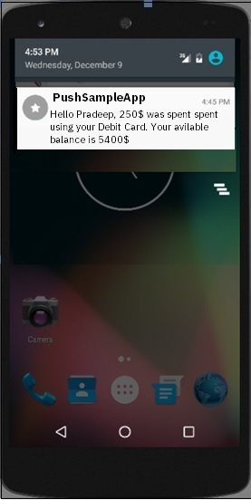

---

copyright:
 years: 2015, 2017

---

{:new_window: target="_blank"}
{:shortdesc: .shortdesc}
{:screen:.screen}
{:codeblock:.codeblock}

# Parametrizar notificaciones
{: #template_based_notifications}
Última actualización: 21 de agosto de 2017
{: .last-updated}

Puede parametrizar y enviar notificaciones personalizadas creando variables y llamándolas en sus plantillas de notificación.

Su plantilla de notificación puede -

 - Combinar elementos estáticos y dinámicos en sus notificaciones
 - Personalizar las notificaciones para cada destinatario añadiendo variables
 - Puede incluir múltiples variables en su notificación 

Pase las variables como objetos JSON en el código de su aplicación durante la inicialización -

    
   ```
    MFPPushNotificationOptions options = new MFPPushNotificationOptions();

    JSONObject tempValue = new JSONObject();
        try {
        
		tempValue.put("username",userName);
        
        tempValue.put("amountSpent",amount);
		
        tempValue.put("currency",currency);
		
        tempValue.put("avilableBalance",balance);
        
		} catch (JSONException e) {
            e.printStackTrace();
        }
        options.setPushVariables(tempValue); 
	   
	   push = MFPPush.getInstance();

       push.initialize(getApplicationContext(),appGuid,clientSecret,options);
   ```
{: codeblock}


Una vez que haya definido las variables, podrán ser invocadas en su plantilla de mensajes.

1. En la consola {{site.data.keyword.mobilepushshort}}, seleccione el separador **Mensajes**.

2. Redacte un mensaje seleccionando la opción **Enviar a**.

2. En el campo **Mensaje**, redacte el mensaje.  Invoque las variables definidas en la plantilla de mensajes. Pulse **Enviar**.


Se enviará el mensaje de notificación personalizado captando los datos de variables -



Nota: Solo se habilita la característica para los usuarios que han elegido el `plan Avanzado`. Seleccione **Plan** en la consola de servicios de {{site.data.keyword.mobilepushshort}} para [actualizar](https://console-tok02-red.cdn.s-bluemix.net/docs/account/change-plan.html#changing).

**Limitaciones:**

 - Actualmente, esta característica no está soportada en Safari
 - Las variables de la plantilla de notificación no pueden funcionar si la app está forzada a salir en iOS. La limitación no tiene control del SDK sino que procede de iOS.


