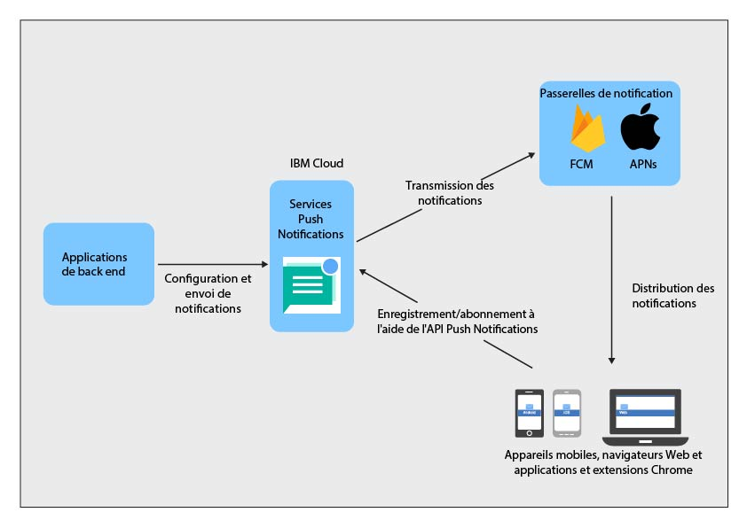

----

copyright:
 years: 2015, 2017

---

{:new_window: target="_blank"}
{:shortdesc: .shortdesc}
{:screen:.screen}
{:codeblock:.codeblock}
{:pre: .pre}
{:tip: .tip}

# A propos des notifications Push 
{: #overview-push}
Dernière mise à jour : 28 septembre 2017
{: .last-updated}

IBM {{site.data.keyword.mobilepushshort}} est un service que vous pouvez utiliser pour envoyer des notifications à des appareils mobiles et à des navigateurs. Les notifications peuvent être ciblées vers tous les utilisateurs d'application ou vers un ensemble spécifique d'utilisateurs et d'appareils à l'aide de balises. Le public visé reçoit une notification pour chaque message que vous soumettez au service.

Vous pouvez utiliser le service {{site.data.keyword.mobilepushshort}} dans le cadre d'un conteneur boilerplate de MobileFirst Services Starter ou dans le cadre des services IBM Cloud [Dedicated](/docs/dedicated/index.html). Vous pouvez également utiliser un SDK (kit de développement de logiciels) et des [API REST ](https://imfpush.{DomainName}/imfpush/){: new_window} pour affiner plus encore le développement de vos applications client.

Le service {{site.data.keyword.mobilepushshort}} est également activé pour [OpenWhisk](/docs/openwhisk/index.html). est un service de traitement distribué et géré par événements, également dénommé plateforme informatique sans serveur. Ceci permet aux développeurs de se concentrer sur l'écriture de la logique d'application et de créer des actions qui sont exécutées à la demande.

## Processus de service
{: #overview_push_process}

Les clients de mobile, de navigateur Web et les applications et extensions Google Chrome peuvent s'abonner et s'enregistrer au service {{site.data.keyword.mobilepushshort}} et s'enregistrer. Au démarrage, les applications client s'enregistrent et s'abonnent elles-mêmes au service {{site.data.keyword.mobilepushshort}}. Les notifications sont diffusées au serveur APNs (Apple Push Notification Service) ou FCM (Firebase Cloud Messaging), puis envoyées à l'appareil mobile, aux clients de navigation ou aux applications et extensions Chrome enregistrés.

### Applications de mobile, de navigateur et applications et extensions Chrome
{: #mobile-applications}

Au démarrage, les applications client s'inscrivent et s'abonnent elles-mêmes au service {{site.data.keyword.mobilepushshort}} pour recevoir des notifications.

### Applications de back end
{: #backend-applications}

Les applications de back end peuvent se trouver sur site ou dans un cloud public. Elles utilisent le service {{site.data.keyword.mobilepushshort}} pour envoyer des notifications en fonction du contexte aux utilisateurs d'applications mobiles, d'applications de navigateur et aux applications et extensions Chrome. Elles n'ont pas besoin d'assurer la maintenance et la gestion des appareils mobiles, des agents de navigateur et des informations utilisateur pour l'envoi des notifications push. Au lieu de cela, les applications peuvent utiliser le service {{site.data.keyword.mobilepushshort}} qui se chargera des ces opérations.

### Propriétaire de l'application de back end
{: #app-backend-owner}

Le propriétaire de l'application de back end crée l'application de back end mobile qui inclut une instance du service {{site.data.keyword.mobilepushshort}}. Il configure et paramètre aussi le service {{site.data.keyword.mobilepushshort}} pour l'adapter aux applications de back end en l'utilisant en même temps que les applications mobiles et les applications de navigateur définies comme cible pour {{site.data.keyword.mobilepushshort}}.

### Service Push Notifications
{: #push-notification-service}

Le service {{site.data.keyword.mobilepushshort}} gère les informations relatives aux appareils mobiles et aux clients de navigateur Web qui sont enregistrés pour les notifications. Avec ce service, les détails de la technologie permettant d'envoyer des notifications à ces plateformes mobiles et de navigateur Web hétérogènes restent transparents pour les applications.

### Passerelles
{: #gateways}

Services de cloud Push Notifications spécifiques aux plateformes, comme FCM ou APNs (Apple Push Notification service), utilisés par le service IBM {{site.data.keyword.mobilepushshort}} pour envoyer des notifications aux applications mobiles et aux applications de navigateur.

## Taille de message
{: #push-message-size}

La taille d'un message de type {{site.data.keyword.mobilepushshort}} dépend des contraintes imposées par les passerelles (FCM, APNS) et les plateformes client. 

- Pour iOS et Safari : pour iOS 8 et ultérieur, la taille maximale autorisée est de 4 kilooctets. Le service APNs n'envoie pas de notifications qui dépassent cette limite.
- Pour Android, le navigateur Firefox ou Chrome, et les applications et extensions Chrome : la taille maximale du contenu de message est limitée à 4 kilooctets.

## Exemples
{: #push-blog}

Des exemples d'application sont disponibles pour [Android](https://github.com/ibm-bluemix-mobile-services/bms-samples-android-hellopush/), [Cordova](https://github.com/ibm-bluemix-mobile-services/bms-samples-cordova-hellopush) et  [iOS](https://github.com/ibm-bluemix-mobile-services/bms-samples-swift-hellopush).
Vous pouvez trouver des informations supplémentaires sur la page du [blogue](http://push-notification-service.mybluemix.net/) du service Push Notifications.  

## Exemple de scénario 
{: #push-scenario}

Le service {{site.data.keyword.mobilepushshort}} est décrit à l'aide de l'exemple de scénario de la banque ACME. La banque ACME est en phase de migration de son architecture informatique existante vers des services IBM Cloud et construit actuellement un service back end mobile
pour les applications servant leurs clients et employés. Ils utilisent le service {{site.data.keyword.mobilepushshort}} pour envoyer des notifications à leurs clients sur leurs transactions bancaires, leur signaler des événements importants, et leur envoyer des rappels.

