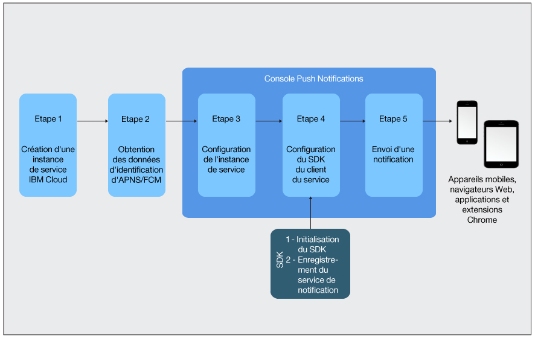

---

copyright:
 years: 2015, 2017

---

{:new_window: target="_blank"}
{:shortdesc: .shortdesc}
{:screen:.screen}
{:codeblock:.codeblock}
{:pre: .pre}
{:tip: .tip}

# Tutoriel Initiation
{: #gettingstartedtemplate}
Dernière mise à jour : 8 septembre 2017
{: .last-updated}

{:shortdesc}

{{site.data.keyword.mobilepushshort}} est disponible en tant que service Catalogue IBM Cloud dans la catégorie Mobile et vous permet d'envoyer et de gérer des notifications push web et mobiles. Une notification push est une alerte signalant une modification ou une mise à jour sur un périphérique mobile ou un navigateur.

Les notifications Push sont un canal de communication universellement accepté entre les entreprises et par un large public. Vous pouvez soumettre ces notifications sous forme de bannière d'alerte à l'écran, voire sur l'écran verrouillé d'un périphérique, fournissant ainsi des informations mises à jour accessibles facilement et rapidement.  

Procédures de base qui vous permettront de démarrer :

1. [Création d'une instance de service IBM Cloud ](/docs/services/mobilepush/push_step_prereq.html)
1. [Obtention de vos données d'identification du fournisseur de notification](/docs/services/mobilepush/push_step_1.html)
1. [Configuration de l'instance de service](/docs/services/mobilepush/push_step_2.html)
1. [Configuration du SDK du client du service push](/docs/services/mobilepush/push_step_3.html)
1. [Envoi d'une notification](/docs/services/mobilepush/push_step_4.html)

L'image ci-dessous illustre le cycle de vie du service Push Notifications.

  

