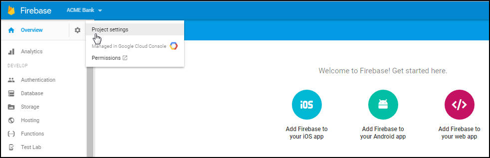

---

copyright:
 years: 2015, 2017

---

{:new_window: target="_blank"}
{:shortdesc: .shortdesc}
{:screen:.screen}
{:codeblock:.codeblock}

# Etape 2 : Obtention de vos données d'identification du fournisseur de notification
{: #push_step_1}
Dernière mise à jour : 27 juin 2017
{: .last-updated}

Pour mettre en place le service {{site.data.keyword.mobilepushshort}}, vous devez obtenir les données d'identification requises auprès de votre fournisseur de notification push. 

## Pour Android
{: #push_step_1_android}

FCM (Firebase Cloud Messaging) est la passerelle utilisée pour remettre des notifications push à des appareils Android , au navigateur Google Chrome et aux applications et extensions Chrome. Pour configurer le service {{site.data.keyword.mobilepushshort}} sur la console, vous devez vous procurer vos données d'identification FCM (ID d'émetteur et clé d'API). 

La clé d'API est stockée de façon sécurisée et utilisée par le service {{site.data.keyword.mobilepushshort}} pour la connexion au serveur FCM. L'ID d'émetteur (numéro de projet) est utilisé par le logiciel SDK Android et le logiciel SDK JS pour Google Chrome et Mozilla Firefox côté client. 

Pour installer FCM et obtenir vos données d'identification, procédez comme suit :

1. Accédez à la [Console Firebase](https://console.firebase.google.com/?pli=1){: new_window}. Un compte utilisateur Google est requis. 
2. Sélectionnez **Ajouter un projet**. 
3. Dans la fenêtre Créer un projet, fournissez un nom de projet, choisissez un pays/région puis cliquez sur **Créer un projet**.
3. Dans le panneau de navigation, sélectionnez **Paramètres** > **Paramètres du projet**.
4. Sélectionnez l'onglet Cloud Messaging pour obtenir vos données d'identification de projet : Clé d'API du serveur et ID d'émetteur. Notez que la clé de serveur listée dans FCM est la même que la clé d'API du serveur.
   
	

Vous devez également générer le fichier `google-services.json`. Exécutez les étapes suivantes :

1. Dans la console Firebase, cliquez sur l'icône **Project Settings**.
    
	

3. Sélectionnez l'icône **ADD APP** ou **Add Firebase to your Android app** dans l'onglet General du panneau Your apps.
    
4. Dans la fenêtre Add Firebase to your Android app, ajoutez **com.ibm.mobilefirstplatform.clientsdk.android.push** en tant que nom du package. La zone App nickname est facultative. Cliquez sur **Ajouter une application**. 
    
	

5. Incluez le nom de package de votre application en l'entrant dans la fenêtre Add Firebase to your Android app. La zone App nickname est facultative. Cliquez sur **REGISTER APP**. 

	

6. Le fichier `google-services.json` est généré. 

Une fois que vous avez obtenu vos données d'identification FCM et généré le fichier `google-services.json`, l'étape suivante consiste à [Créer une instance push](push_step_2.html).

**Remarque **: FCM est la nouvelle version de Google Cloud Messaging (GCM). Prenez soin d'utiliser des données d'identification FCM pour les nouvelles applications. Les appli existantes continueraient à fonctionner avec les configurations GCM.

## Pour iOS
{: #push_step_1_ios}

Pour les appareils et applications iOS, le service APN (Apple Push Notification) permet aux développeurs d'application d'envoyer des notifications à distance depuis une instance de service {{site.data.keyword.mobilepushshort}} sur Bluemix (le fournisseur) vers des appareils et applications iOS. Les messages sont envoyés à une application cible sur l'appareil. 

Vous devez vous procurer et configurer vos données d'identification APN. Les certificats APNS sont gérés de façon sécurisée par le service {{site.data.keyword.mobilepushshort}} et utilisés pour la connexion au serveur APNS en tant que fournisseur.

### Enregistrement d'un ID d'appli
{: #push_step_1_ios_2}

L'ID d'application (l'identificateur de bundle) est un identificateur unique identifiant une application spécifique. Chaque application requiert un ID d'application. Les services tels que le service {{site.data.keyword.mobilepushshort}} sont configurés avec l'ID d'application.

Vérifiez que vous disposez d'un compte [Apple Developers ](https://developer.apple.com/){: new_window}. Ce prérequis est impératif.

2. Accédez au portail [Apple Developer ](https://developer.apple.com){: new_window}, cliquez sur **Member Center**, puis sélectionnez **Certificates, Identifiers & Profiles**.
3. Accédez à la section **Identificateurs** > **ID d'application**.
3. Sur la page **Enregistrement d'ID d'application**, indiquez le nom de l'application dans la zone ID application Description Nom. Par exemple: Notifications ACME Push.
4. Indiquez une chaîne pour le préfixe d'ID d'application.  
4. Pour le suffixe d'ID d'application, sélectionnez **ID d'application explicite** et indiquez une valeur d'ID de bundle. Il est recommandé de fournir un nom de domaine inversé de type chaîne. Par exemple : `com.ACME.push`.
5. Cochez la case **Notifications push** et cliquez sur **Continuer**.
6. Passez en revue vos paramètres, puis cliquez sur **Enregistrement** > **Terminé**.

Votre ID d'application est à présent enregistré. 

   
  

### Création d'un certificat SSL APNS pour le développement et la distribution
{: #push_step_1_ios_3}

Pour pouvoir obtenir un certificat APNS, vous devez d'abord générer une demande de signature de certificat et la soumettre à Apple, l'autorité de certification. La demande de signature de certificat contient des informations qui identifient votre société, ainsi que votre clé publique et votre clé privée que vous utilisez pour signer vos notifications push Apple. Ensuite, générez le certificat SSL dans le portail des développeurs iOS. Le certificat, avec sa clé publique et sa clé privée, est stocké dans Keychain Access.

Vous pouvez utiliser APNS dans deux modes : 

* Mode bac à sable pour le développement et le test.
* Mode production lors de la distribution des applications via l'App Store (ou d'autres mécanismes de distribution d'entreprise).

Vous devez vous procurer des certificats distincts pour vos environnements de développement et de distribution. Les certificats sont associés à un ID d'application pour l'application qui est le destinataire des notifications distantes. Pour la production, vous pouvez créer jusqu'à deux certificats. Bluemix utilise les certificats afin d'établir une connexion SSL à APNS.

<!-- Create a development and distribution SSL certificate. -->

1. Accédez au site Web [Apple Developer ](https://developer.apple.com){: new_window}, cliquez sur **Member Center**, puis sélectionnez **Certificates, Identifiers & Profiles**.
2. Dans la zone **Identifiers**, cliquez sur **App IDs**.
3. Dans leur liste, sélectionnez votre ID d'application, puis **Editer**.
4. Cochez la case **Push Notifications**, puis :
	-  Dans le panneau de certificat Developement SSL, cliquez sur **Create Certificate..**.
	-  Dans le panneau de certificat Production SSL, cliquez sur **Create Certificate..**.

	

5. Quand l'écran **About Creating a Certificate Signing Request (CSR)** s'affiche, démarrez l'application **Keychain Access** sur votre Mac afin de créer une demande de signature de certificat. Cliquez sur **Continue**.
6. Pour l'option de fichier Upload CSR, cliquez sur **Choose File**, puis sélectionnez le fichier `CertificateSigningRequest.certSigningRequest`. 
7. Cliquez sur **Continue**.
8. Sur le panneau Download, Install and Backup, cliquez sur **Download**. Le fichier `aps_development.cer` est téléchargé.
	
		
	
6. Dans le menu, sélectionnez **Keychain Access > Certificate Assistant > Request a Certificate From a Certificate Authority…** 
7. Dans **Certificate Information**, entrez l'adresse électronique qui est associée à votre compte App Developer et un nom usuel. Attribuez un nom significatif qui permet d'identifier s'il s'agit d'un certificat pour le développement (bac à sable) ou pour la distribution (production), _certificat_apns_bacAsable_ ou _certificat_apns_production_, par exemple.
8. Sélectionnez **Save to disk** pour télécharger le fichier `.certSigningRequest` sur votre bureau puis cliquez s ur **Continue**.
9. Dans l'option de menu **Save As**, attribuez un nom au fichier `.certSigningRequest` puis cliquez sur **Save**.
10. Cliquez sur **Done**. A présent, vous possédez une demande de signature de certificat.
11. Revenez à la fenêtre **About Creating a Certificate Signing Request (CSR)** puis cliquez sur **Continue**. 
12. Dans l'écran **Generate**, cliquez sur **Choose File...** et sélectionnez le fichier de demande de signature de certificat que vous avez sauvegardé sur votre bureau. Ensuite, cliquez sur **Generate**.

	
13. Lorsque votre certificat est prêt, cliquez sur **Done**.
14. Sur l'écran **Push Notifications**, cliquez sur **Download** pour télécharger votre certificat, puis cliquez sur **Done**. 
	
	

15. Sur votre Mac, accédez à **Keychain Access > My Certificates** et localisez le certificat que vous venez d'installer. Cliquez deux fois sur le certificat pour l'installer dans Keychain Access.
16. Sélectionnez le certificat et la clé privée puis sélectionnez **Export** pour convertir le certificat au format d'échange d'informations personnelles (format .`.p12`).

	
17. Dans la zone **Save As**, donnez au certificat un nom parlant, `certificat_p12.apns_bacAsable` ou `certificat_p12.apns_production`, par exemple, puis cliquez sur **Save**.
	
	
18. Dans la zone **Enter a password**, entrez un mot de passe pour protéger les éléments exportés, puis cliquez sur **OK**. Vous pouvez utiliser ce mot de passe pour configurer vos paramètres APNS sur la console du service Push Notifications.
	
	
19. **Key Access.app** vous invite à exporter votre clé depuis l'écran **Keychain**. Entrez le mot de passe administrateur pour votre Mac afin de permettre au système d'exporter ces éléments puis sélectionnez l'option **Always Allow**. Un certificat `.p12` est généré sur votre bureau.

### Création d'un profil de mise à disposition pour le développement
{: #create-push-credentials-dev-profile}

Le profil de mise à disposition est utilisé conjointement avec l'ID d'application pour déterminer quels sont les appareils qui peuvent installer et exécuter votre application et quels sont les services auxquels votre application peut accéder. Pour chaque ID d'application, vous créez deux profils de mise à disposition : un pour le développement et un pour la distribution. Xcode utilise le profil de mise à disposition pour le développement afin de déterminer quels sont les développeurs qui sont autorisés à construire l'application et quels sont les appareils qui peuvent être testés avec l'application.

Prenez soin d'enregistrer un ID d'application, de l'activer pour le service {{site.data.keyword.mobilepushshort}} et de le configurer pour utiliser un certificat SSL APNS à des fins de développement et de production.

Créez un profil de mise à disposition pour le développement, comme suit :

1. Accédez au portail [Apple Developer ](https://developer.apple.com){: new_window}, cliquez sur **Member Center**, puis sélectionnez **Certificates, Identifiers & Profiles**.
2. Accédez à la bibliothèque [Mac Developer Library ](https://developer.apple.com/library/mac/documentation/IDEs/Conceptual/AppDistributionGuide/MaintainingProfiles/MaintainingProfiles.html#//apple_ref/doc/uid/TP40012582-CH30-SW62site){: new_window}, défilez jusqu'à la section **Creating Development Provisioning Profiles** et suivez les instructions de création d'un profil de développement.
**Remarque** : Lorsque vous configurez un profil de mise à disposition pour le développement, sélectionnez les options suivantes :
	* **iOS App Development**
	* **For iOS and watchOS apps **

### Création d'un profil de mise à disposition pour la distribution dans un magasin
{: #create-push-credentials-apns-distribute_profile}

Utilisez le profil de mise à disposition dans un magasin afin de soumettre votre application pour la distribution dans l'App Store.

1. Accédez au portail [Apple Developer ](https://developer.apple.com){: new_window}, cliquez sur **Member Center**, puis sélectionnez **Certificates, Identifiers & Profiles**.
2. Cliquez deux fois sur le profil de mise à disposition téléchargé afin de l'installer dans Xcode.

Après l'obtention des données d'identification, l'étape suivante consiste à [Configurer une instance de service](push_step_2.html). 

## Pour les navigateurs Wen et les applications et extensions Chrome
{: #configure-credential-for-browsers}

Le service IBM {{site.data.keyword.mobilepushshort}} étend les capacités d'envoi de notifications à votre application et également aux Applications et extensions Chrome.

L'URL ou le nom de domaine de votre site Web sont requis par le service {{site.data.keyword.mobilepushshort}} pour identifier les demandes devant
être autorisées. 

Par exemple, : `https://www.acmebanks.com`

Une instance de service {{site.data.keyword.mobilepushshort}} ne prend en charge qu'un seul nom de domaine à la fois. Par conséquent,
prenez soin de définir la même valeur pour Chrome, Firefox et Safari. Les navigateurs Chrome et Safari requièrent une configuration supplémentaire pour les notifications push sur le Web. Vous aurez besoin d'une clé d'API
FCM vu qu'un noeud final est utilisé pour distribuer des messages dans Chrome. 

Pour configurer le service pour les navigateurs Chrome, Firefox, et les applications Chrome et extensions, voir [Configuration d'une instance de service](push_step_2.html).

### Configuration pour notification push Web sur Safari 
{: #configure-safari}

La version prise en charge du service {{site.data.keyword.mobilepushshort}} sur Safari est la version 10.0. Vous devez générer un certificat via votre
compte Apple Developer avant de pouvoir configurer votre navigateur pour recevoir des notifications.

#### Génération d'un certificat
{: #certificate-generation}

Assurez-vous que vous disposez d'un compte Développeur Apple. Vous devez enregistrer un ID push du site web et générer un certificat afin de configurer votre navigateur Safari pour la réception des notifications. Les étapes suivantes vous aideront à démarrer.

1. Dans le centre des membres développeurs Apple, cliquez sur **Certificates, ID & Profiles**. 
2. Cliquez sur **Identifiers**, puis sur **Website Push IDs**.
3. Choisissez de créer une nouvelle entrée en sélectionnant l'icône.
  

4. Dans le panneau Register Website Push ID, indiquez une description et un identificateur d'ID Push de site Web appropriés. Il est recommandé d'utiliser un format de nom de domaine inverse, en commençant par `web`. Par exemple : `web.com.acmebanks`.
5. Enregistrez l'ID Push de site Web. Vous disposez à présent de votre ID Push de site Web 
6. Sélectionnez **Editer** pour créer un certificat à utiliser pour l'ID Push de site Web.
7. Dans la fenêtre Certificate Assistant de Certificate Information, indiquez votre ID de courrier électronique et un nom usuel. N'indiquez pas l'adresse de courrier électronique de l'autorité de certification.
8. Cliquez sur **Save to disk** et sélectionnez **Continue**.
9. Choisissez d'enregistrer le certificat dans un dossier approprié.
10. Sélectionnez la demande `.certSigningRequest` créée sur le disque à l'invite par l'assistant de générer le certificat. Prenez soin de télécharger le certificat push de site Web créé au format `.cer`.
11. Ouvrez le certificat dans l'outil KeyChain Access. Cliquez sur le bouton droit de la souris et exportez-le en tant que certificat p12. Notez le mot de passe fourni lors de la génération du certificat p12.

Après la génération d'un certificat, l'étape suivante consiste à [Configurer une instance de service](push_step_2.html).

