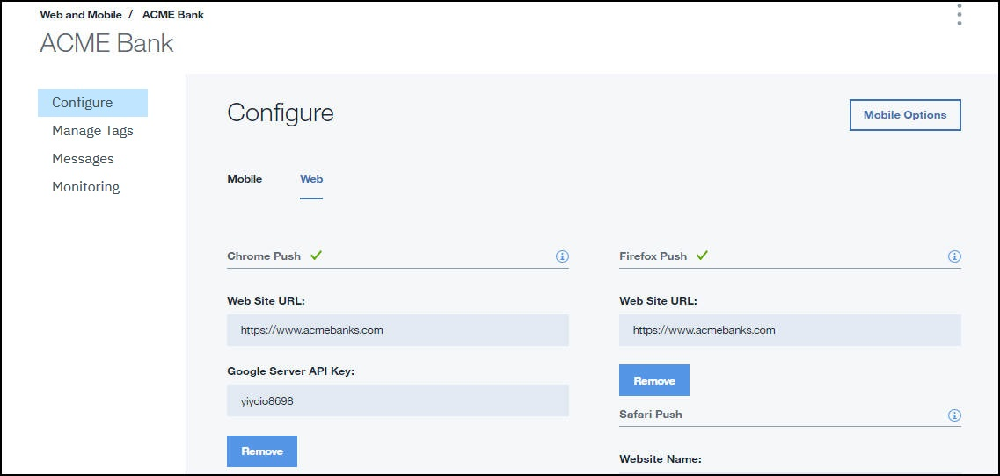

---

copyright:
  years: 2015, 2017, 2019
lastupdated: "2019-06-06"

keywords: push notifications, notifications, service instance, cordova application

subcollection: mobile-pushnotification

---

{:new_window: target="_blank"}
{:shortdesc: .shortdesc}
{:screen:.screen}
{:codeblock:.codeblock}

# Etape 3 : Configuration d'une instance de service 
{: #push_step_2}

Vérifiez que vous avez exécuté la procédure [Obtention de vos données d'identification de notification](/docs/services/mobilepush?topic=mobile-pushnotification-push_step_1).

## Pour Android et applications et extensions Chrome
{: #push_step_2_Android}

Vérifiez que vous avez exécuté la procédure [Obtention des données d'identification de votre fournisseur d'identification](/docs/services/mobilepush?topic=mobile-pushnotification-push_step_1) pour mettre en place le projet FCM et obtenir vos données d'identification.

Pour configurer les données d'identification FCM pour les applications Android et les applications et extensions Google, procédez comme suit :

1. Ouvrez votre catalogue IBM Cloud, puis cliquez sur l'instance de service {{site.data.keyword.mobilepushfull}} que vous avez créée. 
2. Cliquez sur **Gérer ** > **Configurer**. 
3. Sélectionnez l'une des options suivantes : 
	- Pour Android : sélectionnez **Mobile**, puis mettez à jour les données d'identification Push FCM avec l'ID d'émetteur/Numéro de projet et la clé d'API. 
	- Pour applications et extensions Google Chrome : sélectionnez **Web**, puis mettez à jour l'onglet Applications et extensions Chrome avec l'ID d'émetteur/Numéro de projet et la clé d'API. 
4. Cliquez sur **Sauvegarder**. Le service Push Notifications est à présent configuré.

L'étape suivante consiste à [configurer le SDK client du service Push](/docs/services/mobilepush?topic=mobile-pushnotification-push_step_3).

## Pour applications Cordova 
{: #push_step_2_b}

Cordova est une plateforme permettant de construire des applications hybrides avec JavaScript, CSS et HTML. Le service {{site.data.keyword.mobilepushshort}} prend en charge le développement d'applications iOS et Android reposant sur Cordova.

Pour permettre aux applications Cordova de recevoir des notifications push sur vos appareils, accédez au [SDK Push du plug-in Cordova de Push Notifications](https://github.com/ibm-bluemix-mobile-services/bms-clientsdk-cordova-plugin-push/tree/Doc#ios-app).

## Pour applications iOS et le navigateur Safari 
{: #enable-push-ios-notifications}

Pour utiliser le service {{site.data.keyword.mobilepushshort}} pour envoyer des notifications, téléchargez les certificats `.p12` créés lors de l'étape 1 :[ Obtention des données d'identification de votre fournisseur de notification](/docs/services/mobilepush?topic=mobile-pushnotification-push_step_1). Ce certificat contient la clé privée et les certificats SSL requis pour construire et publier votre application. Vous pouvez également utiliser l'API REST pour télécharger un certificat APNS.

**Remarque** : une fois le fichier `.cer` dans votre accès à la chaîne de certificats, exportez-le sur votre ordinateur pour créer un certificat `.p12`.

Pour plus d'information sur l'utilisation du service APNS, reportez-vous au manuel [iOS Developer Library: Local and Push Notification Programming Guide ](https://developer.apple.com/library/content/documentation/NetworkingInternet/Conceptual/RemoteNotificationsPG/APNSOverview.html#//apple_ref/doc/uid/TP40008194-CH8-SW1){: new_window}.

Pour configurer des APN sur la console des services Push Notification, procédez comme suit :

1. Sélectionnez **Configurer** sur la console des services Push Notification.
2. Sélectionnez l'option **Mobile** pour mettre à jour les informations dans le formulaire **Données d'identification push APNS**.
3. Sélectionnez l'une des options suivantes :
	- Pour l'option **Mobile**
		1. Sélectionnez **Bac à sable** (développement) ou  **Production** (distribution) selon le cas et téléchargez le certificat `p.12` que vous avez créé.
		  

		1. Dans la zone **Mot de passe**, entrez le mot de passe qui est associé au fichier de certificat `.p12`, puis cliquez sur **Sauvegarde**.
	- Pour l'option **Web**
		- Dans la section Safari Push, mettez à jour le formulaire avec les informations requises. 
		- **Nom du site web **: nom que vous avez indiqué dans le centre de notification.
		- **ID push du site web **: mettez à jour cette zone avec la chaîne de domaine inverse pour votre ID push de site Web. Par exemple, web.com.acmebanks.www.
		- **URL du site Web **: indiquez l'URL du site Web à abonner pour les notifications push. Par exemple, https://www.acmebanks.com.
		- **Domaines autorisés **: ce paramètre est facultatif. Il s'agit de la liste des sites Web qui réclament une permission de l'utilisateur. Vérifiez que les URL sont des valeurs séparées par des virgules. Notez que la valeur de l'URL de site Web sera utilisée si cette liste n'est pas fournie. 
		- **Chaîne de format de l'URL **: URL à résoudre lors d'un clic sur la notification. Par exemple, ["https://www.acmebanks.com"]. L'URL doit utiliser le schéma http ou https.
		-** Certificat push Web de Safari** : téléchargez le certificat .p12 et indiquez le mot de passe.
4. Cliquez sur **Sauvegarder**.	
	

Après avoir configuré le service pour les applications iOS, vous devez [configurer le SDK du client du service Push](/docs/services/mobilepush?topic=mobile-pushnotification-push_step_3).

## Pour les navigateurs Chrome et Firefox 
{: #push_step2_chromefirefox}

1. Dans la console Notifications Push, sélectionnez **Configurer**.
2. Sélectionnez l'onglet Web.
	
3. Configurez la clé d'API FCM et l'URL de votre site Web qui sera enregistrée pour recevoir les notifications push.
4. Cliquez sur **Sauvegarder**.
5. Une fois que vous avez configuré le service, vous devez configurer le [SDK du client du service Push](/docs/services/mobilepush?topic=mobile-pushnotification-push_step_3).

