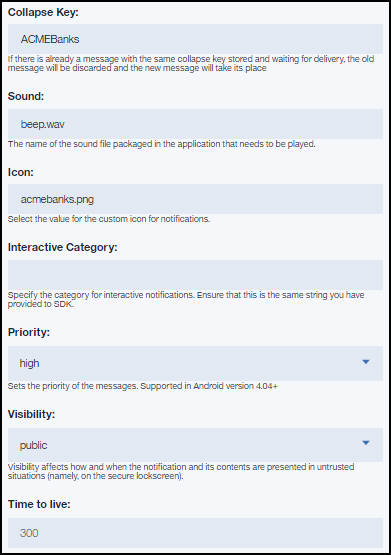

---

copyright:
 years: 2015, 2017

---

{:new_window: target="_blank"}
{:shortdesc: .shortdesc}
{:screen:.screen}
{:codeblock:.codeblock}

# Etape 5 : Envoi d'une notification
{: #push_step_4}
Dernière mise à jour : 27 juin 2017
{: .last-updated}

Une fois que vous avez développé vos applications, vous pouvez envoyer des notifications push de base.

Pour envoyer des notifications push de base, procédez comme suit :

1. Sélectionnez **Envoyer des notifications** et rédigez un message en choisissant une option **Envoyer à**. Les options prises en charge sont **Appareil par étiquette**, **ID de l'appareil**, **ID utilisateur**, **Appareils Android**, **Appareils IOS**, **Notifications Web** et **Tous les appareils**.
**Remarque **: si vous sélectionnez l'option **Tous les appareils**, tous les appareils qui sont abonnés à des notifications de type {{site.data.keyword.mobilepushshort}} recevront les notifications.
	
	

2. Dans la zone **Message**, composez votre message. Configurez les paramètres facultatifs, selon les besoins.
3. Cliquez sur **Envoyer**.
3. Vérifiez que vos appareils ou votre navigateur ont reçu la notification.

La capture d'écran suivante présente une boîte d'alerte relative à une notification push s'exécutant au premier plan sur un appareil Android.
	

La capture d'écran suivante présente une notification push qui s'exécute en arrière-plan sur un appareil Android.
	

## Paramètres Android facultatifs 
{: #push_step_4_Android}

Vous pouvez personnaliser les paramètres de type {{site.data.keyword.mobilepushshort}} pour l'envoi de notifications vers des appareils Android. 

Les options de personnalisation facultatives suivantes sont prises en charge :

- Clé de réduction : des clés de réduction sont attachées aux notifications. Si plusieurs notifications arrivent séquentiellement avec la même clé de réduction quand l'appareil est hors ligne, elles sont réduites. Quand un appareil passe en ligne, il reçoit des notifications du serveur FCM et n'affiche que la dernière notification portant la même clé de réduction. Si aucune clé de réduction n'est définie, les nouveaux et les anciens messages sont stockés pour une distribution future.
- Son : indique le clip audio à exécuter à réception d'une notification. Prend en charge le fichier par défaut ou utilise le nom de la ressource audio intégré dans l'application.
- Icône : spécifie le nom de l'icône à afficher pour la notification. Assurez-vous de bien avoir placé l'icône dans le dossier `res/drawable`, avec l'application client.
- Priorité : spécifie les options d'affectation de la priorité de distribution aux messages. 
	- Une priorité `élevée` ou `maximale` débouche sur une notification avec alerte.
	- Une priorité `faible` ou `par défaut` n'ouvre pas de connexions réseau sur un appareil en sommeil. 
	- Une priorité `min` sera une notification silencieuse.
- Visibilité : vous pouvez choisir de définir l'option de visibilité de notification sur `public` ou `privé`. 
	- L'option `privé` limite l'affichage public ; vous pouvez choisir de l'activer si votre appareil est sécurisé avec un code ou un numéro confidentiel et que le paramètre de notification sélectionné permet de masquer le contenu sensible de la notification. Quand la visibilité est configurée sur `privé`, une zone d'occultation doit être mentionnée. Seul le contenu spécifié dans cette zone apparaîtra sur un écran verrouillé sécurisé sur l'appareil. 
	- L'option `public` permet une lecture libre des notifications.
- Durée de vie : cette valeur est définie en secondes. Si ce paramètre n'est pas spécifié, le serveur FCM stocke le message pendant quatre semaines et tente de le distribuer. La validité expire après quatre semaines. La plage des valeurs possibles va de 0 à 2419200 secondes.
- Délai si inactif : vous pouvez lui attribuer l'une des valeurs suivantes :
	- `True` indique au serveur FCM de ne pas remettre la notification si l'appareil est en veille. 
	- `False` indique de remettre la notification même si l'appareil est en veille.
- Sync : quand cette option est définie à `true`, les notifications figurant sur tous vos appareils enregistrés sont synchronisées. Si l'utilisateur identifié par un nom d'utilisateur qui lui est propre dispose de plusieurs appareils avec la même application installée, la lecture de la notification sur un appareil garantit une suppression des notifications sur les autres appareils. Vous devez vérifier que vous êtes enregistré auprès du service {{site.data.keyword.mobilepushshort}} avec le bon ID utilisateur pour que cette option fonctionne.
- Contenu supplémentaire : spécifie les valeurs de contenu personnalisées pour vos notifications.
- Notification développable : permet aux clients de développer une notification avec des informations supplémentaires tandis qu'une notification de base ne serait visible qu'avec la notification condensée. Les options suivantes sont prises en charge :
	- Notifications avec image de grande taille : vous pouvez indiquer d'inclure une image lorsque la notification est développée. Prenez soin d'inclure un fichier de titre et une URL pour l'image.
	- Notifications avec texte de grande taille : vous pouvez indiquer d'inclure un texte supplémentaire avec un titre. Prenez soin que le message avec texte de grande taille et le texte du titre soient renseignés.
	- Notifications de style boîte de réception : vous pouvez envoyer la notification sous forme de notification de boîte de réception. Indiquez le texte du titre et le contenu du message dans des lignes.	 

## Paramètres iOS facultatifs 
{: #push_step_4_ios}

Vous pouvez personnaliser les paramètres {{site.data.keyword.mobilepushshort}} pour envoi de notifications aux appareils iOS. Les options de personnalisation facultative suivantes sont prises en charge.

- **Badge** : indique le nombre qui s'affiche sur le badge d'application. La valeur par défaut, zéro (0), n'affiche pas de badge. 
- **Son** : indique le clip audio à exécuter à réception d'une notification. Prend en charge le fichier par défaut ou utilise le nom de la ressource audio intégré dans l'application.
- **Contenu supplémentaire** : spécifie les valeurs de contenu personnalisées pour vos notifications.

Vous pouvez également choisir d'activer les [notifications interactives](https://github.com/ibm-bluemix-mobile-services/bms-clientsdk-swift-push/tree/Doc#interactive-notifications) et les [notifications Rich Media (média enrichi)](https://github.com/ibm-bluemix-mobile-services/bms-clientsdk-swift-push/tree/Doc#enabling-rich-media-notifications).

## Suivi des modifications diffusées 
{: #push_step_4_monitor}

Le service {{site.data.keyword.mobilepushshort}} fournit un utilitaire de surveillance destiné à vous aider à vérifier le statut des messages qui sont envoyés. Pour configurer votre utilitaire de surveillance, utilisez l'une des options suivantes :

- [Activation de la surveillance des applications Android](https://github.com/ibm-bluemix-mobile-services/bms-clientsdk-android-push/tree/Doc#monitoring).
- [Activation de la surveillance des applications iOS](https://github.com/ibm-bluemix-mobile-services/bms-clientsdk-swift-push/tree/Doc#enable-monitoring).
