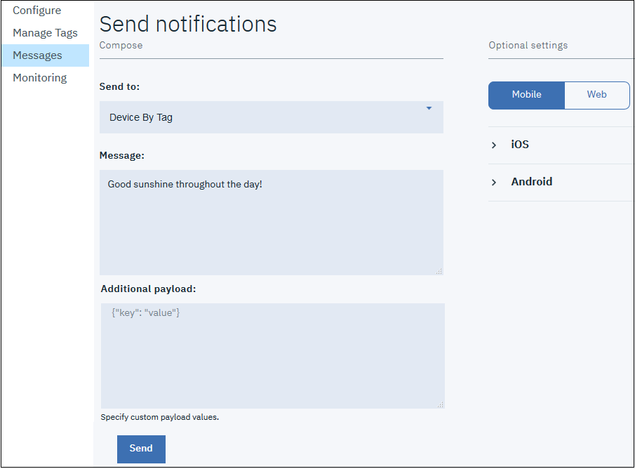

---

copyright:
  years: 2015, 2019
lastupdated: "2019-06-06"

keywords: push notifications, notifications, tag-based, creating tags, managing tags, get tag, subscribe tag

subcollection: mobile-pushnotification

---

{:new_window: target="_blank"}
{:shortdesc: .shortdesc}
{:screen:.screen}
{:codeblock:.codeblock}

# Notifications basées sur les étiquettes
{: #tag_based_notifications}

Les messages de notifications basées sur les étiquettes sont envoyés à tous les appareils abonnés à une étiquette particulière. Elles permettent la segmentation des notifications en fonction de domaines ou de rubriques. Les destinataires des notifications peuvent choisir de ne recevoir les notifications que si elles concernent un sujet ou une rubrique qui les intéresse. Par conséquent, les notifications en fonction d'une étiquette constituent un moyen de segmenter les destinataires. Cette fonction permet de définir des étiquettes, puis d'envoyer et de recevoir des messages en fonction des étiquettes. Un message n'est ciblé que vers les instances d'application client (sur un appareil mobile, un navigateur ou une extension) qui sont abonnées à l'étiquette. Vous devez d'abord créer des étiquettes pour l'application, configurer les abonnements aux étiquettes puis initier les notifications basées sur une étiquette. Pour envoyer une notification basée sur une étiquette qui utilise l'API REST, vérifiez que les éléments "tagNames" sont fournis lors de l'envoi à la ressource de message.

Vous pouvez définir des étiquettes, puis envoyer et recevoir des messages en fonction des étiquettes. Vous devez d'abord créer les étiquettes pour l'application, créer des abonnements, puis initier les
notifications en fonction d'une étiquette. Pour envoyer une notification basée sur les étiquettes à l'aide de l'[API REST](https://eu-gb.imfpush.cloud.ibm.com/imfpush/){: new_window}, vérifiez que les éléments "tagNames" sont fournis lors de l'envoi à la ressource de message.

## Gestion des étiquettes
{: #manage_tags}

Utilisez la console {{site.data.keyword.mobilepushshort}} afin de créer et de supprimer des étiquettes pour votre application, puis d'initier des notifications basées sur des étiquettes. Ces notifications basées sur des étiquettes sont reçues sur les appareils abonnés à ces étiquettes.

### Création d'étiquettes
{: #create_tags}

Les notifications basées sur les étiquettes sont des messages qui sont ciblés vers tous les appareils abonnés à une étiquette
particulière. Chaque appareil peut s'abonner à un nombre illimité d'étiquettes. 

1. Sur la console {{site.data.keyword.mobilepushshort}}, sélectionnez l'onglet **Gérer les étiquettes**.
1. Cliquez sur le bouton + **Créer une étiquette**.   
   1. Dans la zone **Nom**, entrez le nom de l'étiquette. Exemple : "coupons".
   1. Dans la zone **Description**, entrez la description de l'étiquette.
   1. Cliquez sur **Sauvegarder**.

1. Dans la zone **Fragments de code**, sélectionnez la plateforme pour votre application mobile.
1. Modifiez les fragments de code pour traiter les erreurs, puis copiez-les pour chaque étiquette dans votre application mobile.

### Suppression de étiquettes
{: #delete_tags}

1. Dans l'onglet **Etiquette**, sélectionnez l'étiquette que vous voulez supprimer puis cliquez sur l'icône **Supprimer**.
1. Cliquez sur **OK**.

Quand une étiquette est supprimée, les informations qui lui sont associées, y compris ses abonnés et les appareils, sont supprimées. Un désabonnement automatique n'est pas nécessaire car cette étiquette n'existe plus. Aucune autre action supplémentaire n'est nécessaire côté client.

### Edition d'une description d'étiquette
{: #edit_tags}

1. Dans l'onglet **Etiquette**, sélectionnez l'étiquette à éditer.
1. Cliquez sur l'icône **Editer**.
1. Editez la description de l'étiquette, puis cliquez sur le bouton **Sauvegarder**.

## Obtention des étiquettes
{: #get_tags}

Les étiquettes permettent d'envoyer des notifications ciblées aux utilisateurs en fonction de leurs intérêts, à la différence des diffusions
générales qui sont envoyées à toutes les applications. Vous pouvez les créer et les gérer à l'aide de l'onglet Etiquettes de la console {{site.data.keyword.mobilepushshort}} ou utiliser des API REST. Vous pouvez utiliser des fragments de code pour gérer et interroger vos abonnements aux étiquettes pour votre application mobile. Vous pouvez utiliser les fragments de code pour extraire les abonnements, vous abonner ou annuler l'abonnement à une étiquette, ou obtenir la liste des étiquettes disponibles. Copiez ces fragments de code dans votre application mobile.

- Pour Android, voir l'API `getTags` et l'API `getSubscriptions` dans [Push Notification get tags on Android](https://github.com/ibm-bluemix-mobile-services/bms-clientsdk-cordova-plugin-push/tree/Doc#ios-app).

- Pour Cordova, voir l'API `retrieveAvailableTags()` et l'API `retrieveSubscriptions()` dans [Push Notifications get tags on Cordova](https://github.com/ibm-bluemix-mobile-services/bms-clientsdk-cordova-plugin-push/tree/Doc#push-notification-service-tags).

- Pour iOS, voir l'API `retrieveAvailableTagsWithCompletionHandler` dans [Push Notifications get tags on Swift](https://github.com/ibm-bluemix-mobile-services/bms-clientsdk-swift-push/tree/Doc#retrieve-tags).

- Pour les navigateurs Web, voir l'API `retrieveAvailableTags()` dans [Push Notifications get tag on web browsers](https://github.com/ibm-bluemix-mobile-services/bms-clientsdk-javascript-webpush/blob/Doc/README.md#push-notification-service-tags).

## Abonnement à des étiquettes
{: #Subscribe_tags}

Utilisez l'API suivante pour permettre à vos appareils d'extraire des étiquettes, de s'abonner à des étiquettes, d'extraire la liste des abonnements et d'annuler l'abonnement à une étiquette.

- Pour Android, utilisez les API `getTags`, `subscribe`, `getSubscriptions` et `unsubscribeFromTags`. Voir [Push Notifications subscribe tags for Android](https://github.com/ibm-bluemix-mobile-services/bms-clientsdk-android-push/tree/Doc#push-notification-service-tags).

- Pour Cordova, utilisez les API `retrieveAvailableTags()`, `subscribe()`, `retrieveSubscriptions()` et `unsubscribe()`. Voir [Push Notifications subscribe tags for Cordova](https://github.com/ibm-bluemix-mobile-services/bms-clientsdk-cordova-plugin-push/tree/Doc#push-notification-service-tags).

- Pour iOS, utilisez les API `retrieveAvailableTagsWithCompletionHandler`, `subscribeToTags`, `retrieveSubscriptionsWithCompletionHandler` et `unsubscribeFromTags`. Voir [Push Notifications subscribe tags for Swift](https://github.com/ibm-bluemix-mobile-services/bms-clientsdk-swift-push/tree/Doc#push-notification-service-tags).

- Pour les navigateurs Web, utilisez les API `retrieveAvailableTags()`, `subscribe()`, `retrieveSubscriptions()` et `unSubscribe()`. Voir [Push Notifications subscribe tags for web browsers](https://github.com/ibm-bluemix-mobile-services/bms-clientsdk-javascript-webpush/blob/Doc/README.md#push-notification-service-tags).

## Utilisation de notifications basées sur les étiquettes
{: #using_tags}

Les messages de notifications basées sur les étiquettes sont envoyés à tous les appareils abonnés à une étiquette particulière. Chaque appareil peut s'abonner à un nombre illimité d'étiquettes. Cette rubrique explique comment envoyer des notifications basées sur des étiquettes. Les abonnements sont gérés par l'instance de service IBM Cloud {{site.data.keyword.mobilepushshort}}. Quand une étiquette est supprimée, toutes les informations qui lui sont associées, y compris ses abonnés et appareils, sont supprimées. Aucun désabonnement automatique n'est requis pour cette étiquette car elle n'existe plus et aucune action supplémentaire n'est requise depuis le côté client.

Créez des étiquettes sur l'écran **Etiquette**. Pour plus d'informations sur la création d'étiquettes,
voir [Création d'étiquettes](/docs/services/mobilepush?topic=mobile-pushnotification-tag_based_notifications#create_tags).

1. Dans la console **Push Notification**, cliquez sur **Messages**.
2. Sélectionnez l'option **Appareil par étiquette** dans la liste déroulante **Envoyer à**.
3. Recherchez les étiquettes que vous voulez utiliser et sélectionnez-les.

4. Dans la zone **Texte du message**, entrez le texte qui sera envoyé en tant que notification aux destinataires abonnés.
5. Cliquez sur **Envoyer**.

