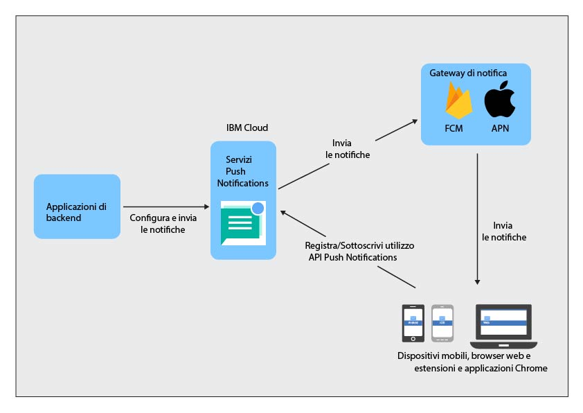

----

copyright:
 years: 2015, 2017

---

{:new_window: target="_blank"}
{:shortdesc: .shortdesc}
{:screen:.screen}
{:codeblock:.codeblock}
{:pre: .pre}
{:tip: .tip}

# Informazioni su Push Notifications 
{: #overview-push}
Ultimo aggiornamento: 22 giugno 2017
{: .last-updated}

IBM {{site.data.keyword.mobilepushshort}} è un servizio che puoi utilizzare per inviare notifiche a dispositivi mobili e browser. Le notifiche possono essere destinate a tutti gli utenti dell'applicazione oppure a uno specifico insieme di utenti e dispositivi facendo uso delle tag. Per ogni messaggio che invii al servizio, i destinatari previsti ricevono una notifica.

Puoi scegliere di utilizzare il servizio {{site.data.keyword.mobilepushshort}} come parte del contenitore tipo MobileFirst Services Starter o come [Servizi dedicati](/docs/dedicated/index.html) Bluemix.  Puoi anche utilizzare un SDK (software development kit) e delle [API REST](https://mobile.{DomainName}/imfpush/ "icona link esterno"){: new_window} per sviluppare ulteriormente le tue applicazioni client.

Il servizio {{site.data.keyword.mobilepushshort}} è abilitato anche per [OpenWhisk](/docs/openwhisk/index.html). OpenWhisk è un servizio di calcolo distribuito guidato dagli eventi conosciuto anche come elaborazione senza server. Questo consente agli sviluppatori di concentrarsi sulla scrittura della logica dell'applicazione e sul creare azioni eseguite su richiesta.

## Processi del servizio
{: #overview_push_process}

I client browser web, mobili e le estensioni e le applicazioni Google Chrome possono sottoscriversi e registrarsi per il servizio {{site.data.keyword.mobilepushshort}}. All'avvio, le applicazioni client si registrano al servizio {{site.data.keyword.mobilepushshort}} e lo sottoscrivono. Le notifiche vengono spedite al servizio APNS (Apple Push Notification Service) o al server FCM (Firebase Cloud Messaging) e inviate quindi al dispositivo mobile, ai client browser o alle estensioni e applicazioni Chrome.

### Applicazioni browser, mobili e estensioni e applicazioni Chrome
{: #mobile-applications}

All'avvio, le applicazioni client si registrano al servizio {{site.data.keyword.mobilepushshort}} e lo sottoscrivono per ricevere notifiche.

### Applicazioni di backend
{: #backend-applications}

Le applicazioni di backend possono essere in loco o in un cloud pubblico. Le applicazioni di backend utilizzeranno il servizio {{site.data.keyword.mobilepushshort}} per inviare notifiche sensibili all'applicazione browser, mobile e agli utenti delle estensioni e applicazioni Chrome. Le applicazioni di backend non devono necessariamente conservare e gestire informazioni sugli utenti, sugli agent browser e sui dispositivi mobili per inviare notifiche di push. Invece, le applicazioni di backend possono utilizzare il servizio {{site.data.keyword.mobilepushshort}} che le gestisce e mantiene.

### Proprietario backend applicazione
{: #app-backend-owner}

Il proprietario del backend dell'applicazione crea l'applicazione di back-end mobile che aggrega un'istanza al servizio {{site.data.keyword.mobilepushshort}}. Il proprietario del backend dell'applicazione configurare inoltre il servizio {{site.data.keyword.mobilepushshort}} in modo che le applicazioni di backend utilizzino il servizio con le applicazioni mobili e browser destinate a {{site.data.keyword.mobilepushshort}}.

### Servizio Push Notifications 
{: #push-notification-service}

Il servizio {{site.data.keyword.mobilepushshort}} gestisce tutte le informazioni relative ai dispositivi mobili e ai client browser web registrati per le notifiche. Il servizio fornisce alle tue applicazioni la trasparenza dei dettagli di tecnologia relativi all'invio di notifiche a queste eterogenee piattaforme mobili e browser web, gestendo tutto questo internamente.

### Gateway
{: #gateways}

Servizi cloud specifici per piattaforme quali FCM/GCM o APNS (Apple Push Notification Service) utilizzati dal servizio {{site.data.keyword.mobilepushshort}} IBM per inviare notifiche alle applicazioni mobili e browser.

### Sicurezza
{: #push-security}

Le API {{site.data.keyword.mobilepushshort}} sono protette da due tipi di segreti:

- **appSecret**: l'`appSecret` protegge le API normalmente richiamate dalle applicazioni di backend, come l'API per inviare {{site.data.keyword.mobilepushshort}} e l'API per configurare le impostazioni.
- **clientSecret**:  il `clientSecret` protegge le API normalmente richiamate dalle applicazioni client mobili. C'è solo una API correlata alla registrazione di un dispositivo con un ID utente associato che richiede questo `clientSecret`. Nessuna delle altre API richiamate dai client mobili richiede il `clientSecret`. 

L'`appSecret` e il `clientSecret` vengono assegnati a ogni istanza del servizio al momento del bind di un'applicazione al servizio {{site.data.keyword.mobilepushshort}}. Fai riferimento alla documentazione [API REST ](https://mobile.{DomainName}/imfpush/ "Icona link esterno") per informazioni su come i segreti vengono trasmessi e a quale API.

**Nota**: sono necessarie le precedenti applicazioni per trasmettere il clientSecret solo quando viene seguita la registrazione o l'aggiornamento dei dispositivi con il campo userID. Tutte le altre API richiamate dai client mobili e browser non richiedono il clientSecret. Queste vecchie applicazioni possono continuare ad utilizzare il clientSecret facoltativamente per le registrazioni del dispositivo o per l'aggiornamento delle chiamate. Tuttavia, è fortemente raccomandato che il controllo clientSecret venga applicato a tutte le chiamate API client. Per applicarlo alle applicazioni esistenti, è stata pubblicata una nuova API denominata `verifyClientSecret`.  Per le nuove applicazioni, il controllo clientSecret sarà imposto per tutte le chiamate API client e questo comportamento non può essere modificato con l'API `verfiyClientSecret`.

Per impostazione predefinita, la verifica del segreto client viene forzata solo nelle nuove applicazioni. Alle applicazioni nuove e esistenti è consentito abilitare o disabilitare la verifica del segreto client utilizzando l'API REST verifyClientSecret. Ti raccomandiamo di forzare la verifica del segreto client per evitare l'esposizione dei dispositivi agli utenti che possono conoscere il applicationId e il deviceId.

Assicurati che il `clientSecret` sia mantenuto riservato e che non venga mai impostato come hard-coded nell'applicazione mobile. Esistono vari modelli di inizializzazione dell'applicazione che possono essere utilizzati per estrarre dinamicamente il `clientSecret` durante il runtime delle applicazioni. Il diagramma della sequenza illustra il possibile modello.
 

## Dimensione messaggio
{: #push-message-size}

La dimensione del payload del messaggio di {{site.data.keyword.mobilepushshort}} dipende dai vincoli disposti dai gateway (FCM/GCM, APNs) e dalle piattaforme client. 

- Per iOS e Safari: per iOS 8 e successivi, la dimensione massima consentita è 2 kilobyte. Le APNs non inviano notifiche che superano questo limite.
- Per Android, i browser Firefox e Chrome e le estensioni e applicazioni Chrome: esiste una limitazione di 4 kilobyte come massimo consentito per la dimensione del payload del messaggio.

## Esempi
{: #push-blog}

Le applicazioni di esempio sono disponibili per [Android](https://github.com/ibm-bluemix-mobile-services/bms-samples-android-hellopush/), [Cordova](https://github.com/ibm-bluemix-mobile-services/bms-samples-cordova-hellopush) e [iOS](https://github.com/ibm-bluemix-mobile-services/bms-samples-swift-hellopush).
Puoi inoltre trovare ulteriori informazioni sul servizio Push Notifications alla pagina [Blog](http://push-notification-service.mybluemix.net/).  

## Scenario di esempio 
{: #push-scenario}

Il servizio {{site.data.keyword.mobilepushshort}} viene illustrato utilizzando lo scenario di esempio della banca ACME. La banca ACME è nella fase di spostare la propria infrastruttura IT legacy ai servizi IBM e al momento sta creando un backend mobile per i propri clienti e le proprie applicazioni dei dipendenti. Utilizzano il servizio {{site.data.keyword.mobilepushshort}} per inviare una notifica ai propri clienti sulle transazioni bancarie e su altri eventi e promemoria importanti.

