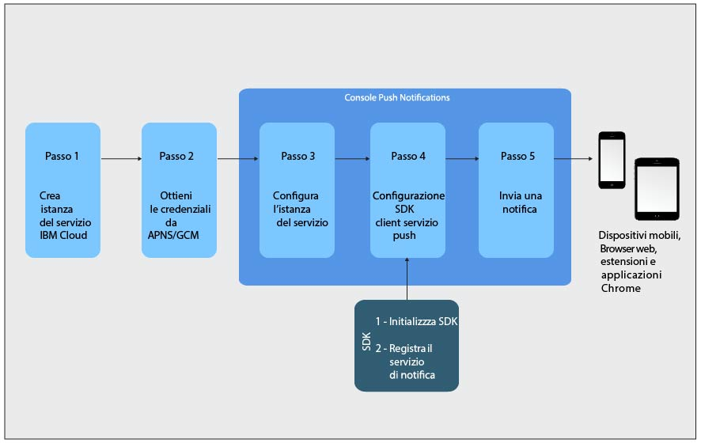

---

copyright:
years: 2015, 2017

---

{:new_window: target="_blank"}
{:shortdesc: .shortdesc}
{:screen:.screen}
{:codeblock:.codeblock}
{:pre: .pre}
{:tip: .tip}

# Esercitazione introduttiva
{: #gettingstartedtemplate}
Ultimo aggiornamento: 8 settembre 2017
{: .last-updated}

{:shortdesc}

{{site.data.keyword.mobilepushshort}} è disponibile come servizio del Catalogo Bluemix nella categoria Mobile e ti consente di inviare e gestire le notifiche di push mobili e web. Una notifica push è un avviso che indica una modifica o un aggiornamento di un browser o un dispositivo mobile.

Le notifiche push sono il canale di comunicazione universalmente accettato tra le aziende o da un ampio spettro di destinatari. Puoi inviare queste notifiche come un avviso banner sullo schermo o a una schermata di blocco di un dispositivo, fornendo quindi informazioni aggiornate che sono accessibili facilmente e velocemente.  

Passi di base introduttivi:

1. [Crea un'istanza del servizio Bluemix](/docs/services/mobilepush/push_step_prereq.html)
1. [Ottieni le tue credenziali del provider della notifica](/docs/services/mobilepush/push_step_1.html)
1. [Configura l'istanza del servizio](/docs/services/mobilepush/push_step_2.html)
1. [Configura la SDK client del servizio Push](/docs/services/mobilepush/push_step_3.html)
1. [Invia una notifica](/docs/services/mobilepush/push_step_4.html)

La seguente immagine ti fornisce una panoramica del ciclo di vita del servizio Push Notifications.

  

