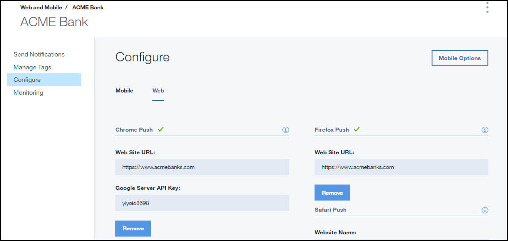

---

copyright:
years: 2015, 2017

---

{:new_window: target="_blank"}
{:shortdesc: .shortdesc}
{:screen:.screen}
{:codeblock:.codeblock}

# Passo 3: configura un'istanza del servizio  
{: #push_step_2}
Ultimo aggiornamento: 27 giugno 2017
{: .last-updated}

Assicurati di aver consultato [Ottieni le tue credenziali di notifica](push_step_1.html).

## Per le estensioni e applicazioni Chrome e Android
{: #push_step_2_Android}

Assicurati di aver consultato [Ottieni le tue credenziali del provider della notifica](push_step_1.html) per configurare il progetto FCM e ottenere le tue credenziali.

Per configurare le credenziali FCM per le applicazioni Android e per le estensioni e applicazioni Chrome, completa le seguenti istruzioni:

1. Apri il tuo catalogo IBM Cloud e fai quindi clic sull'istanza del servizio {{site.data.keyword.mobilepushfull}} che hai creato. 
2. Fai clic su **Manage** > **Configure**. 
3. Scegli una delle seguenti opzioni: 
	- Per Android: seleziona **Mobile** e quindi aggiorna la scheda delle credenziali push GCM/FCM con l'ID mittente/Numero progetto e la chiave API. 
	- Per le estensioni e applicazioni Google Chrome: seleziona **Web** e quindi aggiorna la scheda delle estensioni e applicazioni Chrome con l'ID mittente/Numero progetto e la chiave API. 
4. Fai clic su **Save**. Il servizio Push Notifications è ora configurato.

Il tuo prossimo passo è di [configurare l'SDK client del servizio Push](push_step_3.html).

## Per le applicazioni Cordova 
{: #push_step_2_b}

Cordova è una piattaforma per creare applicazioni ibride con JavaScript, CSS e HTML. Il servizio {{site.data.keyword.mobilepushshort}} supporta lo sviluppo di applicazioni Android e iOS basate su Cordova.

Per abilitare le applicazioni Cordova alla ricezione delle notifiche push per i tuoi dispositivi, utilizza [Push Notifications Cordova Plugin Push SDK](https://github.com/ibm-bluemix-mobile-services/bms-clientsdk-cordova-plugin-push/tree/Doc#ios-app).

## Per le applicazioni iOS e il browser Safari 
{: #enable-push-ios-notifications}

Per utilizzare il servizio {{site.data.keyword.mobilepushshort}} per inviare notifiche, carica i certificati `.p12` che hai creato nel passo 1:[Ottieni le tue credenziali del provider della notifica](push_step_1.html). Questo certificato contiene la chiave privata e SSL richiesti per creare e pubblicare la tua applicazione. Puoi inoltre utilizzare l'API REST per caricare un certificato APNS.

**Nota**: dopo che il file `.cer` è presente nel tuo accesso alla catena di chiavi, eseguine l'esportazione sul tuo computer per creare un certificato `.p12`.

Per ulteriori informazioni sull'utilizzo di APNs, vedi [iOS Developer Library: Local and Push Notification Programming Guide ](https://developer.apple.com/library/ios/documentation/NetworkingInternet/Conceptual/RemoteNotificationsPG/Chapters/ProvisioningDevelopment.html#//apple_ref/doc/uid/TP40008194-CH104-SW4){: new_window}.

Per configurare APNS sulla console dei servizi Push Notification, completa la procedura:

1. Seleziona **Configure** nella console dei servizi Push Notification.
2. Scegli l'opzione **Mobile** per aggiornare le informazioni nel formato **APNs Push Credentials**.
3. Scegli una delle seguenti opzioni:
	- Per l'opzione **Mobile**
		1. Seleziona **Sandbox** (sviluppo) o **Production** (distribuzione) come appropriato e quindi carica il certificato `p.12` che hai creato.
		  

		1. Nel campo **Password**, immetti la password associata al file di certificato `.p12` e quindi fai clic su **Save**.
	- Per l'opzione **Web**
		- Nella sezione Safari Push, aggiorna il modulo con le informazioni richieste. 
		- **Website Name**: il nome che hai fornito nel centro di notifica.
		- **Website Push ID**: aggiorna con la stringa a dominiio inverso per il tuo ID push sito web. Ad esempio, web.com.acmebanks.www.
		- **Website URL**: fornisci l'URL del sito web da sottoscrivere alle notifiche di push. Ad esempio, https://www.acmebanks.com.
		- **Allowed Domains**: parametro facoltativo. Indica l'elenco di siti web che richiedono l'autorizzazione dall'utente. Assicurati che gli URL siano valori separati da virgola. Se non si fornisce questo valore, verrà utilizzato quello specificato in Website URL. 
		- **URL Format String**: l'URL da risolvere quando si fa clic sulla notifica. Ad esempio, ["https://www.acmebanks.com"]. Assicurati che l'URL utilizzi lo schema http o https.
		-**Safari web push certificate**: carica il certificato .p12 e fornisci la password.
4. Fai clic su **Save**.	
	

Dopo aver configurato il servizio per le applicazioni iOS, devi [Configurare l'SDK client del servizio Push](push_step_3.html).

## Per i browser Chrome e Firefox 
{: #push_step2_chromefirefox}

1. Nella console di Push Notifications, seleziona **Configure**.
2. Seleziona la scheda Web.
	
3. Configura la chiave API FCM/GCM e l'URL del tuo sito web che sarà registrato per ricevere le notifiche push.
4. Fai clic su **Save**.
5. Dopo aver configurato il servizio, devi [Configurare l'SDK client del servizio Push](push_step_3.html).
