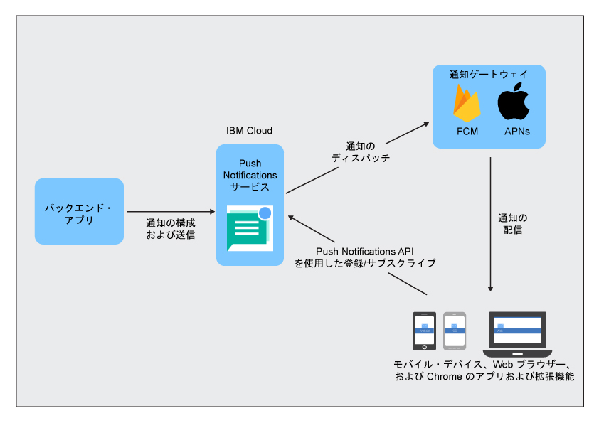

----

copyright:
 years: 2015, 2017

---

{:new_window: target="_blank"}
{:shortdesc: .shortdesc}
{:screen:.screen}
{:codeblock:.codeblock}
{:pre: .pre}
{:tip: .tip}

# Push Notifications 概要 
{: #overview-push}
最終更新日; 2017 年 9 月 28 日
{: .last-updated}

IBM {{site.data.keyword.mobilepushshort}} は、モバイル・デバイスおよびブラウザーに通知を送信するために使用できるサービスです。 通知は、すべてのアプリケーション・ユーザーをターゲットとすることも、タグを使用して特定のユーザーおよびデバイスの集合をターゲットとすることもできます。 このサービスにサブミットするメッセージごとに、対象者は通知を受け取ります。

MobileFirst Services Starter ボイラープレートの一部として、または IBM Cloud [Dedicated Services](/docs/dedicated/index.html) として {{site.data.keyword.mobilepushshort}} サービスを使用することを選択できます。また、SDK (Software Development Kit) と [REST API ](https://imfpush.{DomainName}/imfpush/){: new_window}を使用して、クライアント・アプリケーションをさらに開発することもできます。

{{site.data.keyword.mobilepushshort}} サービスは、[OpenWhisk](/docs/openwhisk/index.html) にも対応します。 OpenWhisk は、サーバーレス・コンピューティングとも呼ばれる、イベント駆動型の分散コンピュート・サービスです。 これにより、開発者は、アプリケーション・ロジックの開発と、オンデマンドで実行されるアクションの作成に専念できます。

## サービスのプロセス
{: #overview_push_process}

モバイル・クライアント、Web ブラウザー・クライアント、Google Chrome のアプリケーションおよび拡張機能は、{{site.data.keyword.mobilepushshort}} サービス用にサブスクライブおよび登録することができます。 クライアント・アプリケーションは、開始時に、{{site.data.keyword.mobilepushshort}}サービスにそれ自体を登録およびサブスクライブします。 通知は、Apple Push Notification Service (APNs) または Firebase Cloud Messaging (FCM) サーバーにディスパッチされ、その後、登録済みのモバイル・デバイス・クライアント、ブラウザー・クライアント、または、Chrome のアプリケーションおよび拡張機能に送信されます。

### モバイル・アプリケーション、ブラウザー・アプリケーション、Chrome のアプリケーションおよび拡張機能
{: #mobile-applications}

クライアント・アプリケーションは、通知を受け取るために、開始時に {{site.data.keyword.mobilepushshort}} サービスにそれぞれを登録してサブスクライブします。

### バックエンド・アプリケーション
{: #backend-applications}

バックエンド・アプリケーションは、オンプレミスまたはパブリック・クラウドに位置することができます。 バックエンド・アプリケーションは、{{site.data.keyword.mobilepushshort}} サービスを使用して、コンテキストに依存した通知を、モバイル・アプリケーション、ブラウザー・アプリケーション、および Chrome のアプリケーションおよび拡張機能のユーザーに送信します。 バックエンド・アプリケーションは、プッシュ通知を送信するためにモバイル・デバイス、ブラウザー・エージェント、およびユーザーに関する情報を維持し管理する必要はありません。 代わりに、バックエンド・アプリケーションは、それらを管理および維持する{{site.data.keyword.mobilepushshort}}サービスを使用することができます。

### アプリ・バックエンド所有者
{: #app-backend-owner}

アプリ・バックエンド所有者は、{{site.data.keyword.mobilepushshort}}サービスのインスタンスをバンドルするモバイル・バックエンド・アプリケーションを作成します。 また、アプリ・バックエンド所有者は、{{site.data.keyword.mobilepushshort}}サービスとこのサービスのターゲットとなるモバイル・アプリケーションおよびブラウザー・アプリケーションとを使用するバックエンド・アプリケーションに合うように、{{site.data.keyword.mobilepushshort}}サービスの構成とセットアップも行います。

### Push Notifications サービス
{: #push-notification-service}

{{site.data.keyword.mobilepushshort}}サービスは、通知用に登録されたモバイル・デバイスと Web ブラウザー・クライアントに関するすべての情報を管理します。 このサービスは、異機種のモバイル・プラットフォームおよび Web ブラウザー・プラットフォームに通知を送信するテクノロジー詳細がアプリケーションに透過的になるようにし、サービス内部でそのすべてを処理します。

### ゲートウェイ
{: #gateways}

モバイル・アプリケーションやブラウザー・アプリケーションに通知をディスパッチするために IBM {{site.data.keyword.mobilepushshort}} サービスが使用する、FCM または Apple Push Notification Service (APNs) などのプラットフォーム固有のプッシュ通知クラウド・サービス。

## メッセージのサイズ
{: #push-message-size}

{{site.data.keyword.mobilepushshort}} のメッセージ・ペイロード・サイズは、ゲートウェイ (FCM、APNs) およびクライアント・プラットフォームによって課せられる制約によって決まります。 

- iOS および Safari: iOS 8 以降では、許容される最大サイズは 4 キロバイトです。 APNs は、この制限を超える通知を送信しません。
- Android、Firefox ブラウザー、Chrome ブラウザー、Chrome のアプリケーションおよび拡張機能: メッセージ・ペイロードの許容される最大サイズとして、4 キロバイトの制限があります。

## サンプル
{: #push-blog}

[Android](https://github.com/ibm-bluemix-mobile-services/bms-samples-android-hellopush/)、[Cordova](https://github.com/ibm-bluemix-mobile-services/bms-samples-cordova-hellopush)、および [iOS](https://github.com/ibm-bluemix-mobile-services/bms-samples-swift-hellopush) 用のサンプル・アプリケーションがあります。
Push Notifications サービスの[ブログ](http://push-notification-service.mybluemix.net/)のページで詳細情報を参照することもできます。  

## サンプル・シナリオ 
{: #push-scenario}

ACME 銀行のサンプル・シナリオで {{site.data.keyword.mobilepushshort}} サービスが説明されています。 ACME 銀行は、既存の IT インフラストラクチャーから IBM Cloud サービスへの移行段階にあり、現在は顧客および従業員向けのアプリケーション用のモバイル・バックエンドを構築しているところです。銀行取引およびその他の重要なイベントやお知らせに関して顧客に通知を送信するために、{{site.data.keyword.mobilepushshort}} サービスを使用しようとしています。

