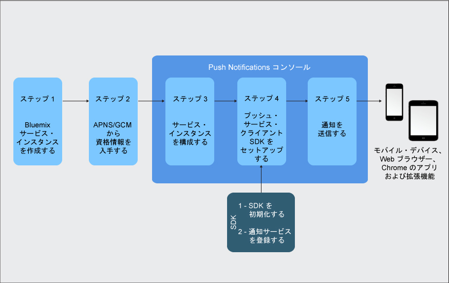

---

copyright:
  years: 2015, 2017, 2018, 2019
lastupdated: "2019-06-06"

keywords: push notifications, ibm cloud catalog, push service client sdk, notification provider

subcollection: mobile-pushnotification

---

{:new_window: target="_blank"}
{:shortdesc: .shortdesc}
{:screen:.screen}
{:codeblock:.codeblock}
{:pre: .pre}
{:tip: .tip}

# 入門チュートリアル
{: #getting-started}

{{site.data.keyword.mobilepushshort}} は、モバイル・カテゴリー内の IBM Cloud カタログ・サービスとして使用可能であり、モバイルおよび Web のプッシュ通知の送信と管理を可能にします。 プッシュ通知とは、モバイル・デバイスまたはブラウザーでの変更または更新を指示するアラートです。
{:shortdesc}

プッシュ通知は、企業間または広範囲の対象者向けに一般に広く受け入れられている通信チャネルです。 これらの通知をスクリーン内のバナー・アラートとして配信したり、デバイスのロックされた画面に配信したりでき、そうすることで迅速かつ簡単にアクセス可能な情報更新を提供できます。  

入門のための基本的な手順は次のとおりです。

1. [IBM Cloud サービス・インスタンスを作成する](/docs/services/mobilepush?topic=mobile-pushnotification-push_step_1a)
2. [通知プロバイダー資格情報の入手](/docs/services/mobilepush?topic=mobile-pushnotification-push_step_1)
3. [サービス・インスタンスを構成する](/docs/services/mobilepush?topic=mobile-pushnotification-push_step_2)
4. [プッシュ・サービス・クライアント SDK のセットアップ](/docs/services/mobilepush?topic=mobile-pushnotification-push_step_3)
5. [通知を
送信する](/docs/services/mobilepush?topic=mobile-pushnotification-push_step_4)

次の図は、Push Notifications サービスのライフサイクルの概要を示します。

