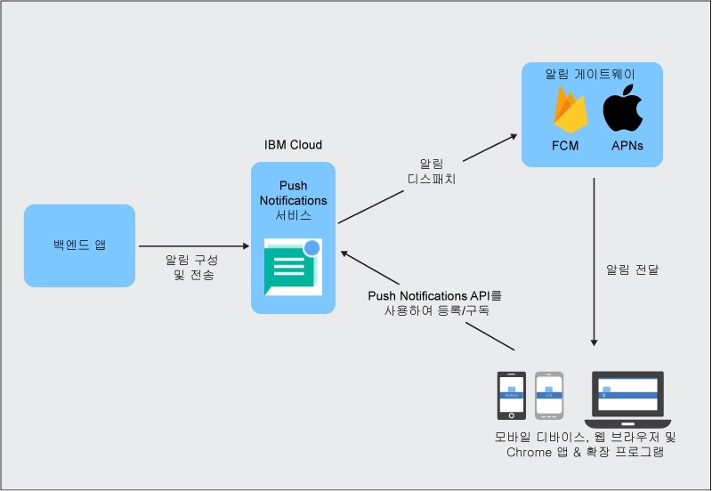

----

copyright:
 years: 2015, 2017

---

{:new_window: target="_blank"}
{:shortdesc: .shortdesc}
{:screen:.screen}
{:codeblock:.codeblock}
{:pre: .pre}
{:tip: .tip}

# Push Notifications 정보 
{: #overview-push}
마지막 업데이트 날짜: 2017년 9월 28일
{: .last-updated}

IBM {{site.data.keyword.mobilepushshort}}는 모바일 디바이스와 브라우저에 알림을 전송하는 데 사용할 수 있는 서비스입니다. 알림은 모든 애플리케이션 사용자와 태그를 사용하는 특정 디바이스 및 사용자 세트를 대상으로 할 수 있습니다. 서비스에 제출하는 모든 메시지의 경우, 대상이 되는 청취자는 알림을 수신합니다.

{{site.data.keyword.mobilepushshort}} 서비스를 MobileFirst Services Starter 표준 유형의 일부 또는 IBM Cloud [데디케이티드 서비스](/docs/dedicated/index.html)로서 사용하도록 선택할 수 있습니다. 또한 SDK(Software Development Kit) 및 [REST API ](https://mobile.{DomainName}/imfpush/){: new_window}를 사용하여 클라이언트 애플리케이션을 추가로 개발할 수 있습니다.

{{site.data.keyword.mobilepushshort}} 서비스도 [OpenWhisk](/docs/openwhisk/index.html)에 사용할 수 있습니다. OpenWhisk는 서버 없는 컴퓨팅으로도 알려져 있는 분산된, 이벤트 중심 컴퓨팅 서비스입니다. 이는 개발자들이 애플리케이션 로직 작성에 초점을 맞추고 요청 시 실행되는 조치를 작성할 수 있도록 합니다.

## 서버 프로세스
{: #overview_push_process}

모바일, 웹 브라우저 클라이언트, Google Chrome 앱 & 확장 프로그램은 {{site.data.keyword.mobilepushshort}} 서비스를 구독하고 등록할 수 있습니다. 시작 시 클라이언트 애플리케이션은 {{site.data.keyword.mobilepushshort}} 서비스에 등록하고 구독을 신청합니다. 알림은 APN(Apple Push Notification) 서비스 또는 FCM(Firebase Cloud Messaging) 서버로 디스패치된 후에 등록된 모바일 디바이스, 브라우저 클라이언트 또는 Chrome 앱 & 확장 프로그램으로 전송됩니다.

### 모바일, 브라우저 애플리케이션 및 Chrome 앱 & 확장 프로그램
{: #mobile-applications}

시작 시 클라이언트 애플리케이션은 알림을 수신하도록 {{site.data.keyword.mobilepushshort}} 서비스에 등록하고 구독을 신청합니다.

### 백엔드 애플리케이션
{: #backend-applications}

백엔드 애플리케이션은 온프레미스 또는 퍼블릭 클라우드에 있습니다. 백엔드 애플리케이션은 {{site.data.keyword.mobilepushshort}} 서비스를 사용하여 컨텍스트 알림을 모바일, 브라우저 애플리케이션 및 Chrome 앱 & 확장 프로그램 사용자에게 전송합니다. 백엔드 애플리케이션은 푸시 알림을 전송하기 위해 모바일 디바이스, 브라우저 에이전트 및 사용자 정보를 유지보수하고 관리할 필요가 없습니다. 대신 백엔드 애플리케이션에서는 이들을 관리하고 유지보수하는 {{site.data.keyword.mobilepushshort}} 서비스를 사용할 수 있습니다.

### 앱 백엔드 소유자
{: #app-backend-owner}

앱 백엔드 소유자는 {{site.data.keyword.mobilepushshort}} 서비스의 인스턴스를 번들로 제공하는 모바일 백엔드 애플리케이션을 작성합니다. 앱 백엔드 소유자는 또한 {{site.data.keyword.mobilepushshort}}의 대상인 모바일 및 브라우저 애플리케이션과 함께 {{site.data.keyword.mobilepushshort}} 서비스를 사용하는 백엔드 애플리케이션에 적합하도록 이 서비스를 구성하고 설정합니다.

### Push Notifications 서비스
{: #push-notification-service}

{{site.data.keyword.mobilepushshort}} 서비스는 알림을 수신하기 위해 등록한 모바일 디바이스 및 웹 브라우저 클라이언트와 관련된 모든 정보를 관리합니다. 이 서비스는 이기종 모바일 및 웹 브라우저 플랫폼에 알림을 보내는 기술 세부사항을 애플리케이션에 적용할 수 있도록 알려주고 이 모든 사항을 내부에서 처리합니다.

### 게이트웨이
{: #gateways}

IBM {{site.data.keyword.mobilepushshort}} 서비스에서 모바일 및 브라우저 애플리케이션에 알림을 디스패치하는 데 사용하는 플랫폼별 Push Notifications 클라우드 서비스(예: FCM 또는 APNs(Apple Push Notification Service))입니다. 

## 메시지 크기
{: #push-message-size}

{{site.data.keyword.mobilepushshort}} 메시지 페이로드 크기는 게이트웨이(FCM, APNs) 및 클라이언트 플랫폼의 제한조건에 따라 다릅니다.  

- iOS 및 Safari의 경우: iOS 8 이상의 경우 허용되는 최대 크기는 4KB입니다. APNs는 이 한계를 초과하는 알림은 전송하지 않습니다.
- Android, Firefox 브라우저, Chrome 브라우저 및 Chrome 앱 & 확장 프로그램의 경우: 허용되는 최대 메시지 페이로드 크기로 4KB의 제한이 있습니다.

## 샘플
{: #push-blog}

샘플 애플리케이션은 [Android](https://github.com/ibm-bluemix-mobile-services/bms-samples-android-hellopush/), [Cordova](https://github.com/ibm-bluemix-mobile-services/bms-samples-cordova-hellopush) 및 [iOS](https://github.com/ibm-bluemix-mobile-services/bms-samples-swift-hellopush)에 사용 가능합니다.
Push Notifications 서비스 [블로그](http://push-notification-service.mybluemix.net/) 페이지에서 정보를 더 찾을 수도 있습니다.  

## 샘플 시나리오 
{: #push-scenario}

ACME 은행의 샘플 시나리오를 사용해서 {{site.data.keyword.mobilepushshort}} 서비스를 설명합니다. ACME 은행은 자사의 레거시 IT 인프라를 IBM Cloud 서비스로 이동하는 단계에 있으며 현재 자사의 고객 및 직원이 접하고 있는 앱의 모바일 백엔드를 빌드하고 있습니다. {{site.data.keyword.mobilepushshort}} 서비스를 사용하여 뱅킹 트랜잭션 및 기타 중요한 이벤트와 리마인더에 대한 알림을 그들의 고객에게 전송하고 있습니다.

