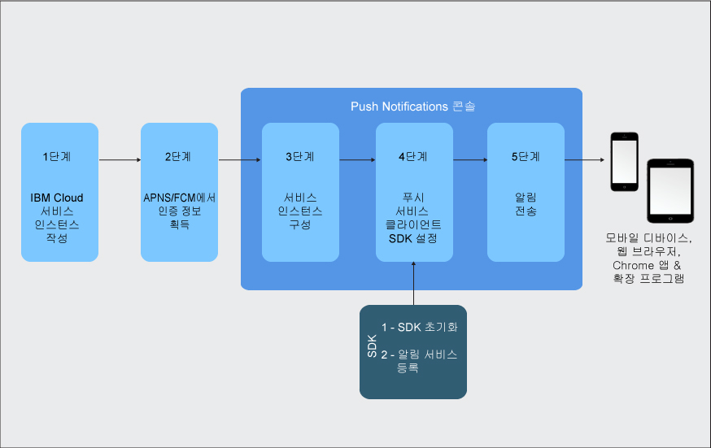

---

copyright:
years: 2015, 2017

---

{:new_window: target="_blank"}
{:shortdesc: .shortdesc}
{:screen:.screen}
{:codeblock:.codeblock}
{:pre: .pre}
{:tip: .tip}

# 시작하기 튜토리얼
{: #gettingstartedtemplate}
마지막 업데이트 날짜: 2017년 9월 8일
{: .last-updated}

{:shortdesc}

{{site.data.keyword.mobilepushshort}}는 모바일 카테고리에서 IBM Cloud 카탈로그 서비스로서 사용 가능하며, 사용자는 이를 사용하여 모바일 및 웹 푸시 알림을 전송하고 관리할 수 있습니다. 푸시 알림은 모바일 디바이스 또는 브라우저에서 변경 또는 업데이트를 표시하는 경보입니다.

Push Notifications는 엔터프라이즈 전체 또는 광범위한 청취자를 위해 보편적으로 허용되는 통신 채널입니다. 화면 상의 배너 경보로서 또는 디바이스의 잠긴 화면에 이러한 알림을 전달할 수 있으며, 따라서 신속하고 쉽게 액세스할 수 있는 정보 업데이트를 제공합니다.  

시작하는 기본 단계:

1. [IBM Cloud 서비스 인스턴스 작성](/docs/services/mobilepush/push_step_prereq.html)
1. [알림 제공자 신임 정보 획득](/docs/services/mobilepush/push_step_1.html)
1. [서비스 인스턴스 구성](/docs/services/mobilepush/push_step_2.html)
1. [푸시 서비스 클라이언트 SDK 설정](/docs/services/mobilepush/push_step_3.html)
1. [알림 전송](/docs/services/mobilepush/push_step_4.html)

다음 이미지는 Push Notifications 서비스 라이프사이클의 개요를 제공합니다.

  

