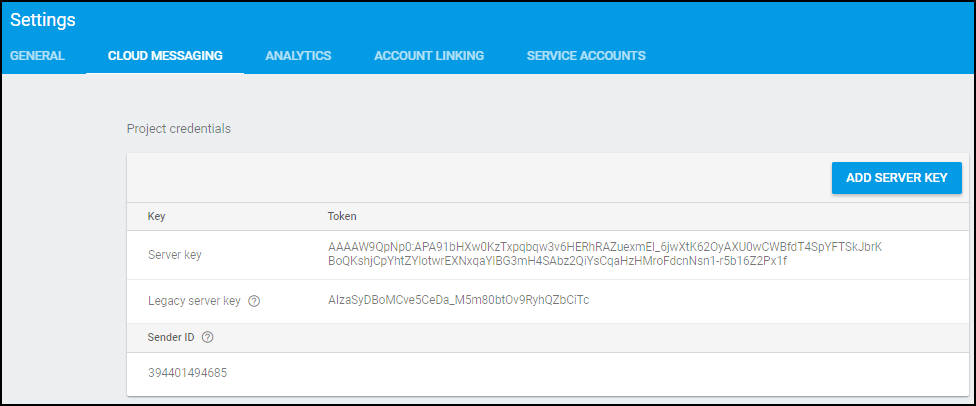

---

copyright:
 years: 2015, 2017

---

{:new_window: target="_blank"}
{:shortdesc: .shortdesc}
{:screen:.screen}
{:codeblock:.codeblock}

# 2단계: 알림 제공자 신임 정보 획득
{: #push_step_1}
마지막 업데이트 날짜: 2017년 6월 27일
{: .last-updated}

{{site.data.keyword.mobilepushshort}} 서비스를 설정하려면 푸시 알림 제공자에서 필요한 신임 정보를 획득해야 합니다. 

## Android의 경우
{: #push_step_1_android}

FCM(Firebase Cloud Messaging)은 Android 디바이스, Google Chrome 브라우저 및 Chrome 웹 & 확장 프로그램에 푸시 알림을 전달하는 데 사용되는 게이트웨이입니다. 콘솔에서 {{site.data.keyword.mobilepushshort}} 서비스를 설정하려면 FCM 신임 정보(발신인 ID 및 API 키)를 가져와야 합니다. 

API 키는 안전하게 저장되어 {{site.data.keyword.mobilepushshort}} 서비스에서 FCM 서버에 연결하는 데 사용되며 발신인 ID(프로젝트 번호)는 클라이언트 측의 Google Chrome 및 Mozilla Firefox용 Android SDK와 JS SDK에서 사용됩니다. 

FCM을 설정하고 신임 정보를 획득하려면 다음 단계를 완료하십시오.

1. [Firebase 콘솔 ](https://console.firebase.google.com/?pli=1){: new_window}을 방문하십시오. Google 사용자 계정이 필요합니다. 
2. **프로젝트 추가**를 선택하십시오. 
3. 프로젝트 작성 창에서 프로젝트 이름을 입력하고 국가/지역을 선택한 후 **프로젝트 작성**을 클릭하십시오.
3. 탐색 분할창에서 **설정** > **프로젝트 설정**을 선택하십시오.
4. 클라우드 메시징 탭을 선택하여 프로젝트 신임 정보 - 서버 API 키 및 발신인 ID를 획득하십시오. FCM에 나열된 서버 키는 서버 API 키와 동일하다는 점을 참고하십시오.
   
	

또한 `google-services.json` 파일을 생성해야 합니다. 다음 단계를 완료하십시오.

1. Firebase 콘솔에서 **프로젝트 설정** 아이콘을 클릭하십시오.
    
	

3. 앱 분할창의 일반 탭에서 **앱 추가** 또는 **Android 앱에 Firebase 추가** 아이콘을 선택하십시오.
    
4. Android 앱에 Firebase 추가 창에서, 먼저 **com.ibm.mobilefirstplatform.clientsdk.android.push**를 패키지 이름으로 추가하십시오. 앱 닉네임 필드는 선택사항입니다. **앱 등록**을 클릭하십시오. 
    
	

5. 이제 Android 앱에 Firebase 추가 창에서 애플리케이션의 패키지 이름을 입력하여 이를 포함시키십시오. 앱 닉네임 필드는 선택사항입니다. **앱 등록**을 클릭하십시오.  예는 아래와 같습니다. 

	

6. `google-services.json` 파일이 생성됩니다. 

FCM 신임 정보를 획득하고 `google-services.json` 파일을 생성한 후 다음 단계는 [서비스 인스턴스 작성](push_step_2.html)입니다.

**참고**: Google에서는 GCM을 더 이상 사용하지 않으며 Cloud Messaging을 Firebase와 통합했습니다. 사용자는 Android의 GCM 클라이언트 앱을 FCM으로 마이그레이션해야 합니다. 

## iOS의 경우
{: #push_step_1_ios}

iOS 디바이스 및 애플리케이션의 경우, 애플리케이션 개발자는 APNs(Apple Push Notification Service)로 IBM Cloud의 {{site.data.keyword.mobilepushshort}} 서비스 인스턴스(제공자)에서 iOS 디바이스 및 애플리케이션으로 원격 알림을 전송할 수 있습니다. 디바이스의 대상 애플리케이션으로 메시지가 전송됩니다. 

APNs 신임 정보를 획득해서 구성해야 합니다. {{site.data.keyword.mobilepushshort}} 서비스에서 APNs 인증서를 안전하게 관리하며 제공자로 APNs 서버에 연결하는 데 이 인증서를 사용합니다.

### App ID 등록
{: #push_step_1_ios_2}

App ID(번들 ID)는 특정 애플리케이션을 식별하는 고유 ID입니다. 각 애플리케이션에 App ID가 필요합니다. {{site.data.keyword.mobilepushshort}} 서비스와 같은 서비스는 App ID에 따라 구성됩니다.

[Apple 개발자 ](https://developer.apple.com/){: new_window} 계정이 있는지 확인하십시오. 필수 전제조건입니다.

2. [Apple 개발자 ](https://developer.apple.com){: new_window} 포털로 이동하여 **멤버 센터**를 클릭하고 **인증서, ID & 프로파일**을 선택하십시오.
3. **ID** > **앱 ID 섹션**으로 이동하십시오.
3. **앱 ID 등록** 페이지에서 앱 ID 설명 이름 필드에 앱 이름을 제공하십시오. 예: ACME Push Notifications.
4. 앱 ID 접두부에 대한 문자열을 제공하십시오.  
4. 앱 ID 접두부의 경우, **명시적 앱 ID**을 선택하고 번들 ID 값을 제공하십시오. 역 도메인 이름 스타일 문자열을 제공하도록 권장합니다. 예: `com.ACME.push`.
5. **Push Notifications** 선택란을 선택하고 **계속**을 클릭하십시오.
6. 설정 과정을 거치고 **등록** > **완료**를 클릭하십시오.

사용자의 앱 ID가 이제 등록되었습니다. 

   
  

### 개발 및 배포 APNs SSL 인증서 작성
{: #push_step_1_ios_3}

APNs 인증서를 획득하려면 먼저 인증서 서명 요청(CSR)을 작성하여 이를 Apple 인증 기관(CA)에 제출해야 합니다. CSR에는 사용자의 회사, Apple 푸시 알림을 신청할 때 사용하는 공용 키와 개인 키를 식별하는 정보가 포함됩니다. 그런 다음 iOS 개발자 포털에서 SSL 인증서를 생성하십시오. 인증서와 이의 공개 및 개인 키는 Keychain Access에 저장됩니다.

다음 두 모드에서 APNs를 사용할 수 있습니다. 

* 개발 및 테스트를 위한 샌드박스 모드에서
* 앱 저장소(또는 다른 엔터프라이즈 배포 메커니즘)를 통해 애플리케이션을 배포할 때 프로덕션 모드에서

개발 및 배포 환경을 위한 별도의 인증서를 획득해야 합니다. 인증서는 원격 알림의 수신인인 앱의 App ID와 연관되어 있습니다. 프로덕션의 경우 최대 2개의 인증서를 작성할 수 있습니다. IBM Cloud는 인증서를 사용하여 APNs와의 SSL 연결을 설정합니다. 

<!-- Create a development and distribution SSL certificate. -->

1. [Apple 개발자 ](https://developer.apple.com){: new_window} 웹 사이트로 이동하여 **멤버 센터**를 클릭하고 **인증서, ID & 프로파일**을 선택하십시오.
2. **ID** 영역에서 **App ID**를 클릭하십시오.
3. 앱 ID의 목록에서 앱 ID를 선택한 다음 **편집**을 선택하십시오.
4. **Push Notifications** 선택란을 선택한 후에 다음을 수행하십시오.
	-  개발 SSL 인증서 분할창에서 **인증서 작성..**을 클릭하십시오.
	-  프로덕션 SSL 인증서 분할창에서 **인증서 작성..**을 클릭하십시오.

	

5. **인증서 서명 요청(CSR) 작성 정보 화면**이 표시되면 Mac에서 **Keychain Access** 애플리케이션을 시작하여 인증서 서명 요청(CSR)을 작성하십시오. **계속**을 클릭하십시오.
6. CSR 파일 업로드 옵션의 경우, **파일 선택**을 클릭하고 `CertificateSigningRequest.certSigningRequest` 파일을 선택하십시오. 
7. **계속**을 클릭하십시오.
8. 다운로드, 설치 및 백업 분할창에서 **다운로드**를 클릭하십시오. `aps_development.cer` 파일이 다운로드됩니다.
	
	 	
	
6. 메뉴에서 **Keychain Access > 인증서 지원 > 인증 기관에 인증서 요청…**을 선택하십시오. 
7. **인증서 정보**에서 앱 개발자 계정과 연관된 이메일 주소와 공통 이름을 입력하십시오. 개발(샌드박스)용 인증서인지 배포(프로덕션)용 인증서인지 식별할 수 있도록 의미있는 이름을 지정하십시오(예: _sandbox-apns-certificate_ 또는 _production-apns-certificate_).
8. **디스크에 저장**을 선택하여 `.certSigningRequest` 파일을 데스크탑에 다운로드한 다음 **계속**을 클릭하십시오.
9. **다른 이름으로 저장** 메뉴 옵션에서 `.certSigningRequest` 파일의 이름을 지정한 후 **저장**을 클릭하십시오.
10. **완료**를 클릭하십시오. 이제 CSR이 작성되었습니다.
11. **인증서 서명 요청(CSR) 작성 정보** 창으로 돌아가서 **계속**을 클릭하십시오. 
12. **생성** 화면에서 **파일 선택... **을 클릭하고 데스크탑에 저장한 CSR 파일을 선택하십시오. 그런 다음 **생성**을 클릭하십시오.

	
13. 인증서가 준비되면 **완료**를 클릭하십시오.
14. **Push Notifications** 화면에서 **다운로드**를 클릭하여 인증서를 다운로드하고 **완료**를 클릭하십시오. 
	
	 

15. Mac의 경우 **Keychain Access > 내 인증서**로 이동하여 새로 설치된 인증서를 찾아보십시오. 인증서를 두 번 클릭하여 Keychain Access에 인증서를 설치하십시오.
16. 인증서와 개인 키를 선택한 다음 **내보내기**를 선택하여 인증서를 개인 정보 변환 형식(`.p12` 형식)으로 변환하십시오.

	
17. **다른 이름으로 저장** 필드에서 인증서에 의미있는 이름을 지정하십시오. 예를 들어, `sandbox_apns.p12_certifcate` 또는 `production_apns.p12`를 지정한 후 **저장**을 클릭하십시오.
	
	
18. **비밀번호 입력** 필드에 내보낸 항목을 보호하기 위한 비밀번호를 입력한 다음 **확인**을 클릭하십시오. 이 비밀번호를 사용하여 Push Notifications 서비스 콘솔에서 APNs 설정을 구성할 수 있습니다.
	
	
19. **Key Access.app**이 **키 체인** 화면에서 키를 내보내도록 프롬프트를 표시합니다. 시스템이 해당 항목을 내보낼 수 있도록 Mac의 관리 비밀번호를 입력한 다음 **항상 허용** 옵션을 선택하십시오. 데스크탑에 `.p12` 인증서가 생성됩니다.

### 개발 프로비저닝 프로파일 작성
{: #create-push-credentials-dev-profile}

프로비저닝 프로파일은 App ID와 함께 작동하여 사용자 앱을 설치하고 실행할 수 있는 디바이스 및 사용자 앱에서 액세스할 수 있는 서비스를 판별합니다. 각 App ID에 대해 개발 및 배포용으로 두 개의 프로비저닝 프로파일을 작성하십시오. Xcode는 개발 프로비저닝 프로파일을 사용하여 애플리케이션을 빌드할 수 있는 개발자와 애플리케이션을 테스트할 수 있는 디바이스를 판별합니다.

App ID를 등록하고 이를 {{site.data.keyword.mobilepushshort}} 서비스에 사용할 수 있도록 설정하였으며 개발 및 프로덕션 APNs SSL 인증서를 사용하도록 구성했는지 확인하십시오.

개발 프로비저닝 프로파일을 다음과 같이 작성하십시오.

1. [Apple 개발자 ](https://developer.apple.com){: new_window} 포털로 이동하여 **멤버 센터**를 클릭하고 **인증서, ID & 프로파일**을 선택하십시오.
2. [Mac Developer Library ](https://developer.apple.com/library/mac/documentation/IDEs/Conceptual/AppDistributionGuide/MaintainingProfiles/MaintainingProfiles.html#//apple_ref/doc/uid/TP40012582-CH30-SW62site){: new_window}로 이동하고, **Creating Development Provisioning Profiles** 섹션으로 화면 이동하여 지시사항에 따라 개발 프로파일을 작성하십시오.
**참고**: 개발 프로비저닝 프로파일을 구성할 때 다음 옵션을 선택하십시오.
	* **iOS 앱 개발**
	* **iOS 및 watchOS 앱용**

### 저장소 배포 프로비저닝 프로파일 작성
{: #create-push-credentials-apns-distribute_profile}

저장소 프로비저닝 프로파일을 사용하여 배포용 앱을 앱 저장소에 제출하십시오.

1. [Apple 개발자 ](https://developer.apple.com){: new_window} 포털로 이동하여 **멤버 센터**를 클릭하고 **인증서, ID & 프로파일**을 선택하십시오.
2. 다운로드한 프로비저닝 프로파일을 두 번 클릭하여 이를 Xcode에 설치하십시오.

신임 정보 획득 후의 다음 단계는 [서비스 인스턴스 구성](push_step_2.html)입니다.

## 웹 브라우저 및 Chrome 앱 & 확장 프로그램의 경우
{: #configure-credential-for-browsers}

IBM {{site.data.keyword.mobilepushshort}} 서비스는 기능을 확장하여 사용자의 브라우저와 Chrome 앱 & 확장 프로그램에도 알림을 전송합니다.

{{site.data.keyword.mobilepushshort}} 서비스에서 허용해야 할 요청을 식별하려면 웹 사이트 URL 또는 웹 사이트의 도메인 이름이 필요합니다. 

예: `https://www.acmebanks.com`

{{site.data.keyword.mobilepushshort}} 서비스 인스턴스는 한 번에 하나의 도메인 이름만 지원합니다. 그러므로 Chrome, Firefox 및 Safari에 동일한 값이 설정되는지 확인하십시오. Chrome 및 Safari 브라우저에서는 웹 푸시를 위해 추가 구성이 필요합니다. FCM 엔드포인트를 사용하여 Chrome에서 메시지를 제공하므로 FCM API 키가 필요합니다. 

Chrome, Firefox 브라우저, Chrome 앱 및 확장 프로그램용 서비스를 설정하려면 [서비스 인스턴스 구성](push_step_2.html)을 참조하십시오.

### Safari 웹 푸시 구성 
{: #configure-safari}

Safari에서 {{site.data.keyword.mobilepushshort}} 서비스에 지원되는 버전은 10.0입니다. Apple Developer 계정을 통해 인증서를 생성해야 알림을 받도록 브라우저를 구성할 수 있습니다.

#### 인증서 생성
{: #certificate-generation}

Apple 개발자 계정이 있는지 확인하십시오. 알림을 수신하도록 Safari 브라우저를 구성하려면 웹 사이트 푸시 ID를 등록하고 인증서를 생성해야 합니다. 다음 단계를 수행하면 시작에 도움이 됩니다.

1. Apple 개발자 구성원 센터에서 **인증서, ID 및 프로파일**을 클릭하십시오. 
2. **ID**를 클릭한 후 **웹 사이트 푸시 ID**를 클릭하십시오.
3. 더하기 아이콘을 선택하여 새 항목을 작성하도록 선택하십시오.
  

4. 웹 사이트 푸시 ID 등록 패널에서 적절한 웹 사이트 푸시 ID 설명 및 식별자 ID를 제공하십시오. `web`으로 시작하는 역 도메인 이름 형식을 사용하도록 권장합니다. 예: `web.com.acmebanks`.
5. 웹 사이트 푸시 ID를 등록하십시오. 사용자의 웹 사이트 푸시 ID가 생성됩니다. 
6. **편집**을 선택하여 웹 사이트 푸시 ID에 사용할 인증서를 생성하십시오.
7. 인증서 정보의 인증서 지원 창에서 이메일 ID와 공통 이름을 제공하십시오. 인증 기관 이메일 주소는 공백으로 두십시오.
8. **디스크에 저장**을 클릭하고 **계속**을 선택하십시오.
9. 인증서를 적절한 폴더에 저장하도록 선택하십시오.
10. 마법사에서 인증서를 생성하도록 프롬프트하면 디스크에 작성된 `.certSigningRequest`를 선택하십시오. `.cer` 형식으로 작성된 웹 사이트 푸시 인증서를 다운로드해야 합니다.
11. KeyChain Access 도구에서 인증서를 여십시오. 마우스 오른쪽 단추를 클릭하고 p12 인증서로 내보내십시오. p12 인증서 생성 중에 입력한 비밀번호를 기록하십시오.

인증서 생성 후의 다음 단계는 [서비스 인스턴스 구성](push_step_2.html)입니다.

