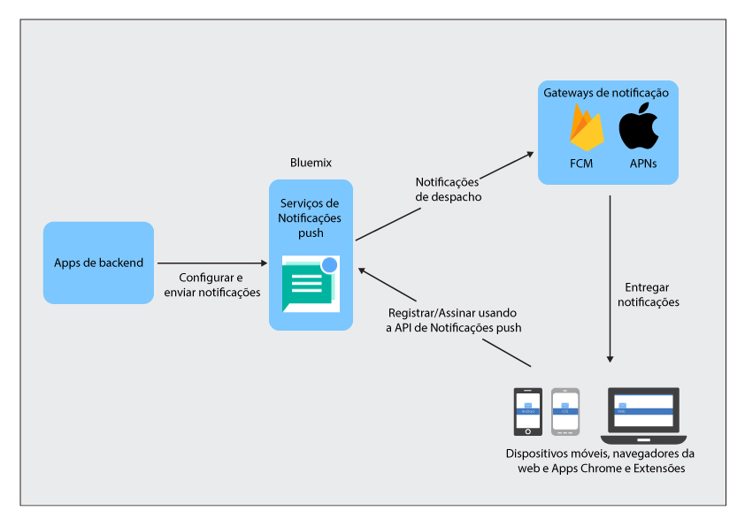

----

copyright:
 years: 2015, 2017

---

{:new_window: target="_blank"}
{:shortdesc: .shortdesc}
{:screen:.screen}
{:codeblock:.codeblock}
{:pre: .pre}
{:tip: .tip}

# Sobre notificações push 
{: #overview-push}
Última atualização: 28 de setembro de 2017
{: .last-updated}

O IBM {{site.data.keyword.mobilepushshort}} é um serviço que pode ser usado para enviar notificações para dispositivos móveis e navegadores. É possível direcionar notificações para todos os usuários
do aplicativo ou para um conjunto específico de usuários e dispositivos usando tags. Para cada mensagem enviada para o serviço, o público desejado recebe uma notificação.

É possível optar por usar o serviço {{site.data.keyword.mobilepushshort}} como uma parte do Modelo do MobileFirst Services Starter ou como [Serviços dedicados](/docs/dedicated/index.html) do Bluemix.  Também é possível usar um SDK (kit de desenvolvimento de software) e [APIs de REST ](https://mobile.{DomainName}/imfpush/){: new_window} para desenvolver adicionalmente seus aplicativos clientes.

O serviço {{site.data.keyword.mobilepushshort}} também é ativado para o [OpenWhisk](/docs/openwhisk/index.html). O OpenWhisk é um serviço de cálculo distribuído, acionado por evento, conhecido como computação sem servidor, como alternativa. Isso permite que os desenvolvedores se concentrem na composição de lógica do aplicativo e criem ações que sejam executadas sob demanda.

## Processos do serviço
{: #overview_push_process}

Dispositivo móvel, clientes do navegador da web e Apps Google Chrome e Extensões podem assinar e se registrar no serviço {{site.data.keyword.mobilepushshort}}. Na inicialização, os aplicativos clientes farão seus próprios registros e assinaturas no serviço {{site.data.keyword.mobilepushshort}}. As notificações são despachadas para o Apple Push Notification Service (APNs) ou o servidor Firebase Cloud Messaging (FCM) e, em seguida, enviadas para o dispositivo móvel, clientes de navegador ou Apps Chrome e Extensões registrados.

### Dispositivos móveis, aplicativos do navegador e Apps Chrome e Extensões
{: #mobile-applications}

Na inicialização, os aplicativos clientes se registram e assinam o serviço {{site.data.keyword.mobilepushshort}} para receber notificações.

### Aplicativos backend
{: #backend-applications}

Os aplicativos backend podem ser locais ou estarem em uma nuvem pública. Os aplicativos backend usarão o serviço {{site.data.keyword.mobilepushshort}} para enviar notificações sensíveis ao contexto para usuários de aplicativos móveis, do navegador e do Apps Chrome e Extensões. Os aplicativos backend não
são obrigados a manter e gerenciar dispositivos móveis, agentes do navegador e
informações sobre o usuário para enviar notificações push. Em vez disso, os aplicativos
podem usar o serviço {{site.data.keyword.mobilepushshort}} que os gerenciará
e os manterá.

### Proprietário backend do app
{: #app-backend-owner}

O proprietário backend do App cria o aplicativo backend móvel que empacota uma instância do serviço {{site.data.keyword.mobilepushshort}}. O
proprietário backend do App também configura e instala o serviço
{{site.data.keyword.mobilepushshort}} para adequar os aplicativos backend usando
o serviço com os aplicativos móveis e do navegador que se destinam a {{site.data.keyword.mobilepushshort}}.

### Serviço Push Notifications
{: #push-notification-service}

O serviço {{site.data.keyword.mobilepushshort}} gerencia todas as
informações relacionadas a dispositivos móveis e clientes do navegador da web que são
registrados para notificações. O serviço mantém seus aplicativos transparentes para os
detalhes de tecnologia de envio de notificações a plataformas móveis e de navegador da
web heterogêneas, manipulando todos esses dentro.

### Gateways
{: #gateways}

Serviços de nuvem de Notificações push específicos da plataforma, como FCM/GCM ou Apple Push Notification Service (APNs), que são usados pelo serviço IBM
{{site.data.keyword.mobilepushshort}} para despachar notificações aos aplicativos móveis e do navegador.

## Tamanho da Mensagem
{: #push-message-size}

O tamanho da carga útil da mensagem de {{site.data.keyword.mobilepushshort}} depende das restrições estabelecidas pelos Gateways (FCM/GCM, APNs) e
pelas plataformas do cliente. 

- Para iOS e Safari: para o iOS 8 e mais recente, o tamanho máximo permitido é de 4 kilobytes. O APNs não envia notificações que excedem esse limite.
- Para Android, navegador Firefox, navegador Chrome e Apps Chrome e Extensões: há uma limitação de 4 kilobytes como o tamanho máximo permitido da carga útil da mensagem.

## Amostras
{: #push-blog}

Os aplicativos de amostra estão disponíveis para [Android](https://github.com/ibm-bluemix-mobile-services/bms-samples-android-hellopush/), [Cordova](https://github.com/ibm-bluemix-mobile-services/bms-samples-cordova-hellopush) e [iOS](https://github.com/ibm-bluemix-mobile-services/bms-samples-swift-hellopush).
Também é possível localizar mais informações na página [Blog](http://push-notification-service.mybluemix.net/) do serviço Push Notifications.  

## Cenário de Amostra 
{: #push-scenario}

O serviço {{site.data.keyword.mobilepushshort}} é explicado usando o cenário de amostra do ACME Bank. O ACME Bank está na fase de ter a infraestrutura de TI anterior movida para os serviços do IBM Bluemix e está construindo atualmente um backend móvel para seus apps voltados para os clientes e funcionários. Eles estão usando o serviço {{site.data.keyword.mobilepushshort}} para enviar notificação para seus clientes em transações bancárias e outros eventos e lembretes importantes.

