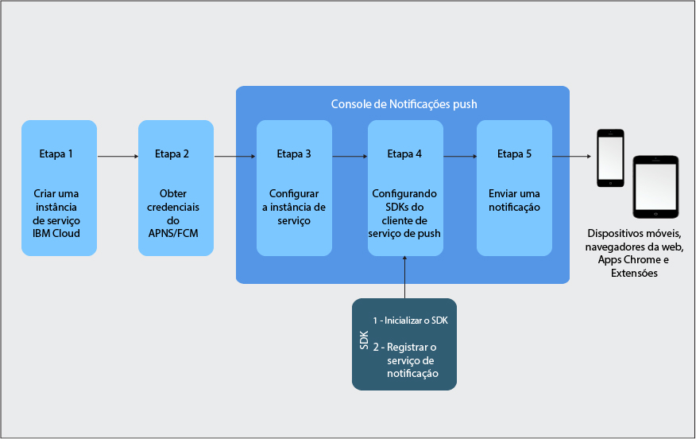

---

copyright:
years: 2015, 2017

---

{:new_window: target="_blank"}
{:shortdesc: .shortdesc}
{:screen:.screen}
{:codeblock:.codeblock}
{:pre: .pre}
{:tip: .tip}

# Tutorial Introdução
{: #gettingstartedtemplate}
Última atualização: 8 de setembro de 2017
{: .last-updated}

{:shortdesc}

O {{site.data.keyword.mobilepushshort}} está disponível como um serviço de catálogo do Bluemix na categoria Móvel e permite enviar e gerenciar notificações push móveis e da web. Uma notificação push é um alerta que indica uma mudança ou uma atualização em um dispositivo móvel ou um navegador.

As Notificações push são um canal de comunicação aceito universalmente entre as empresas ou para um amplo espectro de público. É possível entregar essas notificações como um alerta de banner na tela ou para a tela bloqueada de um dispositivo, fornecendo atualizações de informações que são rápida e facilmente acessíveis.  

As etapas básicas que farão você iniciar a utilização:

1. [Criar uma instância de serviço do Bluemix](/docs/services/mobilepush/push_step_prereq.html)
1. [Obter suas credenciais de provedor de notificação](/docs/services/mobilepush/push_step_1.html)
1. [Configurar a instância de serviço](/docs/services/mobilepush/push_step_2.html)
1. [Configurar os SDKs do cliente de serviço de push](/docs/services/mobilepush/push_step_3.html)
1. [Enviar uma
notificação](/docs/services/mobilepush/push_step_4.html)

A imagem a seguir fornece uma visão geral do ciclo de vida do serviço Push Notifications.

  

