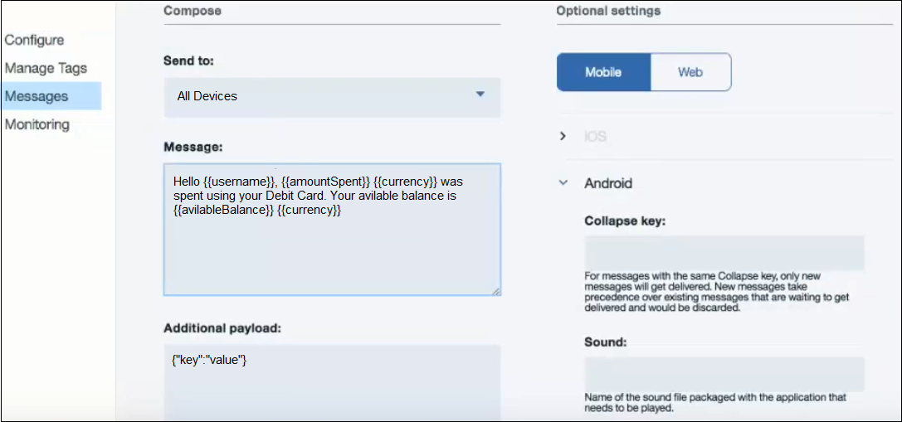

---

copyright:
 years: 2015, 2017

---

{:new_window: target="_blank"}
{:shortdesc: .shortdesc}
{:screen:.screen}
{:codeblock:.codeblock}

# Parametrizar notificações
{: #template_based_notifications}
Última atualização: 21 de agosto de 2017
{: .last-updated}

É possível parametrizar e enviar notificações customizadas criando variáveis e chamando-as em seus modelos de notificação.

Seu modelo de notificação pode-

 - Combinar elementos estáticos e dinâmicos em suas notificações
 - Personalizar notificações para cada destinatário, incluindo variáveis
 - Pode incluir múltiplas variáveis em sua notificação 

Passar variáveis como objetos JSON em seu código do aplicativo durante a inicialização -

    
   ```
    MFPPushNotificationOptions opções = MFPPushNotificationOptions novo ();

    JSONObject tempValue = new JSONObject();
        try {
        
		TempValue.put ("username", userName);
        
        TempValue.put (,amount "amountSpent");
		
        TempValue.put ("de" ,currency);
		
        TempValue.put (,balance "avilableBalance");
        
		} Catch (JSONException e) {
            e.printStackTrace();
        }
        options.setPushVariables(tempValue); 
	   
	   Push = MFPPush.getInstance ();

       Push.initialize( getApplicationContext (), appGuid, clientSecret, opções);
   ```
{: codeblock}


Quando as variáveis estiverem definidas, elas poderão ser chamadas em seu modelo de mensagem.

1. No console do {{site.data.keyword.mobilepushshort}}, selecione a guia **Mensagens**.

2. Componha uma mensagem escolhendo uma opção **Enviar para**.

2. No campo **Mensagem**, componha sua mensagem.  Chame as variáveis definidas no modelo de mensagem. Clique em **Enviar**.



Sua mensagem de notificação customizada será enviada buscando os dados variáveis -


Nota: o recurso é ativado apenas para usuários que optaram pelo `Advanced Plan`. Selecione **Planejar** no console do serviço {{site.data.keyword.mobilepushshort}} para [fazer upgrade](https://console-tok02-red.cdn.s-bluemix.net/docs/account/change-plan.html#changing).

**Limitações:**

 - Atualmente, esse recurso não é suportado no Safari
 - As variáveis no modelo de notificação poderão não funcionar se um app for forçado a encerrar no iOS. A limitação não está no controle de SDK, mas vem do iOS.


