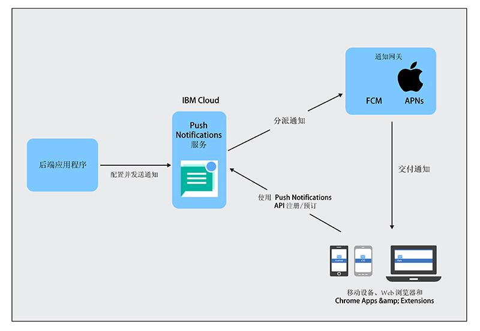

----

copyright:
 years: 2015, 2017

---

{:new_window: target="_blank"}
{:shortdesc: .shortdesc}
{:screen:.screen}
{:codeblock:.codeblock}
{:pre: .pre}
{:tip: .tip}

# 关于 Push Notifications 
{: #overview-push}
上次更新时间：2017 年 9 月 28 日
{: .last-updated}

IBM {{site.data.keyword.mobilepushshort}} 是一项服务，您可以使用该服务将通知发送到移动设备和浏览器。通知可以针对所有应用程序用户，也可以针对一组使用标记的特定用户和设备。对于您提交给该服务的每条消息，目标受众都会收到一个通知。

可以选择将 {{site.data.keyword.mobilepushshort}} 服务用作 MobileFirst Services Starter 样板的一部分或用作 Bluemix [专用服务](/docs/dedicated/index.html)。您还可以使用 SDK（软件开发包）和 [REST API ](https://mobile.{DomainName}/imfpush/){: new_window} 来进一步开发您的客户机应用程序。

{{site.data.keyword.mobilepushshort}} 服务还支持 [OpenWhisk](/docs/openwhisk/index.html)。OpenWhisk 是一种分布式事件驱动型计算服务，也称为无服务器计算。这将支持开发者专注于编写应用程序逻辑，以及创建按需执行的操作。

## 服务过程
{: #overview_push_process}

移动、Web 浏览器客户机和 Google Chrome Apps & Extensions 可以针对 {{site.data.keyword.mobilepushshort}} 服务进行预订和注册。启动时，客户机应用程序会自行注册并预订 {{site.data.keyword.mobilepushshort}} 服务。通知会分派到 Apple 推送通知服务 (APNs) 或 Firebase 云消息传递 (FCM) 服务器，然后发送到注册的移动设备、浏览器客户机或 Chrome Apps & Extensions。

### 移动、浏览器应用程序和 Chrome Apps & Extensions
{: #mobile-applications}

启动时，客户机应用程序会自行注册并预订 {{site.data.keyword.mobilepushshort}} 服务来接收通知。

### 后端应用程序
{: #backend-applications}

后端应用程序可以位于内部部署中，也可以位于公共云中。后端应用程序会使用 {{site.data.keyword.mobilepushshort}} 服务将上下文相关通知发送给移动、浏览器应用程序和 Chrome Apps & Extensions 用户。后端应用程序无需维护和管理用于发送推送通知的移动设备、浏览器代理程序和用户信息。相反，后端应用程序可以使用将用于对其进行管理和维护的 {{site.data.keyword.mobilepushshort}} 服务。

### 应用程序后端所有者
{: #app-backend-owner}

应用程序后端所有者会创建捆绑了 {{site.data.keyword.mobilepushshort}} 服务实例的移动后端应用程序。应用程序后端所有者还会使用该服务搭配以 {{site.data.keyword.mobilepushshort}} 为目标的移动和浏览器应用程序，配置和设置 {{site.data.keyword.mobilepushshort}} 服务，以符合后端应用程序。

### Push Notifications 服务
{: #push-notification-service}

{{site.data.keyword.mobilepushshort}} 服务可管理与注册通知的移动设备和 Web 浏览器相关的所有信息。对于如何将通知发送给异构移动和 Web 浏览器平台，您的应用程序无需了解详细的技术信息，该服务会在其内部对所有这一切进行处理。

### 网关
{: #gateways}

平台特定的 Push Notifications 云服务（例如，IBM {{site.data.keyword.mobilepushshort}} 服务使用的 FCM/GCM 或 Apple 推送通知服务 (APNs)）将通知分派给移动和浏览器应用程序。

## 消息大小
{: #push-message-size}

{{site.data.keyword.mobilepushshort}} 消息有效内容大小取决于网关（FCM/GCM、APNs）和客户机平台规定的约束。 

- 对于 iOS 和 Safari：对于 iOS 8 和更高版本，允许的最大大小为 4 KB。APNs 不会发送超过此限制的通知。
- 对于 Android、Firefox 浏览器、Chrome 浏览器和 Chrome Apps & Extensions：允许的消息有效内容最大大小限制为 4 KB。

## 样本
{: #push-blog}

针对 [Android](https://github.com/ibm-bluemix-mobile-services/bms-samples-android-hellopush/)、[Cordova](https://github.com/ibm-bluemix-mobile-services/bms-samples-cordova-hellopush) 和 [iOS](https://github.com/ibm-bluemix-mobile-services/bms-samples-swift-hellopush) 提供了样本应用程序。
还可以在 Push Notifications 服务[博客](http://push-notification-service.mybluemix.net/)页面上找到更多信息。  

## 样本场景 
{: #push-scenario}

使用 ACME Bank 的样本场景对 {{site.data.keyword.mobilepushshort}} 服务进行了说明。ACME Bank 处于将其原有 IT 基础架构移至 IBM Bluemix 服务的阶段，并且目前正在针对面向客户和员工的应用程序构建移动后端。这些应用程序将使用 {{site.data.keyword.mobilepushshort}} 服务向其客户发送有关银行交易以及其他重要事件和提醒的通知。

