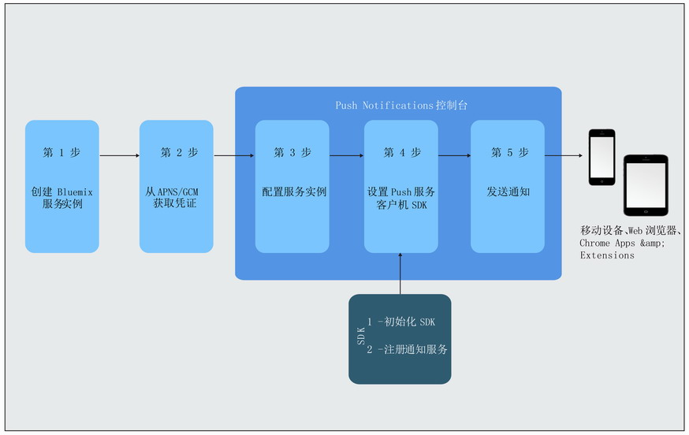

---

copyright:
years: 2015, 2017

---

{:new_window: target="_blank"}
{:shortdesc: .shortdesc}
{:screen:.screen}
{:codeblock:.codeblock}
{:pre: .pre}
{:tip: .tip}

# 入门教程
{: #gettingstartedtemplate}
上次更新时间：2017 年 9 月 8 日
{: .last-updated}

{:shortdesc}

{{site.data.keyword.mobilepushshort}} 作为 IBM Cloud“目录”服务在“移动”类别中提供，使您能够发送和管理移动和 Web 推送通知。推送通知是一种警报，指示移动设备或浏览器上有更改或更新。

Push Notifications 是企业之间或针对各种受众普遍接受的通信渠道。可以将这些通知作为屏幕上的条幅警报传递，或者传递到设备的锁定屏幕上，从而提供可快速、轻松访问的信息更新。  

基本入门步骤：

1. [创建 IBM Cloud 服务实例](/docs/services/mobilepush/push_step_prereq.html)
1. [获取通知提供程序凭证](/docs/services/mobilepush/push_step_1.html)
1. [配置服务实例](/docs/services/mobilepush/push_step_2.html)
1. [设置 Push 服务客户机 SDK](/docs/services/mobilepush/push_step_3.html)
1. [发送通知](/docs/services/mobilepush/push_step_4.html)

下图概述了 Push Notifications 服务的生命周期。

  

