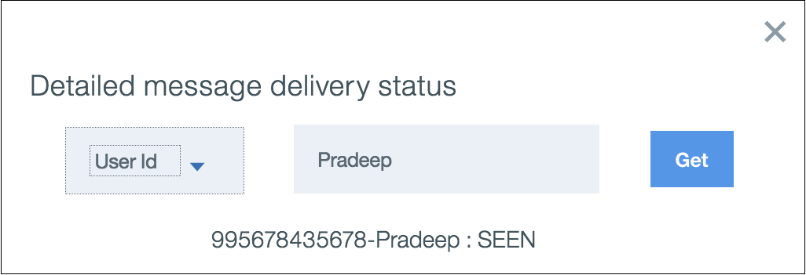

---

copyright:
  years: 2015, 2019
lastupdated: "2019-06-06"

keywords: push notifications, notifications, message delivery status

subcollection: mobile-pushnotification

---

{:new_window: target="_blank"}
{:shortdesc: .shortdesc}
{:screen:.screen}
{:codeblock:.codeblock}

# 消息传递状态
{: #message-delivery-status}

使用 {{site.data.keyword.mobilepushshort}} 服务，您可以查看已提交给服务的每个通知的传递状态。 

一旦发送消息，可通过查看其传递状态来跟踪消息的传递信息。在任意给定时刻，服务仅显示在 90 天内可用的最近 10 条消息的状态。

{{site.data.keyword.mobilepushshort}} 服务**消息**选项卡显示通知状态。

1. **消息标识** - 用于标识消息的唯一标识。

2. **消息文本** - 发送给应用程序用户的消息模板。

3. **日期** - 将消息提交给服务的日期和时间。

4. **状态** - 提供消息的简短摘要状态。根据消息的传递状态，可能会看到下列其中一个状态：

 - 已接受：Push Notifications 服务已接受消息进行传递。
   
 - 正在分派：通知提供程序（APNs、FCM 或 Web）已收到通知，并且即将分派通知。处于分派过程中的通知也可能返回失败，状态为**分派失败**。
 
 - 已分派：通知提供程序已分派通知。
 
 - 正在处理：正在处理消息，以分派给通知提供程序网关。正在处理的通知也可能返回失败，状态为**处理失败**。
 
 - 未知：无法确定通知的状态。
 
5. **查看** - 显示分派的通知的传递状态。可以查看基于以下方面的信息：

 - 类别：全部、移动、Web<!---and HTTP--->。
 
 - 消息状态：已发送、已查看、已打开和无效。 

6. **选项** - 提供通知的详细状态。可通过从下拉菜单中选择`设备标识`或`用户标识`来跟踪状态。要跟踪失败消息时，获取特定于用户/设备的详细状态消息可能非常有用。

**注**：此功能仅对选择`高级套餐`的用户启用。在 {{site.data.keyword.mobilepushshort}} 服务控制台中选择**套餐**以进行[升级](https://cloud.ibm.com/docs/account?topic=account-changing#changing)

