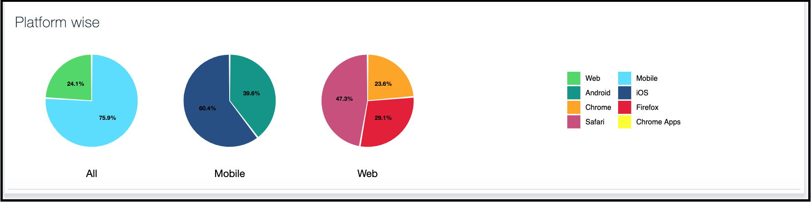

---

copyright:
  years: 2015, 2019
lastupdated: "2019-06-06"

keywords: push notifications, notifications, monitoring notification

subcollection: mobile-pushnotification

---

{:new_window: target="_blank"}
{:shortdesc: .shortdesc}
{:screen:.screen}
{:codeblock:.codeblock}

# 监视通知 
{: #push_monitoring}

IBM {{site.data.keyword.mobilepushshort}} 服务现已扩展了功能，可以通过用户数据生成图形，从而监视推送性能。您可以使用实用程序列出所有已发送的推送通知，或者列出所有已注册的设备，并以每天、每周或每月为基础来分析信息。

要为所有已发送的通知生成报告，请使用 [REST API](https://eu-gb.imfpush.cloud.ibm.com/imfpush/#!/messages/get_apps_applicationId_messages_report){: new_window} 中的“推送消息 GET”报告方法。 
	
 &nbsp; 
	

要为所有已注册的设备生成报告，请使用 [REST API](https://eu-gb.imfpush.cloud.ibm.com/imfpush/#!/devices/get_apps_applicationId_devices_report){: new_window} 中的“推送设备注册 GET”报告方法。
	
 &nbsp; 
	

要获取有关如何启用平台的监视实用程序的信息，请执行以下操作：

 - [在 Android 设备上监视推送通知](https://github.com/ibm-bluemix-mobile-services/bms-clientsdk-android-push/tree/Doc#monitoring)。
 - [在 iOS 设备上监视推送通知](https://github.com/ibm-bluemix-mobile-services/bms-clientsdk-swift-push/tree/Doc#enable-monitoring)。

注：

1. {{site.data.keyword.mobilepushshort}} 的“监视”选项卡并不显示分析数据。
2. 系统将对使用 REST API 生成的报告进行高速缓存，并且高速缓存可保持 30 分钟。
此外，将从高速缓存的数据生成以图形表示的数据。
 
