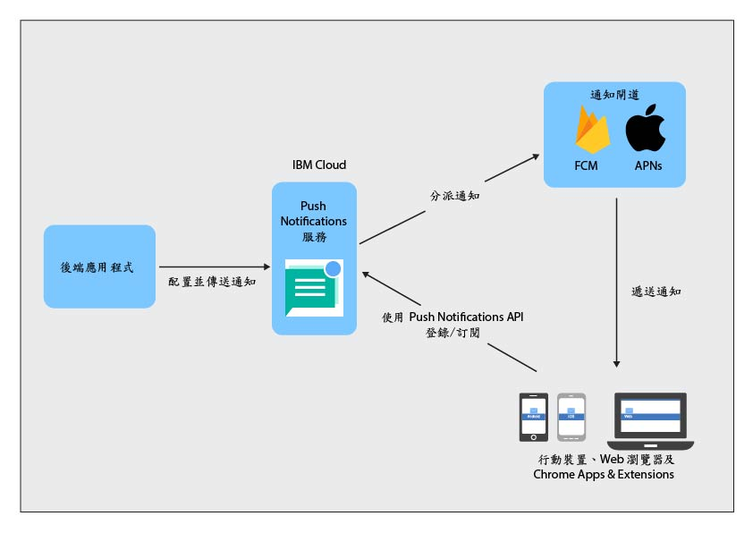

----

copyright:
 years: 2015, 2017

---

{:new_window: target="_blank"}
{:shortdesc: .shortdesc}
{:screen:.screen}
{:codeblock:.codeblock}
{:pre: .pre}
{:tip: .tip}

# 關於 Push Notifications 
{: #overview-push}
前次更新：2017 年 9 月 28 日
{: .last-updated}

IBM {{site.data.keyword.mobilepushshort}} 是您可以用來傳送通知至行動裝置及瀏覽器的一種服務。通知可以使用標籤，以所有應用程式使用者或一組特定使用者及裝置為目標。對於您提交給服務的每一則訊息，預期的對象都會收到通知。

您可以選擇使用 {{site.data.keyword.mobilepushshort}} 服務作為 MobileFirst Services 入門範本樣板的一部分，或是作為 IBM Cloud [專用服務](/docs/dedicated/index.html)。您也可以使用 SDK（軟體開發套件）及 [REST API ](https://mobile.{DomainName}/imfpush/){: new_window}，以進一步開發用戶端應用程式。

也已針對 [OpenWhisk](/docs/openwhisk/index.html) 啟用 {{site.data.keyword.mobilepushshort}} 服務。OpenWhisk 是分散式、事件驅動的運算服務，也稱為無伺服器運算。這可讓開發人員專注於撰寫應用程式邏輯，且建立視需要執行的動作。

## 服務程序
{: #overview_push_process}

行動裝置、Web 瀏覽器用戶端及 Google Chrome Apps & Extensions 可以訂閱及登錄 {{site.data.keyword.mobilepushshort}} 服務。啟動時，用戶端應用程式會自行登錄及訂閱 {{site.data.keyword.mobilepushshort}} 服務。通知會先分派到 Apple Push Notification Service (APNs) 或 Firebase Cloud Messaging (FCM) 伺服器，然後傳送給已登錄的行動裝置、瀏覽器用戶端或 Chrome Apps & Extensions。

### 行動、瀏覽器應用程式及 Chrome Apps & Extensions
{: #mobile-applications}

啟動時，用戶端應用程式會自行登錄及訂閱 {{site.data.keyword.mobilepushshort}} 服務以接收通知。

### 後端應用程式
{: #backend-applications}

後端應用程式可以位於內部部署中，也可以位於公用雲端中。後端應用程式會使用 {{site.data.keyword.mobilepushshort}} 服務，以將環境定義相關通知傳送給行動、瀏覽器應用程式及 Chrome Apps & Extensions 使用者。不需要後端應用程式，也可以維護及管理用於傳送推送通知的行動裝置、瀏覽器代理程式及使用者資訊。反之，後端應用程式可以使用對其進行管理及維護的 {{site.data.keyword.mobilepushshort}} 服務。

### 應用程式後端擁有者
{: #app-backend-owner}

應用程式後端擁有者會建立可組合 {{site.data.keyword.mobilepushshort}} 服務實例的行動後端應用程式。應用程式後端擁有者也會配置及設定 {{site.data.keyword.mobilepushshort}} 服務，以符合使用此服務的後端應用程式以及作為 {{site.data.keyword.mobilepushshort}} 目標的行動及瀏覽器應用程式。

### Push Notifications 服務
{: #push-notification-service}

{{site.data.keyword.mobilepushshort}} 服務會管理用於登錄通知之行動裝置及 Web 瀏覽器用戶端的所有相關資訊。此服務讓應用程式不必處理將通知傳送給異質行動及 Web 瀏覽器平台的技術詳細資料，全都在其內進行處理。

### 閘道
{: #gateways}

IBM {{site.data.keyword.mobilepushshort}} 服務使用平台專用 Push Notifications 雲端服務（例如 FCM/GCM 或 Apple Push Notification Service (APNs)）將通知分派給行動及瀏覽器應用程式。

## 訊息大小
{: #push-message-size}

{{site.data.keyword.mobilepushshort}} 訊息有效負載大小取決於「閘道」（FCM/GCM、APNs）及用戶端平台所配置的限制。 

- 若為 iOS 及 Safari：若為 iOS 8 以及更新版本，接受的大小上限為 4 KB。APNs 不會傳送超過此限制的通知。
- 若為 Android、Firefox 瀏覽器、Chrome 瀏覽器及 Chrome Apps & Extensions：容許的訊息有效負載大小上限為 4 KB。

## 範例
{: #push-blog}

範例應用程式可用於 [Android](https://github.com/ibm-bluemix-mobile-services/bms-samples-android-hellopush/)、[Cordova](https://github.com/ibm-bluemix-mobile-services/bms-samples-cordova-hellopush) 及 [iOS](https://github.com/ibm-bluemix-mobile-services/bms-samples-swift-hellopush)。
您也可以在 Push Notifications 服務[部落格](http://push-notification-service.mybluemix.net/)頁面找到相關資訊。  

## 範例情境 
{: #push-scenario}

我們使用 ACME Bank 的範例情境來解釋 {{site.data.keyword.mobilepushshort}} 服務。ACME Bank 正在將其舊 IT 基礎架構移至 IBM Cloud   服務，且目前正在為與客戶及員工互動的應用程式建置行動後端。他們使用 {{site.data.keyword.mobilepushshort}} 服務來傳送有關銀行交易及其他重要事件和提醒的通知給客戶。

