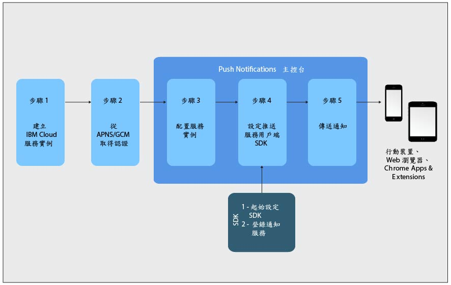

---

copyright:
 years: 2015, 2017

---

{:new_window: target="_blank"}
{:shortdesc: .shortdesc}
{:screen:.screen}
{:codeblock:.codeblock}
{:pre: .pre}
{:tip: .tip}

# 開始使用指導教學
{: #gettingstartedtemplate}
前次更新：2017 年 9 月 8 日
{: .last-updated}

{:shortdesc}

{{site.data.keyword.mobilepushshort}} 提供為「行動」種類下的 IBM Cloud 型錄服務，並且讓您傳送及管理行動與 Web 推送通知。推送通知是指出行動裝置或瀏覽器上有變更或更新的警示。

Push Notifications 是在企業之間或針對廣泛對象通用接受的通訊通道。您可以將這些通知當作畫面上的橫幅警示遞送，或是遞送到裝置的已鎖定畫面，如此可提供可快速且輕鬆存取的資訊更新。  

將讓您開始使用的基本步驟：

1. [建立 IBM Cloud 服務實例](/docs/services/mobilepush/push_step_prereq.html)
1. [取得通知提供者認證](/docs/services/mobilepush/push_step_1.html)
1. [配置服務實例](/docs/services/mobilepush/push_step_2.html)
1. [設定推送服務用戶端 SDK](/docs/services/mobilepush/push_step_3.html)
1. [傳送通知](/docs/services/mobilepush/push_step_4.html)

下圖提供 Push Notifications 服務生命週期的概觀。

  

