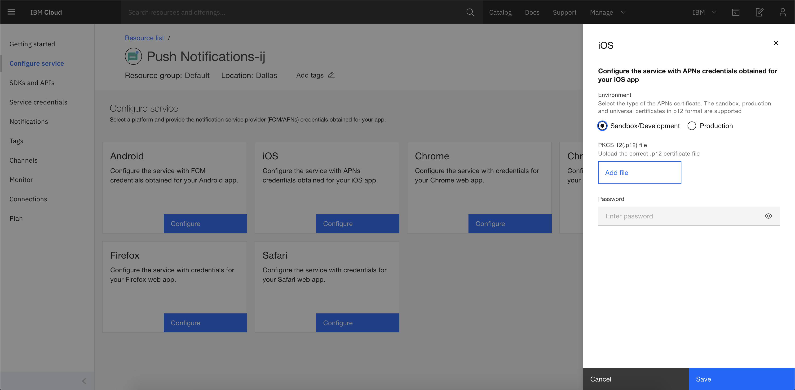

---

copyright:
   years: 2020
lastupdated: "2020-09-21"

keywords: push notifications, push notification, ios tutorial

subcollection: mobilepush

content-type: tutorial
services: mobilepush
account-plan: paid 
completion-time: 30m

---

{:shortdesc: .shortdesc}
{:screen: .screen}
{:codeblock: .codeblock}
{:pre: .pre}
{:tip: .tip}
{:note: .note}
{:external: target="_blank" .external}
{:important: .important}
{:step: data-tutorial-type='step'}

# Send Push Notifications to iOS devices
{: #push-tutorial-ios}
{: toc-content-type="tutorial"} 
{: toc-services="mobilepush"} 
{: toc-completion-time="30m"} 

In this tutorial, you learn how to create iOS application with high-value mobile service like {{site.data.keyword.mobilepushshort}} on {{site.data.keyword.cloud_notm}}.
{: shortdesc}

## Objectives
{: #push-tutorial-ios-objectives}

- Create a mobile app with {{site.data.keyword.mobilepushshort}} service.
- Obtain Apple Push Notification Service (APNs) credentials.
- Download the code and complete required setup.
- Configure, send, and monitor {{site.data.keyword.mobilepushshort}}.

## Before you begin
{: #push-tutorial-ios-beforeubegin}

- [Apple developer account](https://developer.apple.com/) for registering and sending notifications.
- {{site.data.keyword.cloud_notm}} account. If you do not have an {{site.data.keyword.cloud_notm}} account, create an [IBM Cloud account](https://cloud.ibm.com/).

## Create an {{site.data.keyword.cloud_notm}} {{site.data.keyword.mobilepushshort}} service instance
{: #mp-tutorial-create-push-service-instance}
{: step}
1. Log in to your [IBM Cloud account](https://cloud.ibm.com/).
1. In the [IBM Cloud catalog](https://cloud.ibm.com/catalog#services), click **Mobile** > **Push Notifications**.
1. **Select a Region** from the list of supported region and **Select a pricing plan**.
1. Provide a **Service name**. 
1. `Optional`: Select a resource group.

   Consider how you want the resources that are organized in your account. The resource group that you selected cannot be changed after the service instance is created. 
   {: note}

1. Click **Create**. 

In the next step, you will obtain Apple Push Notification Service (APNs) credentials.

## Obtain Apple Push Notification Service (APNs) credentials.
{: #push-tutorial-obtain-apns-credentials}
{: step}

For iOS devices and applications, Apple Push Notification Service (APNs) allows application developers to send remote notifications from {{site.data.keyword.mobilepushshort}} service instance on {{site.data.keyword.cloud_notm}} (the provider) to iOS devices and applications. Messages are sent to a target application on the device. 

You need to obtain and configure your APNs credentials. The APNs certificates are securely managed by {{site.data.keyword.mobilepushshort}} service and used to connect to APNs server as a provider.

### Registering an App ID
{: #push-tutorial-ios-registering-an-app-id}

The App ID (the bundle identifier) is a unique identifier that identifies a specific application. Each application requires an App ID. Services like the {{site.data.keyword.mobilepushshort}} service are configured to the App ID.

1. Go to the [Apple Developer](https://developer.apple.com){: external} portal, click **Member Center**, and select **Certificates, Identifiers & Profiles**.
1. Go to **Identifiers** > **Add identifier button**.
1. In the **Register a New Identifier** page, select the **AppIDs** option. 
1. Provide the App name in the App ID Description Name field. For example, ACME Push Notifications.
1. Provide a string for the App ID Prefix.  
1. For the Bundle ID, choose **Explicit** and provide a Bundle ID value. It is recommended that you provide a reverse domain-name style string. For example, `com.ACMECloud.push`
1. Select the **{{site.data.keyword.mobilepushshort}}** check-box from the Capabilities and click **Continue**.
1. Go through your settings and click **Register** > **Done**.

Your App ID is now registered. 

### Create a development and distribution APNs SSL certificate
{: #push-tutorial-ios-create-ssl-certificate}

Before you obtain an APNs certificate, you must first generate a certificate signing request (CSR) and submit it to Apple, the certificate authority (CA). The CSR contains information that identifies your company and your public and private key that you use to sign for your Apple push notifications. Then, generate the SSL certificate on the iOS Developer Portal. The certificate, along with its public and private key, is stored in Keychain Access.

You can use APNs in two modes: 
- Sandbox mode for development and testing.
- Production mode when distributing applications through the App Store (or other enterprise distribution mechanisms).

You must obtain separate certificates for your development and distribution environments. The certificates are associated with an App ID for the app that is the recipient of remote notifications. For production, you can create up to two certificates. IBM Cloud uses the certificates to establish an SSL connection with APNs.

1. Go to [Apple Developer](https://developer.apple.com){: external} website, click **Member Center**, and select **Certificates, Identifiers & Profiles**.
1. In the **Identifiers** area, select your App ID. 
1. Select the **Push Notifications** check-box OR select the **configure** option, then:
   - On Development SSL certificate pane, click **Create Certificate..**.
   - On Production SSL certificate pane, click **Create Certificate..**.

   
   
1. Use **Keychain Access** application on your Mac to create a Certificate Signing Request (CSR).
1. From the menu, select **Keychain Access > Certificate Assistant > Request a Certificate From a Certificate Authority…** 
1. In **Certificate Information**, enter the email address that is associated with your App Developer account and a common name. Give a meaningful name that helps you identify whether it is a certificate for development (sandbox) or distribution (production); for example, _sandbox-apns-certificate_ or _production-apns-certificate_.
1. Select **Save to disk** to download the `.certSigningRequest` file to your desktop, then click **Continue**.
1. In the **Save As** menu option, name the `.certSigningRequest` file and click **Save**.
1. Click **Done**. You now have a CSR.
1. For the Upload CSR file option, click **Choose File**, and select file  `CertificateSigningRequest.certSigningRequest`. 
1. Click **Continue**.
1. On the Download, Install and Backup pane, click **Download**. The `aps_development.cer` file is downloaded.

   	

1. Click **Download** to download your certificate, then click **Done**.
1. On your Mac, go to **Keychain Access > My Certificates**, and locate your newly installed certificate. Double-click the certificate to install it into the Keychain Access.
1. Select the certificate and private key, and then select **Export** to convert the certificate into the personal information exchange format (`.p12` format).

   

1. In the **Save As** field, provide the certificate a meaningful name. For example, `sandbox_apns.p12_certifcate` or `production_apns.p12`, then click **Save**.
	
   

1. In the **Enter a password** field, enter a password to protect the exported items, then click **OK**. You can use this password to configure your APNs settings on the {{site.data.keyword.mobilepushshort}} service console.
	
   

1. The **Key Access.app** prompts you to export your key from the **Keychain** screen. Enter your administrative password for your Mac to allow your system to export these items, and then select the **Always Allow** option. A `.p12` certificate is generated on your desktop.

### Creating a development provisioning profile
{: #push-tutorial-ios-create-dev-provisioning-profile}

The provisioning profile works with the App ID to determine which devices can install and run your app and which services your app can access. For each App ID, you create two provisioning profiles: one for development and the other for distribution. Xcode uses the development provisioning profile to determine which developers are allowed to build the application and which devices are allowed to be tested on the application.

Ensure that you have registered an App ID, enabled it for {{site.data.keyword.mobilepushshort}} service, and configured it to use a development and production APNs SSL certificate.

Create a development provisioning profile, as follows:

1. Go to the [Apple Developer](https://developer.apple.com){: external} portal, click **Member Center**, and select **Certificates, Identifiers & Profiles**.
1. Go to the [Mac Developer Library](https://developer.apple.com/library/mac/documentation/IDEs/Conceptual/AppDistributionGuide/MaintainingProfiles/MaintainingProfiles.html#//apple_ref/doc/uid/TP40012582-CH30-SW62site){: external}, scroll to the **Creating Development Provisioning Profiles** section, and follow the instructions to create a development profile.

When you configure a development provision profile, select the following options:
* **iOS App Development**
* **For iOS and watchOS apps**
{: note}

### Creating a store distribution provisioning profile
{: #push-tutorial-ios-distribute-profile}

Use the store provisioning profile to submit your app for distribution to the App Store.

1. Go to the [Apple Developer](https://developer.apple.com){: external} portal, click **Member Center**, and select **Certificates, Identifiers & Profiles**.
1. Double-click the downloaded provisioning profile to install it into Xcode.

After obtaining the credentials, the next step is to Configure a service instance.

## Configure the {{site.data.keyword.mobilepushshort}} service instance 
{: #push-tutorial-ios-configure-service-instance}
{: step}
To use the {{site.data.keyword.mobilepushshort}} service to send notifications, upload the `.p12` certificates that you had created in **Obtain notification service provider credentials**. This certificate contains the private key and SSL certificates that are required to build and publish your application. You can also use the ReST API to upload an APNs certificate.

After the `.cer` file is in your key chain access, export it to your computer to create a `.p12` certificate.
{: note}

To set up APNs on the Push Notification service console, complete the steps:

1. In the {{site.data.keyword.mobilepushshort}} service console, click **Configure Service** on the left navigation menu.
1. In the iOS tile, click **Configure**. 
1. In the side panel, update the **APNs Push Credentials** information.
   - Select **Sandbox/development** or **Production** (distribution).
   - Click **Add file** and upload the `p.12` certificate that you have created. 
   - In the **Password** field, enter the password that is associated with the `.p12` certificate file.

   

1. Click **Save**. The {{site.data.keyword.mobilepushfull}} service is now configured.

After you have setup the service, you need to Set up the Push service client SDKs.

## Set up {{site.data.keyword.mobilepushshort}} service SDK
{: #push-tutorial-setup-push-ios-sdks}
{: step}

### On iOS applications
To enable iOS applications to receive {{site.data.keyword.mobilepushshort}} to your devices, you need to configure the [iOS SDK](https://github.com/ibm-bluemix-mobile-services/bms-clientsdk-swift-push/tree/master#setup-client-application){: external} for {{site.data.keyword.mobilepushshort}} service. 

After setting up the iOS SDK, your next step is to Send a notification.

### On Cordova applications
Cordova is a platform for building hybrid applications with JavaScript, CSS, and HTML. The {{site.data.keyword.mobilepushshort}} service supports development of Cordova-based iOS applications.

To enable Cordova applications to receive, push notifications to your devices, you need to configure the [Cordova plug-in Push SDK](https://github.com/ibm-bluemix-mobile-services/bms-clientsdk-cordova-plugin-push/tree/master#ios-app){: external}.

After setting up the Cordova plug-in Push SDK, the next step is to Send a notification.

## Send a notification 
{: #push-tutorial-ios-send-a-notification}
{: step}
After your applications are developed, you can send basic push notifications.
1. In the {{site.data.keyword.mobilepushshort}} service console, click **Notifications** on the left navigation menu.
1. Click **Create**, and compose a message.
   - Compose a new notification by providing the following information: **Notification text**, **Notification title** (optional), **Additional payload** (optional).
   - Select the **Target audience** by one of the following targets:
      - **Platforms** - Options are: **Android**, **iOS**, **Web Notifications**, **Chrome Apps and Extensions**, **Chrome Browser**, **Firefox**, **Safari**, and **All Devices**.
      - **Tags** - Enter the Tag, topic name or create a tag.
      - **Devices/user IDs** - Select either **Device ID** or **User ID** and enter the device/user ID detail for the selection.

   When you select the **All Devices** option, all devices that are subscribed to {{site.data.keyword.mobilepushshort}} will receive notifications.
   {: note}

   - Optionally for rich media notifications use **Advanced settings**. Select the **Priority** (valid options are: Default, Max, Min, Low, High) and select the type of notification to be sent (**Default** or **Silent**).
   - Quickly review your selection in the **Review** section.

1. Click **Send**.
1. Verify that your devices or browser has received the notification.

Optionally, You can further customize the Push Notifications settings for sending notifications to iOS devices. For more information, see [here](/docs/mobilepush?topic=mobilepush-push_step_4#push_step_4_ios).
{: note}

