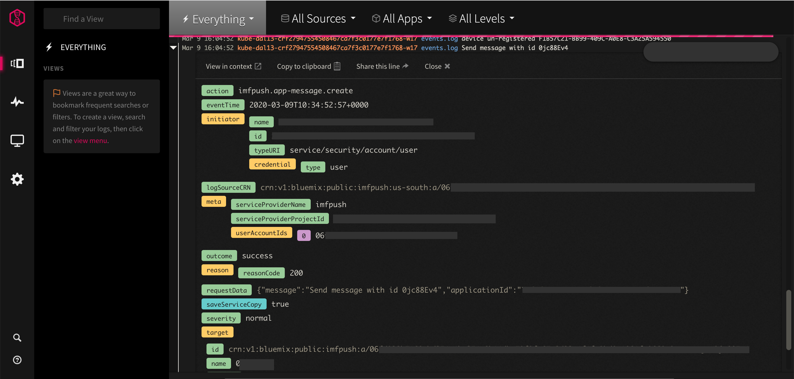

---

copyright:
  years: 2016, 2021
lastupdated: "2021-04-05"

keywords: push notifications, push notification, activity tracker for Push Notifications service, Monitoring instance for Push Notifications service, Push Notifications service events, Push Notifications service security, audit logs for Push Notifications service, viewing Push Notifications service events, Push Notifications service events

subcollection: mobilepush

---

{:external: target="_blank" .external}
{:shortdesc: .shortdesc}
{:codeblock: .codeblock}
{:pre: .pre}
{:screen: .screen}
{:tsSymptoms: .tsSymptoms}
{:tsCauses: .tsCauses}
{:tsResolve: .tsResolve}
{:tip: .tip}
{:important: .important}
{:note: .note}
{:download: .download}
{:table: .aria-labeledby="caption"}
{:java: .ph data-hd-programlang='java'}
{:ruby: .ph data-hd-programlang='ruby'}
{:c#: .ph data-hd-programlang='c#'}
{:objectc: .ph data-hd-programlang='Objective C'}
{:python: .ph data-hd-programlang='python'}
{:javascript: .ph data-hd-programlang='javascript'}
{:php: .ph data-hd-programlang='PHP'}
{:swift: .ph data-hd-programlang='swift'}
{:reactnative: .ph data-hd-programlang='React Native'}
{:csharp: .ph data-hd-programlang='csharp'}
{:ios: .ph data-hd-programlang='iOS'}
{:android: .ph data-hd-programlang='Android'}
{:cordova: .ph data-hd-programlang='Cordova'}
{:xml: .ph data-hd-programlang='xml'}

# Auditing events for {{site.data.keyword.mobilepushshort}} service
{: #at_events}

As a security officer, auditor, or manager, use the Activity Tracker service to track how users and applications interact with the {{site.data.keyword.mobilepushshort}} service in {{site.data.keyword.cloud}}. You can manage, view, and audit actions or events such as device registration, device subscription, and application configuration can be tracked for {{site.data.keyword.mobilepushshort}} service. 
{: shortdesc}

{{site.data.keyword.at_full_notm}} records user-initiated activities that change the state of a service in {{site.data.keyword.cloud_notm}}. You can use this service to investigate abnormal activity and critical actions and to comply with regulatory audit requirements. In addition, you can be alerted about actions as they happen. The events that are collected comply with the Cloud Auditing Data Federation (CADF) standard. For more information, see the [getting started tutorial for {{site.data.keyword.at_full_notm}}](/docs/activity-tracker?topic=activity-tracker-getting-started).

## Prerequisite
{: at-prerequisite}

You need to have an instance of {{site.data.keyword.at_full_notm}} in the region where you would like to track events.

To view and search for the event logs, use any one of the {{site.data.keyword.at_full_notm}} plans (7 or 14 or 30 days) based on your log search need. Using {{site.data.keyword.at_full_notm}} lite plan is not recommended for event logging.
{: important}

## List of events by {{site.data.keyword.mobilepushshort}} service
{: #at_actions}

The following table lists the {{site.data.keyword.cloudaccesstrailfull}} events for {{site.data.keyword.cloud_notm}} {{site.data.keyword.mobilepushshort}} service:

|Action                                      |Description                                                                       |
|--------------------------------------------|----------------------------------------------------------------------------------|
|imfpush.app.create                          |App provisioned                                                                   |
|imfpush.app.delete                          |App unprovisioned                                                                 |
|imfpush.app.list                            |Get all the settings of an application                                            |
|imfpush.app.update                          |Updates to the Application                                                        |
|imfpush.app-channel.create                  |Channel creation                                                                  |
|imfpush.app-channel.delete                  |Channel deletion                                                                  |
|imfpush.app-channel.list                    |Get all channels of an application                                                |
|imfpush.app-channel.read                    |App channel information read                                                      |
|imfpush.app-channel.update                  |Channel updation                                                                  |
|imfpush.app-channel-group.create            |Channel group create                                                              |
|imfpush.app-channel-group.delete            |Channel group delete                                                              |
|imfpush.app-channel-group.list              |Get all channel groups of an application                                          |
|imfpush.app-channel-group.read              |App channel group read                                                            |
|imfpush.app-channel-group.update            |Channel group update                                                              |
|imfpush.app-conf-apns.delete                |Application configuration deletion for apns                                       |
|imfpush.app-conf-apns.read                  |Application configuration read for apns                                           |
|imfpush.app-conf-apns.update                |Application configuration update for apns                                         |
|imfpush.app-conf-chrome.delete              |Application configuration deletion for chrome                                     |
|imfpush.app-conf-chrome.read                |Application configuration read for chrome                                         |
|imfpush.app-conf-chrome.update              |Application configuration update for chrome                                       |
|imfpush.app-conf-chromeapp.delete           |Application configuration deletion for chromeapp                                  |
|imfpush.app-conf-chromeapp.read             |Application configuration read for chromeapp                                      |
|imfpush.app-conf-chromeapp.update           |Application configuration update for chromeapp                                    |
|imfpush.app-conf-firefox.delete             |Application configuration deletion for firefox                                    |
|imfpush.app-conf-firefox.read               |Application configuration read for firefox                                        |
|imfpush.app-conf-firefox.update             |Application configuration update for firefox                                      |
|imfpush.app-conf-gcm.delete                 |Application configuration deletion for gcm                                        |
|imfpush.app-conf-gcm.read                   |Application configuration read for gcm                                            |
|imfpush.app-conf-gcm.update                 |Application configuration update for gcm                                          |
|imfpush.app-conf-safari.delete              |Application configuration deletion for safari                                     |
|imfpush.app-conf-safari.read                |Application configuration read for safari                                         |
|imfpush.app-conf-safari.update              |Application configuration update for safari                                       |
|imfpush.app-device.create                   |Device registration                                                               |
|imfpush.app-device.delete                   |Device unregistration                                                             |
|imfpush.app-device.list                     |Get all devices of an application                                                 |
|imfpush.app-device.read                     |Device information read                                                           |
|imfpush.app-device.update                   |Update device of an application                                                   |
|imfpush.app-device.report.read              |Devices report                                                                    |
|imfpush.app-message.create                  |Send message                                                                      |
|imfpush.app-message.delete                  |Message deleted for an application                                                |
|imfpush.app-message.list                    |Get messages for an application                                                   |
|imfpush.app-message.read                    |Message information read                                                          |
|imfpush.app-message.delivery_status.read    |Get delivery status of a message                                                  |
|imfpush.app-message.delivery_status.update  |Update delivery status of a message                                               |
|imfpush.app-message-latest.read             |Latest Messages information by timestamp                                          |
|imfpush.app-message-report.read             |Get message report of an application                                              |
|imfpush.app-message-report.list             |Get all messages report of an application                                         |
|imfpush.app-message-status.read             |Get status of a message                                                           |
|imfpush.app-subscription.create             |Device subscription for a tag                                                     |
|imfpush.app-subscription.delete             |Device unsubscription for a tag                                                   |
|imfpush.app-subscription.list               |Get subscription of an application                                                |
|imfpush.app-subscription.read               |Subscription information read                                                     |
|imfpush.app-tag.create                      |Tag creation                                                                      |
|imfpush.app-tag.delete                      |Tag deletion                                                                      |
|imfpush.app-tag.list                        |Get tags of an application                                                        |
|imfpush.app-tag.read                        |Tag information read                                                              |
|imfpush.app-tag.update                      |Tag update                                                                        |
|imfpush.app-webhook.create                  |Webhook creation                                                                  |
|imfpush.app-webhook.delete                  |Webhook deletion                                                                  |
|imfpush.app-webhook.list                    |Get all web hooks of an application                                               |
|imfpush.app-webhook.read                    |Webhook information read                                                          |
|imfpush.app-webhook.update                  |Webhook update                                                                    |
|imfpush.credentials.ready-to-use	           |Event sent before sending credentials for encryption or decryption to Key Protect |
|imfpush.instance-key-state.update           |Events sent for KP lifecycle events like enable, disable, rotation and deletion.  |
{: caption="Table 1. List of actions that genererate an event" caption-side="top"}

Currently, the {{site.data.keyword.cloudaccesstrailshort}} Events for {{site.data.keyword.cloud_notm}} {{site.data.keyword.mobilepushshort}} service are available only on `Dallas, Washington DC, London, Sydney, and Tokyo`.
{: note}

## Viewing events
{: #at_ui}

Events that are generated by an instance of the {{site.data.keyword.mobilepushshort}} service are automatically forwarded to the {{site.data.keyword.at_full_notm}} service instance that is available in the same location.

{{site.data.keyword.mobilepushshort}} service manages Activity Tracker by using the same common Dallas instance for Washington DC and Dallas and use tags that let events filter based on region.
{: note}

{{site.data.keyword.at_full_notm}} can have only one instance per location. To view events, you must access the web UI of the {{site.data.keyword.at_full_notm}} service in the same location where your service instance is available. For more information, see [Launching the web UI through the IBM Cloud UI](/docs/activity-tracker?topic=activity-tracker-launch#launch_cloud_ui).

## Analyzing events
{: #at_events_iam_analyze}

{{site.data.keyword.at_full_notm}} compiles all of your logs at an account level, which means that all of your services are shown in the same instance, per region. If you have an app that runs in Dallas and another app that runs in London, the events are found in the respective instances of Activity Tracker.

1. Log in to your IBM Cloud account.
1. In the IBM Cloud console navigation, click **Observability**.
1. Select **Activity Tracker** from the **Observability** navigation.
1. Select the instance of Activity Tracker that correlates to the region for which you want to see events.
1. Click **Open Dashboard**. When the dashboard loads, you see an overview of all of the activity that is covered by that instance of {{site.data.keyword.at_full_notm}}. You can use the search operators to filter the events by tags, sources, apps, or levels. You can also search for specific events or jump to a specific timeframe.
1. To see events for **Push Notification Service** select **imfpush** from the **All Sources** drop-down. To help meet compliance regulations, you can choose to retain your events or archive them into [IBM Cloud Object Storage](https://www.ibm.com/cloud/object-storage).
1. For update events user can use intialValue and newValue provided as part of **requestData** to check the delta. However if the information is confidential newValue will contain uniqueId of the resource, user can use newValue and applicationId provided as part of **requestData** to cross check the delta.

   

   Figure 1: View of your Activity Tracker instance with a sample audit event.
