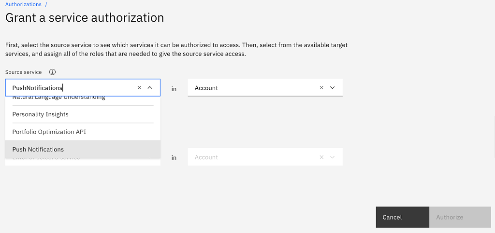
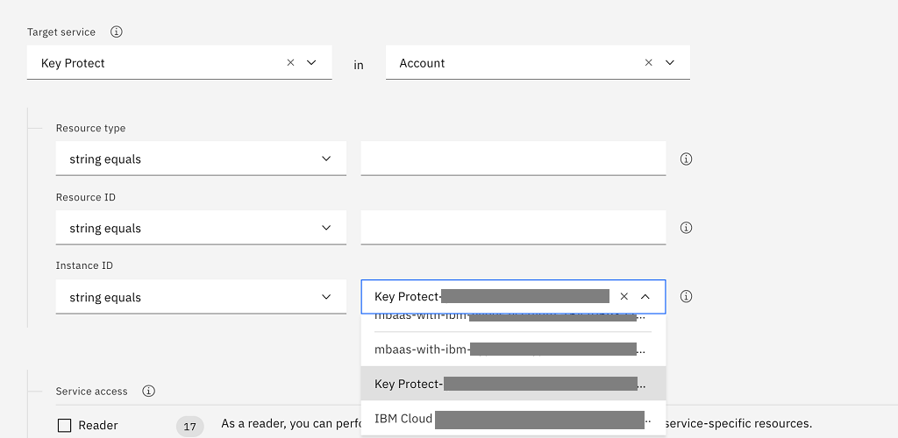
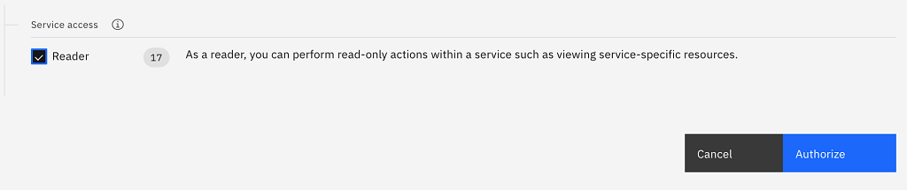
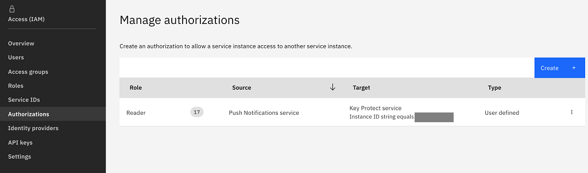

---

copyright:
  years: 2020
lastupdated: "2020-10-07"

keywords: push notifications, push notification, notifications, byok, key protect integration

subcollection: mobilepush

---

{:external: target="_blank" .external}
{:shortdesc: .shortdesc}
{:codeblock: .codeblock}
{:pre: .pre}
{:screen: .screen}
{:tsSymptoms: .tsSymptoms}
{:tsCauses: .tsCauses}
{:tsResolve: .tsResolve}
{:tip: .tip}
{:important: .important}
{:note: .note}
{:download: .download}
{:java: .ph data-hd-programlang='java'}
{:ruby: .ph data-hd-programlang='ruby'}
{:c#: .ph data-hd-programlang='c#'}
{:objectc: .ph data-hd-programlang='Objective C'}
{:python: .ph data-hd-programlang='python'}
{:javascript: .ph data-hd-programlang='javascript'}
{:php: .ph data-hd-programlang='PHP'}
{:swift: .ph data-hd-programlang='swift'}
{:reactnative: .ph data-hd-programlang='React Native'}
{:csharp: .ph data-hd-programlang='csharp'}
{:ios: .ph data-hd-programlang='iOS'}
{:android: .ph data-hd-programlang='Android'}
{:cordova: .ph data-hd-programlang='Cordova'}
{:xml: .ph data-hd-programlang='xml'}

# Key Protect Integration 
{: #push_key_protect_integration}

You can create or add a root key in Key Protect, and provision a {{site.data.keyword.mobilepushshort}} service instance with BYOK for **Advanced Plan** only. For existing {{site.data.keyword.mobilepushshort}} service instances use the default key protection.
{: important}

The customer settings for each platform that is stored in {{site.data.keyword.cloud_notm}} {{site.data.keyword.mobilepushshort}} is encrypted by default by using the default key protect instance for {{site.data.keyword.mobilepushshort}} service. If you need to control the encryption keys, you can Bring Your Own Key (BYOK) through [{{site.data.keyword.keymanagementservicelong_notm}}](https://cloud.ibm.com/catalog/key-protect), and use one of your own keys to encrypt your databases and backups.
{: shortdesc}

To get started, you need [Key Protect](https://cloud.ibm.com/catalog/services/key-protect) provisioned on your {{site.data.keyword.cloud_notm}} account.

Make sure you provision [Key Protect](https://cloud.ibm.com/catalog/services/key-protect) instance in the same region as {{site.data.keyword.mobilepushshort}} service instance. 
{: note}

## Create or add a root key in Key Protect
{: #push-byok-create-or-add-key}

If you are not prefer to use the default root key used by {{site.data.keyword.mobilepushshort}} service, navigate to your instance of Key Protect and [generate or enter a key](https://cloud.ibm.com/docs/key-protect?topic=key-protect-getting-started-tutorial).

## Granting service authorization
{: #push-byok-grant-service-authorization}

Authorize Key Protect for use with Push Notifications deployments:

1. Open your {{site.data.keyword.cloud_notm}} dashboard.
1. From the menu bar, click **Manage > Access (IAM)**.
1. In the side navigation, click **Authorizations**.
1. Click **Create**.
1. In the **Source service** menu, select the service of the deployment. For example, **{{site.data.keyword.mobilepushshort}}**.

   

1. In the **Source service instance** menu, select **All instances**.
1. In the **Target service** menu, select **Key Protect**.

   

1. Select or retain the default value Account as the resource group for the **Target Service**.
1. In the **Target service Instance ID** menu, select the service instances to authorize.
1. Enable the **Reader** role.

   

1. Click **Authorize**.

   

If the service authorization is not present before provisioning your deployment with a key, the provision fails with 401 error.
{: note}

## Prerequisite before using BYOK

- To get started, you need Key Protect provisioned on your [{{site.data.keyword.cloud_notm}}](https://cloud.ibm.com/catalog/services/key-protect) account.
- Once Key Protect instance gets provisioned, create a [root key](https://cloud.ibm.com/docs/key-protect?topic=key-protect-getting-started-tutorial).

There are two types of keys that are provided by Key Protect a) root key b) shared key, root key is needed for BYOK not shared key as it is only for persisting data into key protect, it cannot be used for encryption and decryption as required by BYOK.
{: note}

## Provisioning {{site.data.keyword.mobilepushshort}} service instance with BYOK
{: #push-byok-provisioning-instances}

When you provision your {{site.data.keyword.mobilepushshort}} service instance with your own `keyprotect` instance and `rootID`, {{site.data.keyword.mobilepushshort}} service registers your `keyprotect rootId` with {{site.data.keyword.mobilepushshort}} service instance CRN in the KMS (Key Protect Management System) that uses CRN token, which is valid only for customer push instance.

If the service-to-service authorization not enabled in [previous step](#grant-service-authorization), then {{site.data.keyword.mobilepushshort}} service will not be able to get CRN token and the provision fails with `401 UnAuthorized error`.
{: note}

For more information on creating a {{site.data.keyword.mobilepushshort}} service instance with BYOK, see [here](/docs/mobilepush?topic=mobilepush-push_step_1a).

## Deleting {{site.data.keyword.mobilepushshort}} service instance with BYOK
{: #push-byok-provisioning-instances-delete}

When {{site.data.keyword.mobilepushshort}} service instance gets deleted, {{site.data.keyword.mobilepushshort}} service unregisters the {{site.data.keyword.mobilepushshort}} service instance `CRN` and customer `rootId` mapping from the KMS (Key Protect Management System).

## Encryption with BYOK
{: #push-byok-encryption}

The customer platform-specific settings (GCM, APNS, and so on) are stored as encrypted data in {{site.data.keyword.mobilepushshort}} service. This encryption is carried over by default by {{site.data.keyword.mobilepushshort}} service by using IBM's own key protect instance.

With BYOK, the encryption is carried out using customer `rootID` and customer `CRN token` generated by {{site.data.keyword.mobilepushshort}} service on behalf of customer.

## Decryption with BYOK
{: #push-byok-deencryption}

The customer platform-specific settings are stored in {{site.data.keyword.mobilepushshort}} service in encrypted form. To use customer setting for sending notification, {{site.data.keyword.mobilepushshort}} service decrypts the data by using {{site.data.keyword.keymanagementservicelong_notm}} instance.

With BYOK, the decryption is carried out using customer `rootID` and customer `CRN token` generated by {{site.data.keyword.mobilepushshort}} service on behalf of customer.
