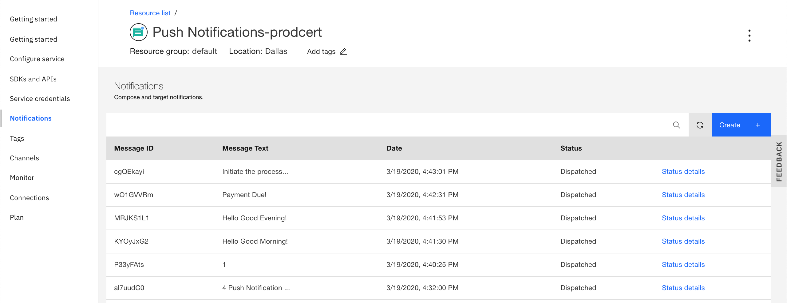
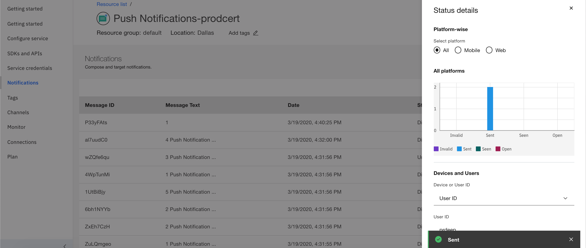

---

copyright:
  years: 2015, 2020
lastupdated: "2020-03-19"

keywords: push notifications, notifications, message delivery status

subcollection: mobile-pushnotification

---

{:external: target="_blank" .external}
{:shortdesc: .shortdesc}
{:codeblock: .codeblock}
{:pre: .pre}
{:screen: .screen}
{:tsSymptoms: .tsSymptoms}
{:tsCauses: .tsCauses}
{:tsResolve: .tsResolve}
{:tip: .tip}
{:important: .important}
{:note: .note}
{:download: .download}
{:java: .ph data-hd-programlang='java'}
{:ruby: .ph data-hd-programlang='ruby'}
{:c#: .ph data-hd-programlang='c#'}
{:objectc: .ph data-hd-programlang='Objective C'}
{:python: .ph data-hd-programlang='python'}
{:javascript: .ph data-hd-programlang='javascript'}
{:php: .ph data-hd-programlang='PHP'}
{:swift: .ph data-hd-programlang='swift'}
{:reactnative: .ph data-hd-programlang='React Native'}
{:csharp: .ph data-hd-programlang='csharp'}
{:ios: .ph data-hd-programlang='iOS'}
{:android: .ph data-hd-programlang='Android'}
{:cordova: .ph data-hd-programlang='Cordova'}
{:xml: .ph data-hd-programlang='xml'}

# Message delivery status
{: #message-delivery-status}

With the {{site.data.keyword.mobilepushshort}} service, you can view the delivery status of every notification that has been submitted to the service. 

Once the message has been sent, you can track delivery information of a message by looking at its delivery status. At any given time, the service displays status of only the latest 10 messages that is available within a period of 90 days.

The {{site.data.keyword.mobilepushshort}} service **Notifications** displays the notification and their status.

1. **Message ID** -  A unique identifier to identify a message.
1. **Message Text** - A message template that was sent to the app users.
1. **Date** - Date and time the message was submitted to the service.
1. **Status** - Gives a brief summary status of a message. Depending on the delivery status of the message, you can see one of the following statuses:
   - Accepted: The message has been accepted for delivery by the Push Notifications service.
   - Dispatching: The notification has been received by notification provider - APNs, FCM, or Web, and is about to be dispatched. A notification that is while being dispatched can also return a failure with the status **Dispatching failed**.
   - Dispatched: The notification has been dispatched by the notification provider.
   - Processing: The message is being processed to be dispatched to the notification provider gateway. A notification that is being processed can also return a failure with the status **Processing failed**.
   - Unknown: The status of the notification cannot be determined.
1. **View** - Displays delivery status of the notifications that are dispatched. You can view information based on the following aspects:
   - Category: All, Mobile, Web<!---and HTTP--->.
   - Message status: Sent, Seen, Open, and Invalid. 
1. **Options** - Gives a detailed status of a notification. Status can be tracked by selecting either the `Device Id` or the `User Id` from the dropdown menu. Getting user/device specific detailed status message can be helpful when you are tracking a failed message.

   

   The feature is enabled only for users who have opted the `Advanced Plan`. Select **Plan** in the {{site.data.keyword.mobilepushshort}} service console to [upgrade](https://cloud.ibm.com/docs/account?topic=account-upgrading-account)
   {: note}
