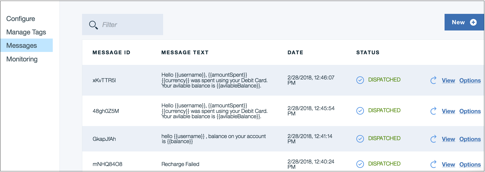

---

copyright:
  years: 2015, 2019
lastupdated: "2019-06-06"

keywords: push notifications, notifications, message delivery status

subcollection: mobile-pushnotification

---

{:new_window: target="_blank"}
{:shortdesc: .shortdesc}
{:screen:.screen}
{:codeblock:.codeblock}

# Message delivery status
{: #message-delivery-status}

With the {{site.data.keyword.mobilepushshort}} service, you can view the delivery status of every notification that has been submitted to the service. 

Once the message has been sent, you can track delivery information of a message by looking at its delivery status. At any given point of time, the service displays status of only the latest 10 messages that is available within a period of 90 days.

The {{site.data.keyword.mobilepushshort}} service **Messages** tab displays the notification status.

1. **Message ID** -  A unique identifier to identify a message.

2. **Message Text** - A message template that was sent to the app users.

3. **Date** - Date and time the message was submitted to the service.

4. **Status** - Gives a brief summary status of a message. Depending on the delivery status of the message, you may see one of the following status:

 - Accepted: The message has been accepted for delivery by the Push Notifications service.
   
 - Dispatching: The notification has been received by notification provider - APNs, FCM, or Web, and is about to be dispatched. A notification that is in the process of being dispatched can also return a failure with the status **Dispatching failed**.
 
 - Dispatched: The notification has been dispatched by the notification provider.
 
 - Processing: The message is being processed, to be dispatched to the notification provider gateway. A notification that is being processed can also return a failure with the status **Processing failed**.
 
 - Unknown: The status of the notification cannot be determined.
 
5. **View** - Displays delivery status of the notifications that are dispatched. You can view information based on the following aspects:

 - Category: All, Mobile, Web<!---and HTTP--->.
 
 - Message status: Sent, Seen, Open and Invalid. 

6. **Options** - Gives a detailed status of a notification. Status can be tracked by selecting either the `Device Id` or the `User Id` from the dropdown menu. Getting user/device specific detailed status message may be helpful when you are tracking a failed message.

**Note**: The feature is enabled only for users who have opted the `Advanced Plan`. Select **Plan** in the {{site.data.keyword.mobilepushshort}} service console to [upgrade](https://cloud.ibm.com/docs/account?topic=account-changing#changing)

