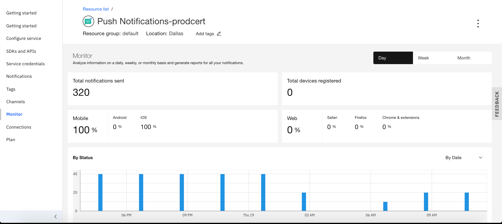
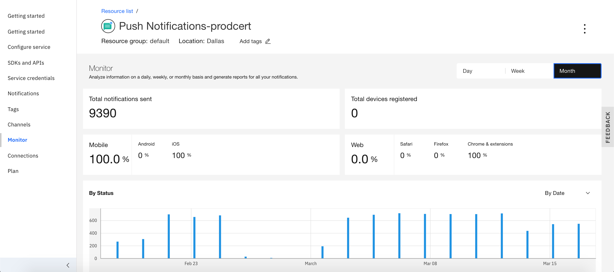

---

copyright:
  years: 2015, 2020
lastupdated: "2020-03-19"

keywords: push notifications, notifications, monitoring notification

subcollection: mobile-pushnotification

---

{:external: target="_blank" .external}
{:shortdesc: .shortdesc}
{:codeblock: .codeblock}
{:pre: .pre}
{:screen: .screen}
{:tsSymptoms: .tsSymptoms}
{:tsCauses: .tsCauses}
{:tsResolve: .tsResolve}
{:tip: .tip}
{:important: .important}
{:note: .note}
{:download: .download}
{:java: .ph data-hd-programlang='java'}
{:ruby: .ph data-hd-programlang='ruby'}
{:c#: .ph data-hd-programlang='c#'}
{:objectc: .ph data-hd-programlang='Objective C'}
{:python: .ph data-hd-programlang='python'}
{:javascript: .ph data-hd-programlang='javascript'}
{:php: .ph data-hd-programlang='PHP'}
{:swift: .ph data-hd-programlang='swift'}
{:reactnative: .ph data-hd-programlang='React Native'}
{:csharp: .ph data-hd-programlang='csharp'}
{:ios: .ph data-hd-programlang='iOS'}
{:android: .ph data-hd-programlang='Android'}
{:cordova: .ph data-hd-programlang='Cordova'}
{:xml: .ph data-hd-programlang='xml'}

# Monitor notifications 
{: #push_monitoring}

From the {{site.data.keyword.mobilepushshort}} service console, select **Monitor** on the left navigation menu. This will display the notification information on a day, weekly, or monthly basis and generate reports for all your notifications.

The monitoring details include:
* Total Notifications sent
* Total devices registered
* Platform information like Mobile (Android, iOS), Web (Safari, Firefox, Chrome & extensions)
* By status of the notifications (Invalid, Sent, Seen, Open)
* Devices registered

