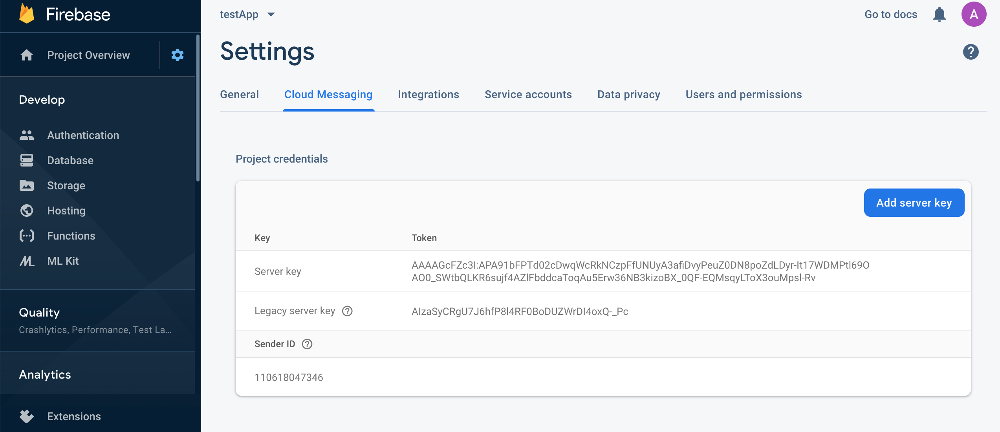
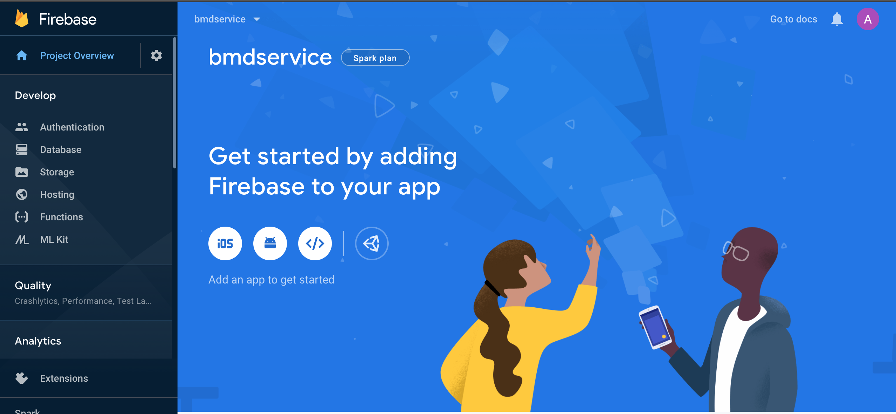
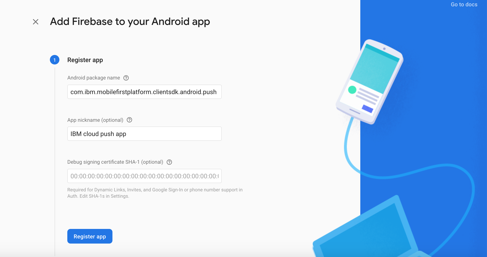
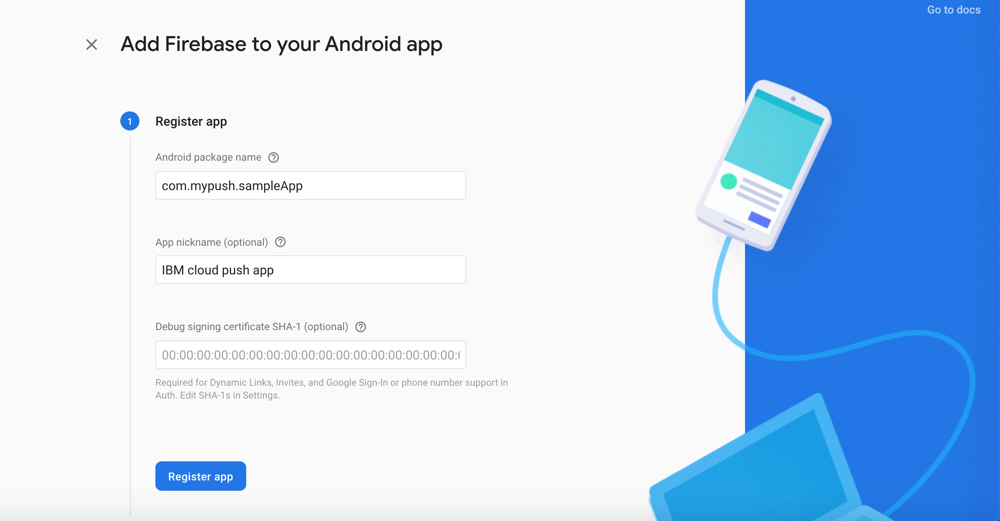
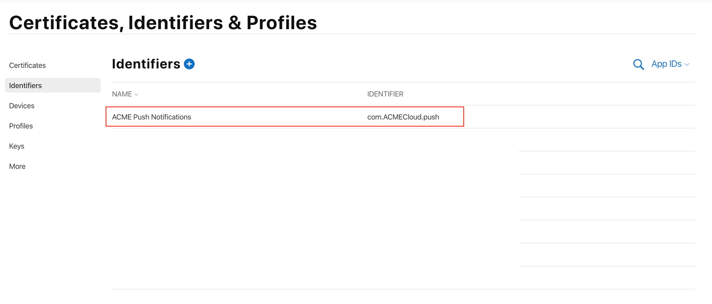
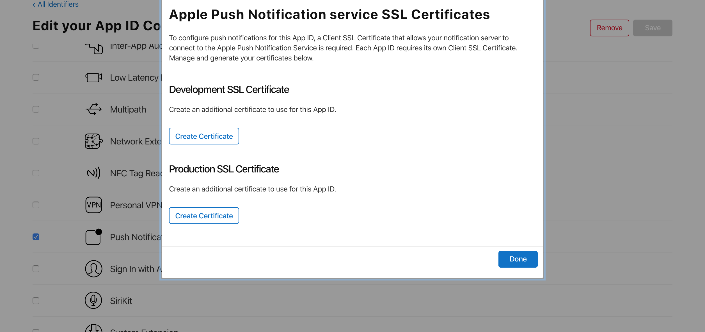
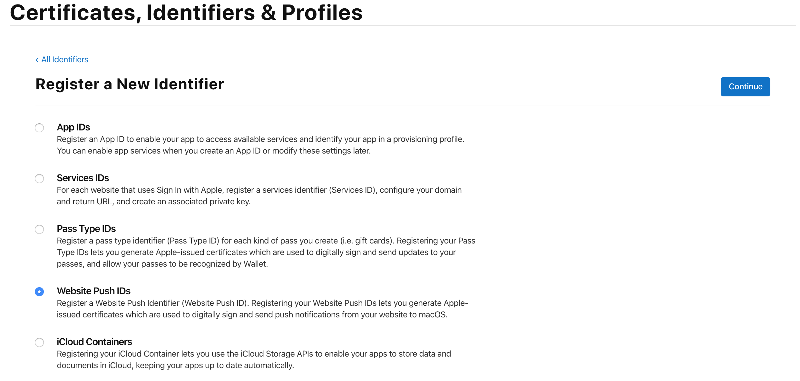

---

copyright:
  years: 2015, 2020
lastupdated: "2020-02-04"

keywords: push notifications, notification provider credentials

subcollection: mobile-pushnotification

---

{:external: target="_blank" .external}
{:shortdesc: .shortdesc}
{:codeblock: .codeblock}
{:pre: .pre}
{:screen: .screen}
{:tsSymptoms: .tsSymptoms}
{:tsCauses: .tsCauses}
{:tsResolve: .tsResolve}
{:tip: .tip}
{:important: .important}
{:note: .note}
{:download: .download}
{:java: .ph data-hd-programlang='java'}
{:ruby: .ph data-hd-programlang='ruby'}
{:c#: .ph data-hd-programlang='c#'}
{:objectc: .ph data-hd-programlang='Objective C'}
{:python: .ph data-hd-programlang='python'}
{:javascript: .ph data-hd-programlang='javascript'}
{:php: .ph data-hd-programlang='PHP'}
{:swift: .ph data-hd-programlang='swift'}
{:reactnative: .ph data-hd-programlang='React Native'}
{:csharp: .ph data-hd-programlang='csharp'}
{:ios: .ph data-hd-programlang='iOS'}
{:android: .ph data-hd-programlang='Android'}
{:cordova: .ph data-hd-programlang='Cordova'}
{:xml: .ph data-hd-programlang='xml'}

# Step 2: Obtain your notification provider credentials
{: #push_step_1}

To set up {{site.data.keyword.mobilepushshort}} service, you need to obtain the required credentials from your push notification provider. 

## For Android
{: #push_step_1_android}

Firebase Cloud Messaging (FCM) is the gateway that is used to deliver push notifications to Android devices, Google Chrome browser and Chrome Apps & Extensions. To set up the {{site.data.keyword.mobilepushshort}} service on the console, you need to get your FCM credentials (Sender ID and API key). 

The API key is stored securely and used by the {{site.data.keyword.mobilepushshort}} service to connect to the FCM server and the sender ID (project number) is used by the Android SDK and the JS SDK for Google Chrome and Mozilla Firefox on the client side. 

To set up FCM and obtain your credentials, complete the steps:

1. Visit the [Firebase Console](https://console.firebase.google.com/?pli=1){: external}. A Google user account is required. 
1. Select **Add project**. 
1. In the Create a project window, provide a project name, choose a country/region and click **Create project**.
1. In the navigation pane, select **Settings** > **Project settings**.
1. Choose the Cloud Messaging tab to obtain your project credentials - Server API Key and a Sender ID. Note that the Server key listed in FCM is the same as Server API Key.

   

You would also need to generate the `google-services.json` file. Complete the following steps:

1. In the Firebase console Project overview section, click the **Add android app** icon.

   

1. In Add Firebase to your Android app window, first add **com.ibm.mobilefirstplatform.clientsdk.android.push** as the Package Name. The App nickname field is optional. Click **REGISTER APP**. 

   

1. Now, include the package name of your application, by entering the package name in Add Firebase to your Android app window. The App nickname field is optional. Click **REGISTER APP**. See the following example:

   

1. The `google-services.json` file is generated. 

Once you have obtained your FCM credentials and have generated the `google-services.json` file, the next step is to [Create a service instance](/docs/services/mobilepush?topic=mobile-pushnotification-push_step_2).

Google has deprecated GCM and has integrated Cloud Messaging with Firebase. You have to migrate your GCM client apps on Android to FCM.
{: note}

## For iOS
{: #push_step_1_ios}

For iOS devices and applications, Apple Push Notification Service (APNs) allows application developers to send remote notifications from {{site.data.keyword.mobilepushshort}} service instance on IBM Cloud (the provider) to iOS devices and applications. Messages are sent to a target application on the device. 

You need to obtain and configure your APNs credentials. The APNs certificates are securely managed by {{site.data.keyword.mobilepushshort}} service and used to connect to APNs server as a provider.

### Registering an App ID
{: #push_step_1_ios_2}

The App ID (the bundle identifier) is a unique identifier that identifies a specific application. Each application requires an App ID. Services like the {{site.data.keyword.mobilepushshort}} service are configured to the App ID.

Ensure that you have an [Apple Developers](https://developer.apple.com/){: external} account. This is a mandatory prerequisite.
{: important}

1. Go to the [Apple Developer](https://developer.apple.com){: external} portal, click **Member Center**, and select **Certificates, Identifiers & Profiles**.
1. Go to **Identifiers** > **Add identifier button**.
1. In the **Register a New Identifier** page, select the **AppIDs** option. 
1. Provide the App name in the App ID Description Name field. For example, ACME Push Notifications.
1. Provide a string for the App ID Prefix.  
1. For the Bundle ID, choose **Explicit** and provide a Bundle ID value. It is recommended that you provide a reverse domain-name style string. For example, `com.ACMECloud.push`
1. Select the **{{site.data.keyword.mobilepushshort}}** check-box from the Capabilities and click **Continue**.
1. Go through your settings and click **Register** > **Done**.

Your App ID is now registered. 

### Create a development and distribution APNs SSL certificate
{: #push_step_1_ios_3}

Before you obtain an APNs certificate, you must first generate a certificate signing request (CSR) and submit it to Apple, the certificate authority (CA). The CSR contains information that identifies your company and your public and private key that you use to sign for your Apple push notifications. Then, generate the SSL certificate on the iOS Developer Portal. The certificate, along with its public and private key, is stored in Keychain Access.

You can use APNs in two modes: 
- Sandbox mode for development and testing.
- Production mode when distributing applications through the App Store (or other enterprise distribution mechanisms).

You must obtain separate certificates for your development and distribution environments. The certificates are associated with an App ID for the app that is the recipient of remote notifications. For production, you can create up to two certificates. IBM Cloud uses the certificates to establish an SSL connection with APNs.

<!-- Create a development and distribution SSL certificate. -->

1. Go to the [Apple Developer](https://developer.apple.com){: external} website, click **Member Center**, and select **Certificates, Identifiers & Profiles**.
1.  1. In the **Identifiers** area, select your App ID. 
1. Select the the **Push Notifications** check-box OR select the **configure** option, then:
   - On Development SSL certificate pane, click **Create Certificate..**.
   - On Production SSL certificate pane, click  **Create Certificate..**.

   

1. Use **Keychain Access** application on your Mac to create a Certificate Signing Request (CSR).
1. From the menu, select **Keychain Access > Certificate Assistant > Request a Certificate From a Certificate Authority…** 
1. In **Certificate Information**, enter the email address that is associated with your App Developer account and a common name. Give a meaningful name that helps you identify whether it is a certificate for development (sandbox) or distribution (production); for example, _sandbox-apns-certificate_ or _production-apns-certificate_.
1. Select **Save to disk** to download the `.certSigningRequest` file to your desktop, then click **Continue**.
1. In the **Save As** menu option, name the `.certSigningRequest` file and click **Save**.
1. Click **Done**. You now have a CSR.

1. For the Upload CSR file option, click **Choose File**, and select file  `CertificateSigningRequest.certSigningRequest`. 
1. Click **Continue**.
1. On the Download, Install and Backup pane, click **Download**. The `aps_development.cer` file is downloaded.

   	

1. Click **Download** to download your certificate, then click **Done**.
1. On your Mac, go to **Keychain Access > My Certificates**, and locate your newly installed certificate. Double-click the certificate to install it into the Keychain Access.
1. Select the certificate and private key, and then select **Export** to convert the certificate into the personal information exchange format (`.p12` format).

   

1. In the **Save As** field, provide the certificate a meaningful name. For example, `sandbox_apns.p12_certifcate` or `production_apns.p12`, then click **Save**.
	
   

1. In the **Enter a password** field, enter a password to protect the exported items, then click **OK**. You can use this password to configure your APNs settings on the {{site.data.keyword.mobilepushshort}} service console.
	
   

1. The **Key Access.app** prompts you to export your key from the **Keychain** screen. Enter your administrative password for your Mac to allow your system to export these items, and then select the **Always Allow** option. A `.p12` certificate is generated on your desktop.

### Creating a development provisioning profile
{: #create-push-credentials-dev-profile}

The provisioning profile works with the App ID to determine which devices can install and run your app and which services your app can access. For each App ID, you create two provisioning profiles: one for development and the other for distribution. Xcode uses the development provisioning profile to determine which developers are allowed to build the application and which devices are allowed to be tested on the application.

Ensure that you have registered an App ID, enabled it for {{site.data.keyword.mobilepushshort}} service, and configured it to use a development and production APNs SSL certificate.

Create a development provisioning profile, as follows:

1. Go to the [Apple Developer](https://developer.apple.com){: external} portal, click **Member Center**, and select **Certificates, Identifiers & Profiles**.
1. Go to the [Mac Developer Library](https://developer.apple.com/library/mac/documentation/IDEs/Conceptual/AppDistributionGuide/MaintainingProfiles/MaintainingProfiles.html#//apple_ref/doc/uid/TP40012582-CH30-SW62site){: external}, scroll to the **Creating Development Provisioning Profiles** section, and follow the instructions to create a development profile.

When you configure a development provision profile, select the following options:
* **iOS App Development**
* **For iOS and watchOS apps**
{: note}

### Creating a store distribution provisioning profile
{: #create-push-credentials-apns-distribute_profile}

Use the store provisioning profile to submit your app for distribution to the App Store.

1. Go to the [Apple Developer](https://developer.apple.com){: external} portal, click **Member Center**, and select **Certificates, Identifiers & Profiles**.
1. Double-click the downloaded provisioning profile to install it into Xcode.

After obtaining the credentials, the next step is to [Configure a service instance](/docs/services/mobilepush?topic=mobile-pushnotification-push_step_2).

## For web browsers and Chrome Apps & Extensions
{: #configure-credential-for-browsers}

The {{site.data.keyword.IBM_notm}} {{site.data.keyword.mobilepushshort}} service extends capabilities to send notifications to your browser and also Chrome Apps & Extensions.

The website URL or the domain name of your website is required by the {{site.data.keyword.mobilepushshort}} service to identify the requests that need to be allowed. 

For example: `https://www.acmebanks.com`

A {{site.data.keyword.mobilepushshort}} service instance supports only one domain name at a time. Hence, ensure that the same value is set for Chrome, Firefox and Safari. Chrome and Safari browsers require additional configuration for web push. You would need an FCM API key, as an FCM endpoint is used to deliver messages in Chrome. 

To set up the service for Chrome, Firefox browsers, and Chrome Apps & Extensions, see [Configure a service instance](/docs/services/mobilepush?topic=mobile-pushnotification-push_step_2).

### Configuring for Safari web push 
{: #configure-safari}

The supported version for {{site.data.keyword.mobilepushshort}} service on Safari is 10.0. You need to generate a certificate through your Apple Developer account, before you can configure your browser to receive notifications.

#### Generating a certificate
{: #certificate-generation}

Ensure that you have an Apple Developer account. You need to register a Website Push ID and generate a certificate to configure your Safari browser to receive notifications. The following steps will help you get started:

1. In the Apple Developer Member center, click **Certificates, ID & Profiles**. 
1. Click **Identifiers** and then **Add identifier button**.
1. In the **Register a New Identifier** page, select the **Website Push IDs** option.

   

1. In the Register Website Push ID pane, provide an appropriate Website Push ID description and identifier ID. It is recommended that this is in reverse-domain name format, starting with `web`. For example, `web.com.acmebanks`.
1. Register the Website Push ID. You now have your Website Push ID 
1. Open the identifier and select **Create certificate** to create a certificate to use for the Website Push ID.
1. Use **Keychain Access** application on your Mac to create a Certificate Signing Request (CSR).
1. From the menu, select **Keychain Access > Certificate Assistant > Request a Certificate From a Certificate Authority…** 
1. In **Certificate Information**, enter the email address that is associated with your App Developer account and a common name. Give a meaningful name that helps you identify whether it is a certificate for development (sandbox) or distribution (production); for example, _sandbox-apns-certificate_ or _production-apns-certificate_.
1. Select **Save to disk** to download the `.certSigningRequest` file to your desktop, then click **Continue**.
1. In the **Save As** menu option, name the `.certSigningRequest` file and click **Save**.
1. Click **Done**. You now have a CSR.
1. For the Upload CSR file option, click **Choose File**, and select file  `CertificateSigningRequest.certSigningRequest`. 
1. Click **Continue**. Ensure that you download the Website push certificate created in the `.cer` format.
1. Open the Certificate in the KeyChain Access tool. Right-click and export as a p12 certificate. Note the password that is provided during the generation of the p12 certificate.

After generating a certificate, the next step is to [Configure a service instance](/docs/services/mobilepush?topic=mobile-pushnotification-push_step_2).
