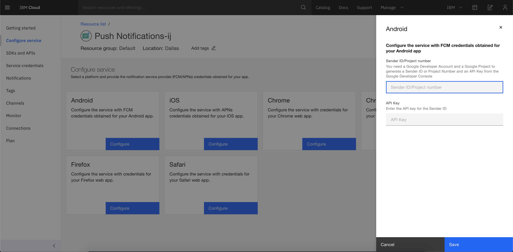
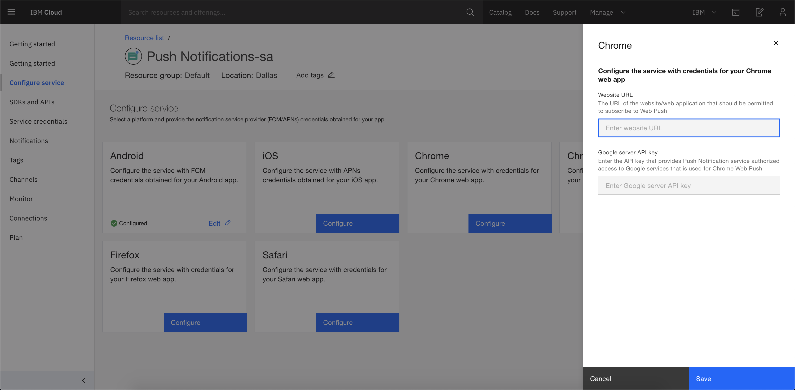
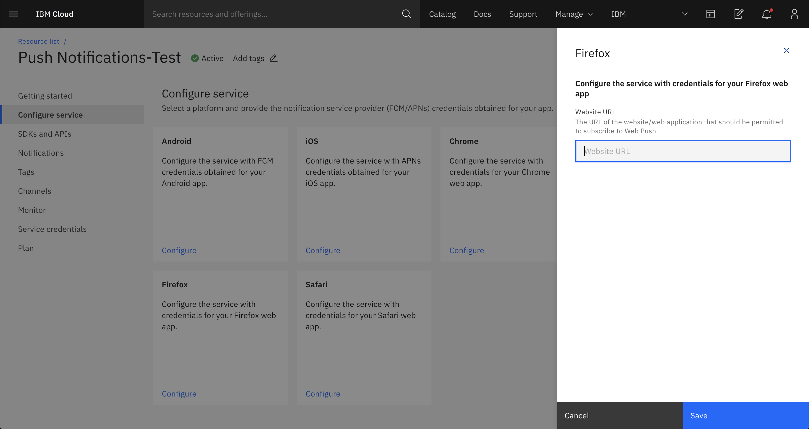
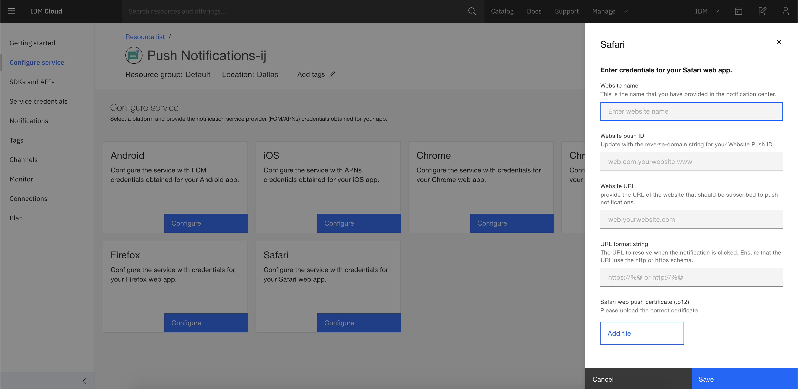

---

copyright:
  years: 2015, 2020
lastupdated: "2020-03-19"

keywords: push notifications, notifications, service instance, cordova application

subcollection: mobile-pushnotification

---

{:external: target="_blank" .external}
{:shortdesc: .shortdesc}
{:codeblock: .codeblock}
{:pre: .pre}
{:screen: .screen}
{:tsSymptoms: .tsSymptoms}
{:tsCauses: .tsCauses}
{:tsResolve: .tsResolve}
{:tip: .tip}
{:important: .important}
{:note: .note}
{:download: .download}
{:java: .ph data-hd-programlang='java'}
{:ruby: .ph data-hd-programlang='ruby'}
{:c#: .ph data-hd-programlang='c#'}
{:objectc: .ph data-hd-programlang='Objective C'}
{:python: .ph data-hd-programlang='python'}
{:javascript: .ph data-hd-programlang='javascript'}
{:php: .ph data-hd-programlang='PHP'}
{:swift: .ph data-hd-programlang='swift'}
{:reactnative: .ph data-hd-programlang='React Native'}
{:csharp: .ph data-hd-programlang='csharp'}
{:ios: .ph data-hd-programlang='iOS'}
{:android: .ph data-hd-programlang='Android'}
{:cordova: .ph data-hd-programlang='Cordova'}
{:xml: .ph data-hd-programlang='xml'}

# Configure a service instance 
{: #push_step_2}

Ensure that you have gone through [Obtain notification service provider credentials](/docs/services/mobilepush?topic=mobile-pushnotification-push_step_1).

You can configure the service for **Android** apps, **iOS** apps, **Chrome** web apps, **Chrome apps and extentions**, **Firefox** web apps, and **Safari** web apps by selecting the **Configure** button in the respective tile.

## For Android apps
{: #push_step_2_Android}

Ensure that you have gone through [Obtain notification service provider credentials](/docs/services/mobilepush?topic=mobile-pushnotification-push_step_1) to set up the FCM project and obtain your credentials.

To configure the service with FCM credentials for Android applications, complete the following steps:

1. In the {{site.data.keyword.mobilepushshort}} service console, click **Configure Service** on the left navigation menu.
1. In the Android tile, click **Configure**. 
1. In the side panel, update the FCM Push Credentials with the **Sender ID/Project number** and **Server Key** or **Legacy Server Key**. You can get these details from your FCM **Project Settings &gt; Cloud Messaging** section.

   

1. Click **Save**. The {{site.data.keyword.mobilepushfull}} service is now configured.

After you have setup the service, you need to [Set up the Push service client SDKs](/docs/services/mobilepush?topic=mobile-pushnotification-push_step_3).

## For iOS apps 
{: #enable-push-ios-notifications}

To use the {{site.data.keyword.mobilepushshort}} service to send notifications, upload the `.p12` certificates that you had created in [Obtain notification service provider credentials](/docs/services/mobilepush?topic=mobile-pushnotification-push_step_1). This certificate contains the private key and SSL certificates that are required to build and publish your application. You can also use the ReST API to upload an APNs certificate.

After the `.cer` file is in your key chain access, export it to your computer to create a `.p12` certificate.
{: note}

For more information about using the APNs, see [iOS Developer Library: Local and Push Notification Programming Guide](https://developer.apple.com/library/content/documentation/NetworkingInternet/Conceptual/RemoteNotificationsPG/APNSOverview.html#//apple_ref/doc/uid/TP40008194-CH8-SW1){: external}.

To set up APNs on the Push Notification service console, complete the steps:

1. In the {{site.data.keyword.mobilepushshort}} service console, click **Configure Service** on the left navigation menu.
1. In the iOS tile, click **Configure**. 
1. In the side panel, update the **APNs Push Credentials** information.
   - Select **Sandbox/development** or **Production** (distribution).
   - Click **Add file** and upload the `p.12` certificate that you have created. 
   - In the **Password** field, enter the password that is associated with the `.p12` certificate file.

   

1. Click **Save**. The {{site.data.keyword.mobilepushfull}} service is now configured.

After you have setup the service, you need to [Set up the Push service client SDKs](/docs/services/mobilepush?topic=mobile-pushnotification-push_step_3).

## For Chrome browser
{: #push_step_2_chrome}

To configure the service with credentials for your Chrome web app, complete the following steps:

1. In the {{site.data.keyword.mobilepushshort}} service console, click **Configure Service** on the left navigation menu.
1. In the Chrome tile, click **Configure**. 
1. In the side panel, update the **Website URL** of your website that will be registered to receive push notifications.
1. Enter the **Google server API Key**. 

   

1. Click **Save**. The {{site.data.keyword.mobilepushfull}} service is now configured.

After you have set up the service, you need to [Set up Push service client SDKs](/docs/services/mobilepush?topic=mobile-pushnotification-push_step_3).

## For Chrome apps and extensions
{: #push_step_2_chrome-apps}

Ensure that you have gone through [Obtain notification service provider credentials](/docs/services/mobilepush?topic=mobile-pushnotification-push_step_1) to set up the FCM project and obtain your credentials.

To configure the service with FCM credentials for your Chrome apps and extensions, complete the following steps:

1. In the {{site.data.keyword.mobilepushshort}} service console, click **Configure Service** on the left navigation menu.
1. In the Chrome apps and extensions tile, click **Configure**. 
1. In the side panel, update the FCM Push Credentials with the **Sender ID/Project number** and **Server Key** or **Legacy Server Key**. You can get these details from your FCM **Project Settings &gt; Cloud Messaging** section.

   

1. Click **Save**. The {{site.data.keyword.mobilepushfull}} service is now configured.

After you have setup the service, you need to [Set up the Push service client SDKs](/docs/services/mobilepush?topic=mobile-pushnotification-push_step_3).

## For Firefox browser
{: #push_step_2_firefox}

To configure the service with credentials for your Firefox web app, complete the following steps:

1. In the {{site.data.keyword.mobilepushshort}} service console, click **Configure Service** on the left navigation menu.
1. In the Firefox tile, click **Configure**. 
1. In the side panel, update the **Website URL** of your website that will be registered to receive push notifications.

   

1. Click **Save**. The {{site.data.keyword.mobilepushfull}} service is now configured.

After you have set up the service, you need to [Set up Push service client SDKs](/docs/services/mobilepush?topic=mobile-pushnotification-push_step_3).

## For Safari browser
{: #push_step_2_safari}

To use the {{site.data.keyword.mobilepushshort}} service to send notifications, upload the `.p12` certificates that you had created in [Obtain notification service provider credentials](/docs/services/mobilepush?topic=mobile-pushnotification-push_step_1). This certificate contains the private key and SSL certificates that are required to build and publish your application. You can also use the ReST API to upload an APNs certificate.

After the `.cer` file is in your key chain access, export it to your computer to create a `.p12` certificate.
{: note}

For more information about using the APNs, see [iOS Developer Library: Local and Push Notification Programming Guide](https://developer.apple.com/library/content/documentation/NetworkingInternet/Conceptual/RemoteNotificationsPG/APNSOverview.html#//apple_ref/doc/uid/TP40008194-CH8-SW1){: external}.

To set up APNs on the Push Notification service console, complete the steps:

1. In the {{site.data.keyword.mobilepushshort}} service console, click **Configure Service** on the left navigation menu.
1. In the Safari tile, click **Configure**. 
1. In the side panel, update the following details:
   - **Website name**: This is the name that you have provided in the Notification center.
   - **Website push ID**: Update with the reverse-domain string for your Website Push ID. For example, web.com.acmebanks.www.
   - **Website URL**: Provide the URL of the website that should be subscribed to push notifications. For example, `https://www.acmebanks.com`.
   - **URL Format String**: The URL to resolve when the notification is clicked. For example, [`https://www.acmebanks.com`]. Ensure that the URL use the http or https scheme.
   - **Safari web push certificate**: Upload the .p12 certificate.
   - In the **Password** field, enter the password that is associated with the `.p12` certificate file.
   - *Optional*: Upload the **Notification icon** of the size specified.

   

1. Click **Save**. The {{site.data.keyword.mobilepushfull}} service is now configured.

After you have set up the service for iOS applications, you need to [Set up Push service client SDKs](/docs/services/mobilepush?topic=mobile-pushnotification-push_step_3).

## For Cordova applications 
{: #push_step_2_b}

Cordova is a platform for building hybrid applications with JavaScript, CSS, and HTML. The {{site.data.keyword.mobilepushshort}} service supports development of Cordova-based iOS and Android applications.

To enable Cordova applications for receiving push notifications to your devices, go through [{{site.data.keyword.mobilepushfull}} Cordova plug-in Push SDK](https://github.com/ibm-bluemix-mobile-services/bms-clientsdk-cordova-plugin-push/tree/Doc#ios-app){: external}.

