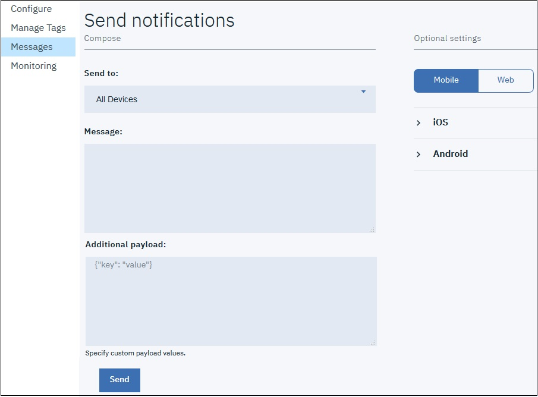
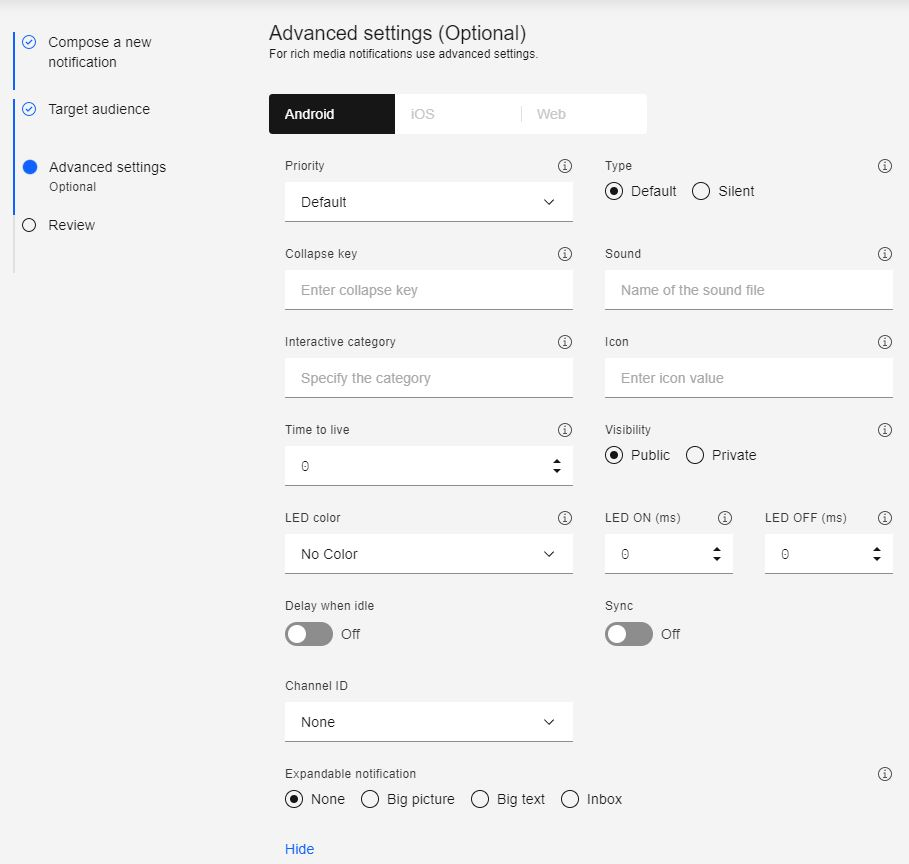

---

copyright:
 years: 2015, 2017

---

{:new_window: target="_blank"}
{:shortdesc: .shortdesc}
{:screen:.screen}
{:codeblock:.codeblock}

# Send a Push Notification
{: #push_step_4}
Last updated: 15 May 2017
{: .last-updated}

After you have developed your applications, you can send basic push notifications.

To send basic push notifications, complete the following steps:

1. Select **Send Notifications**, and compose a message by choosing a **Send to** option. The supported options are **Device by Tag**, **Device Id**, **User Id**, **Android devices**, **iOS devices**, **Web Notifications**, and **All Devices**.
**Note**: When you select the **All Devices** option, all devices subscribed to {{site.data.keyword.mobilepushshort}} will receive notifications.
	
	

2. In the **Message** field, compose your message. Choose to configure the optional settings as required.
3. Click **Send**.
3. Verify that your devices or browser has received the notification.

The following screen shot shows an alert box handling a push notification in the foreground on a Android device.
	

The following following screen shot shows a push notification in the background for Android.
	

## Optional Android settings 
{: #push_step_4_Android}

You can further customize the {{site.data.keyword.mobilepushshort}} settings for sending notifications to Android devices. 
	

The following optional customization options are supported:

- Collapse Key:  Collapse keys are attached to notifications. If multiple notifications arrive sequentially with the same collapse key when the device is offline, they are collapsed. When a device comes online, it receives notifications from the FCM/GCM server, and displays only the latest notification bearing the same collapse key. If the collapse key is not set, both the new and old messages are stored for the future delivery.
- Sound: Indicates a sound clip to be played on the receipt of a notification. Supports default or the name of a sound resource that is	 bundled in the app.
- Icon: Specify the name of the icon to display for the notification. Ensure that you have packaged the icon in the `res/drawable` folder, with the client application.
- Priority: Specifies the options for assigning delivery priority to messages. A priority of `high` or `max` will result in heads-up notification, while `low` or `default` priority messages would not open network connections on a sleeping device. For messages with the option set to `min`, it will be a silent notification.
- Visibility: You can choose to set the notification visibility option to either `public` or `private`. The `private` option restricts public viewing and you can choose to enable it if your device is secure with a pin or pattern, and the notification setting is set to **Hide sensitive notification content**. When the visibility is set as `private`, a `redact` field must be mentioned. Only the content specified in the `redact` field will show up on a secure locked screen on the device. Choosing `public` would render the notifications to be freely read.
- Time to live: This value is set in seconds. If this parameter is not specified, the FCM/GCM server stores the message for four weeks and will try to deliver. The validity expires after four weeks. The possible value range is from 0 to 2,419,200 seconds.
- Delay when idle: Setting this value to `true` instructs the FCM/GCM server not to deliver the notification if the device is idle. Set this value to `false`, to ensure delivery of notification even if the device is idle.
- Sync: By setting this option to `true`, notifications across all your registered devices are in sync. If the user with a username has multiple devices with the same application installed, reading the notification on one device ensures deletion of notifications in the other devices. You need to ensure that you are registered with {{site.data.keyword.mobilepushshort}} service with userId for this option to work.
- Additional payload: Specifies the custom payload values for your notifications.

## Optional iOS settings 
{: #push_step_4_ios}

You can customize the {{site.data.keyword.mobilepushshort}} settings for sending notifications to iOS devices. The following optional customization options are supported.

- **Badge**:  Indicates the number that is displayed on the application badge. The default value is zero (0), and this would not display a badge. 
- **Sound**: Indicates a sound clip to be played on the receipt of a notification. Supports default or the name of a sound resource bundled in the app.
- **Additional payload**: Specifies the custom payload values for your notifications.

You can also choose to enable [interactive notifications](https://github.com/ibm-bluemix-mobile-services/bms-clientsdk-swift-push/tree/Doc#enable-interactive-push-notifications) and [rich media notifications](https://github.com/ibm-bluemix-mobile-services/bms-clientsdk-swift-push/tree/Doc#enabling-ios-10-rich-push-notification).

## Monitoring for delivered notifications 
{: #push_step_4_monitor}

To configure your monitoring utility, go through either of the following options:

- For your Android notifications, see [Enable monitoring for Android applications](https://github.com/ibm-bluemix-mobile-services/bms-clientsdk-android-push/tree/Doc#enable-monitoring)
- For your iOS notifications, see [Enable monitoring for iOS applications](https://github.com/ibm-bluemix-mobile-services/bms-clientsdk-swift-push/tree/Doc#enable-monitoring).
