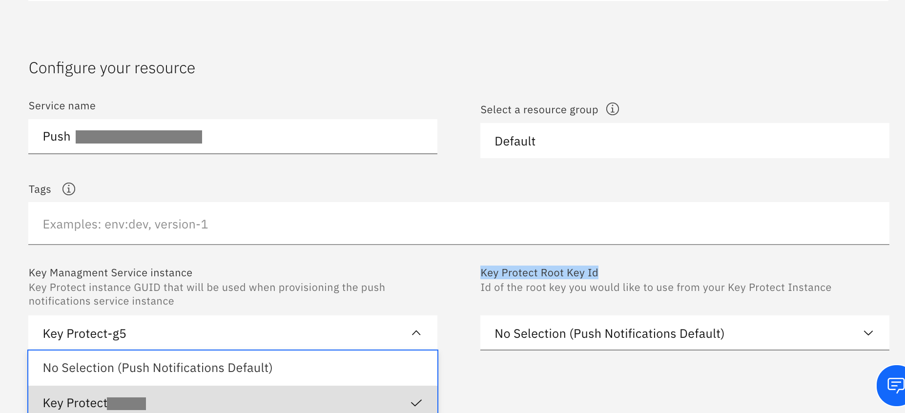
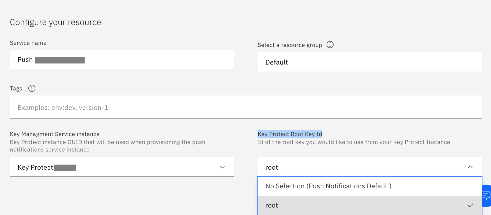

---

copyright:
  years: 2015, 2020
lastupdated: "2020-10-07"

keywords: push notifications, push notification, creating an ibm cloud service instance, ibm cloud service

subcollection: mobilepush

---

{:external: target="_blank" .external}
{:shortdesc: .shortdesc}
{:codeblock: .codeblock}
{:pre: .pre}
{:screen: .screen}
{:tsSymptoms: .tsSymptoms}
{:tsCauses: .tsCauses}
{:tsResolve: .tsResolve}
{:tip: .tip}
{:important: .important}
{:note: .note}
{:download: .download}
{:java: .ph data-hd-programlang='java'}
{:ruby: .ph data-hd-programlang='ruby'}
{:c#: .ph data-hd-programlang='c#'}
{:objectc: .ph data-hd-programlang='Objective C'}
{:python: .ph data-hd-programlang='python'}
{:javascript: .ph data-hd-programlang='javascript'}
{:php: .ph data-hd-programlang='PHP'}
{:swift: .ph data-hd-programlang='swift'}
{:reactnative: .ph data-hd-programlang='React Native'}
{:csharp: .ph data-hd-programlang='csharp'}
{:ios: .ph data-hd-programlang='iOS'}
{:android: .ph data-hd-programlang='Android'}
{:cordova: .ph data-hd-programlang='Cordova'}
{:xml: .ph data-hd-programlang='xml'}

# Creating an {{site.data.keyword.cloud_notm}} {{site.data.keyword.mobilepushshort}} service instance
{: #push_step_1a}

You need to create an [IBM Cloud account](https://cloud.ibm.com/).

To create a {{site.data.keyword.mobilepushshort}} service from the catalog, complete the following steps:

1. In the [IBM Cloud catalog](https://cloud.ibm.com/catalog#services), click **Mobile** > **Push Notifications**.
1. **Select a Region** from the dropdown list and **Select a pricing plan**.
1. Provide a **Service name**. 
1. `Optional` Select a resource group.

   Consider how you want the resources that are organized in your account. The resource group that you selected cannot be changed after the service instance is created. 
   {: note}

1. `Optional` Add **Tags**, if required.
1. `Optional` Select the **Key Managment Service instance** ID from the list of instances, if you want bring your own encryption keys using Key Protect.

   You need to pre-create the Key protect instances and enable service-to-service Authorization before creating {{site.data.keyword.mobilepushshort}} instance, as documented [here](/docs/mobilepush?topic=mobilepush-push_key_protect_integration).
   {: note}

   Key Management Service is enabled for **Advanced Plan** only.
   {: important}

   

1. `Optional` Select the **Key Protect Root Key ID** from the list of keys that you want to use it in this {{site.data.keyword.mobilepushshort}} service instance.

   

1. Click **Create**. 

Your next step is to [Obtain notification service provider credentials](/docs/mobilepush?topic=mobilepush-push_step_1).
