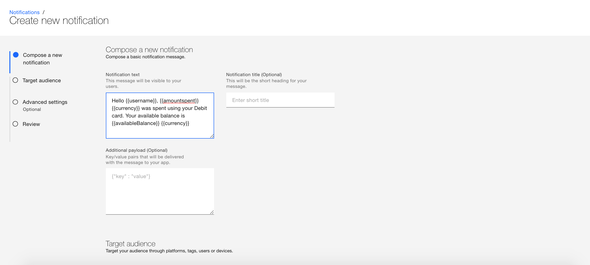

---

copyright:
 years: 2015, 2017

---

{:new_window: target="_blank"}
{:shortdesc: .shortdesc}
{:screen:.screen}
{:codeblock:.codeblock}

# Parameterize Notifications
{: #template_based_notifications}
Last updated: 21 August 2017
{: .last-updated}

You can parameterize and send custom notifications by creating variables and calling them in your notification templates.

Your notification template can -

 - Combine static and dynamic elements in your notifications
 - Personalize notifications for each recipient by adding variables
 - Can include multiple variables in your notification 

Pass variables as JSON objects in your application code during initialization -

    
   ```
    MFPPushNotificationOptions options = new MFPPushNotificationOptions();

    JSONObject tempValue = new JSONObject();
        try {
        
		tempValue.put("username",userName);
        
        tempValue.put("amountSpent",amount);
		
        tempValue.put("currency",currency);
		
        tempValue.put("avilableBalance",balance);
        
		} catch (JSONException e) {
            e.printStackTrace();
        }
        options.setPushVariables(tempValue); 
	   
	   push = MFPPush.getInstance();

       push.initialize(getApplicationContext(),appGuid,clientSecret,options);
   ```
{: codeblock}


Once the variables are defined, they can be called in your message template.

1. On the {{site.data.keyword.mobilepushshort}} console, select the **Messages** tab.

2. Compose a message by choosing a **Send to** option.

2. In the **Message** field, compose your message.  Call the defined variables in the message template. Click **Send**.



Your custom notfication message will be sent by fetching the variable data -


Note: The feature is enabled only for users who have opted the `Advanced Plan`. Select **Plan** in the {{site.data.keyword.mobilepushshort}} service console to [upgrade](https://console-tok02-red.cdn.s-bluemix.net/docs/account/change-plan.html#changing) .

**Limitations:**

 - Currently, this feature is not supported on Safari
 - Variables in the notification template may not work if an app is force quit on iOS. The limitation is not in control of SDK but comes from iOS.


